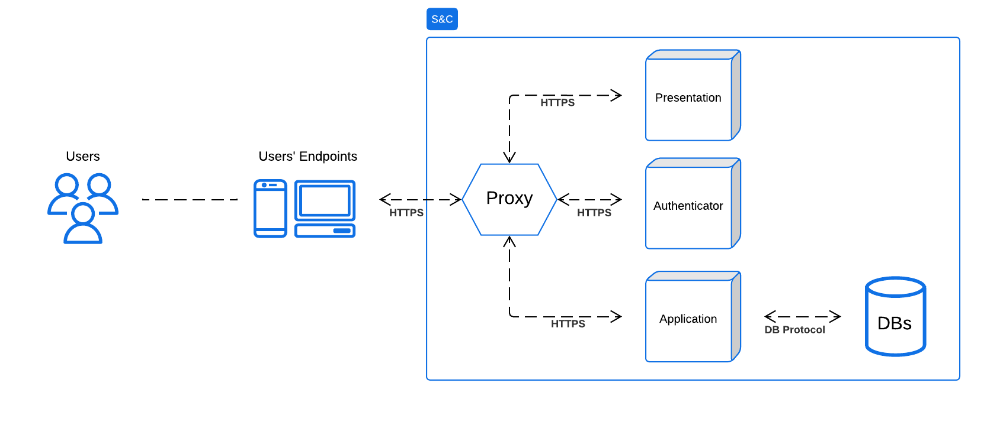
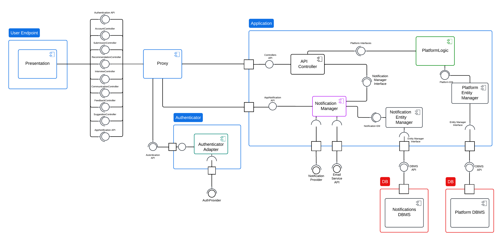
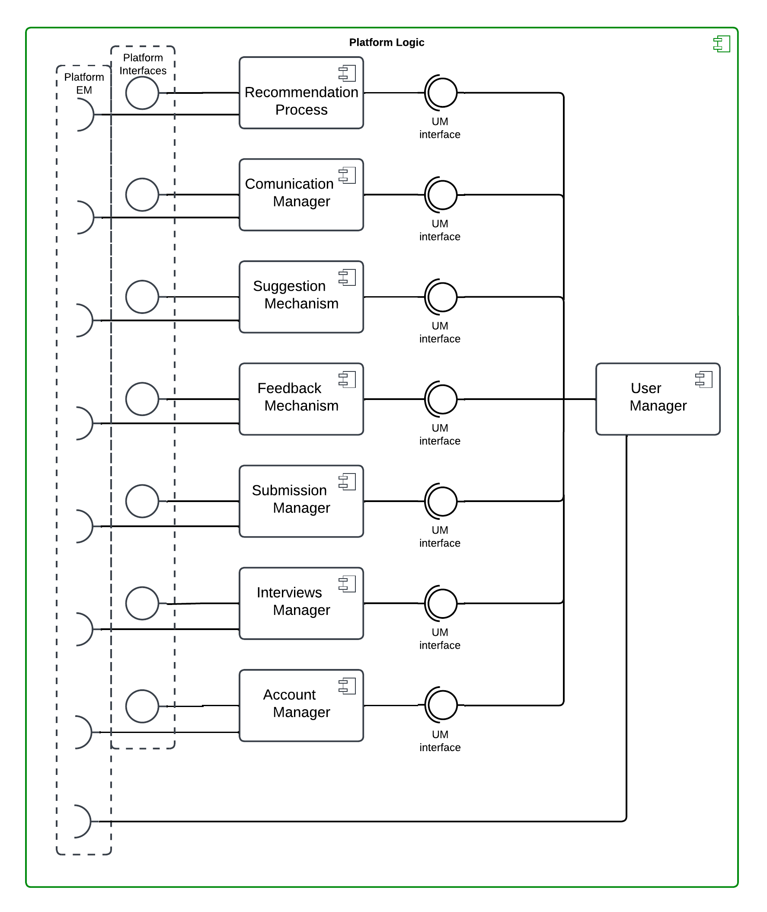
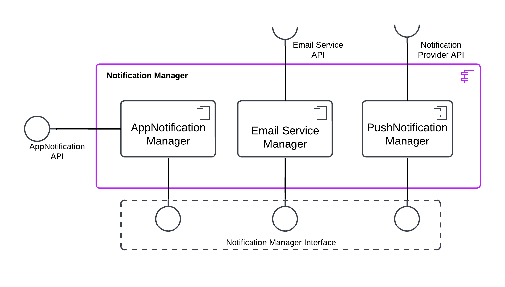
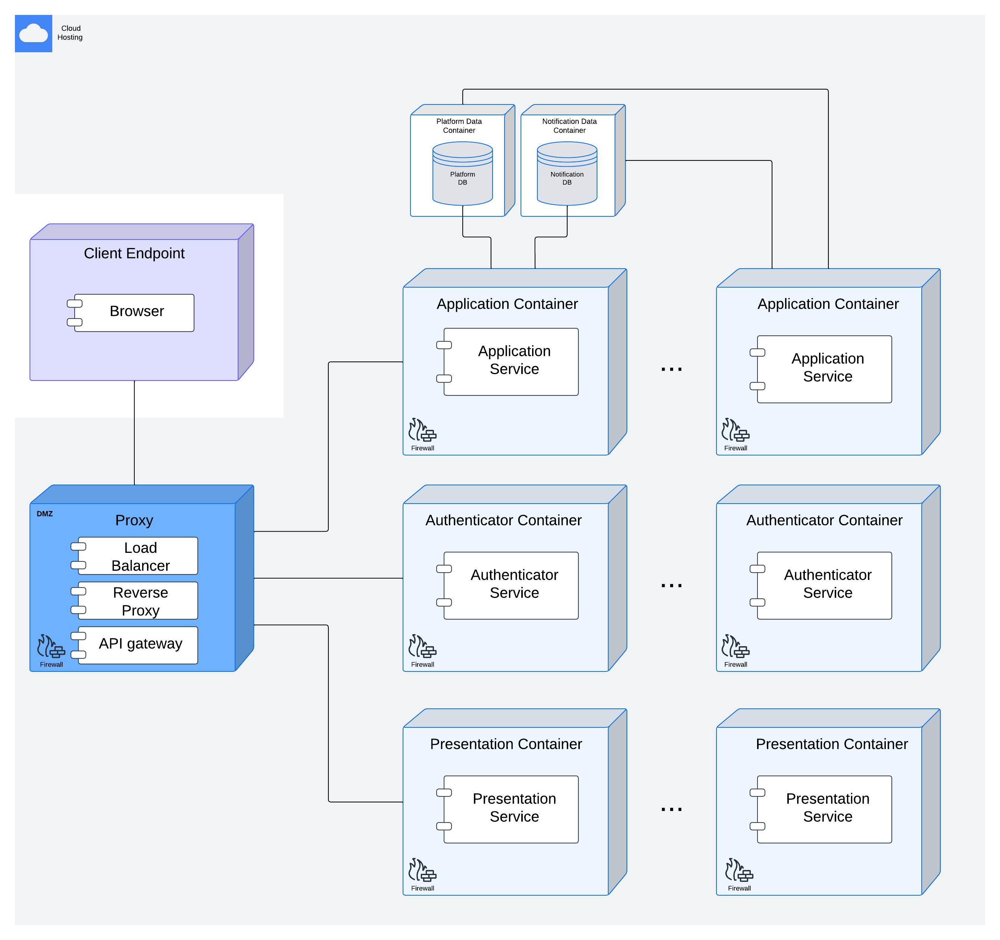

# Design Document

## 1 Introduction

### 1.1 Purpose

The purpose of the Student\&Company (S\&C) platform is to enable students to enroll into internships that will enhance their education and strengthen their CVs while letting companies publish internship offers and select the best candidates thought interviews. More over, S\&C allow students' universities to monitor each of their students' progress and intervene if needed.
The platform support and aid the users throughout the entire process by provide suggestion to the uploaded CVs and internship offers, automatically matches students and companies thanks to a proprietary algorithm, manage the distribution and collection of interviews and provides a space for filing and resolving complaints. The reader can find more information about the platform in the RASD document.
In the remaining part of this chapter we will present a summary of the technical choice made for the creation of the platform and different bullet point lists and table including the Goals that we are trying to accomplish with this software and the Definition, Acronyms, Abbreviations used in this document.

#### 1.1.1 Goals

| **Goal ID** | **Goal Description** |
|-------------|-----------------------|
| **G1**      | Companies would like to advertise the internships they offer. |
| **G2**      | Students would like to autonomously candidate for available internships. |
| **G3**      | Students would like to be matched with internships they might be interested in. |
| **G4**      | Companies would like to perform interviews with suitable students. |
| **G5**      | Students and companies would like to complain, communicate problems, and provide information about an ongoing internship. |
| **G6**      | Students and companies would like to be provided with suggestions about how to improve their submission. |
| **G7**      | Universities would like to handle complaints about ongoing internships. |
| **G8**      | Students would like to choose which internship to attend from among those for which they passed the interview. |
| **G9**      | Companies would like to select students for the internship position among those who passed the interview. |

### 1.2 Scope

This document, Design Document (DD), will provide a detailed description of the architecture of the S\&C platform from a more technical point of view. In particular it will provide a thorough description of the software with a special emphasis on its interfaces, system modules, and architectural framework.
This document will also discuss the implementation, integration and testing plan describing the tools and methodologies that will be used during the development of the platform.
<!-- (Sam 1h)-->

#### 1.2.1 Main architectural choices

The chosen architectural style is a *microservices architecture*, as it enables a scalable and modular approach to development. The three main services are Presentation, Application, and Authenticator, which are responsible for the user interface, business logic, and authentication, respectively. Data-intensive service manage their data through autonomous databases, ensuring modularity and scalability. For now, the databases are not designed to scale horizontally, meaning that when services using them are duplicated, the database remains a single, centralized instance. The Presentation layer provides the client with a Single Page Application (SPA) for a smoother user experience. The Application layer contains modules that handle platform-specific logic services, which could be exported as independent services in the future. This setup facilitates reliability and fault tolerance, as each service is designed to be container-based and can be scaled vertically or horizontally using cloud orchestration tools during deployment.

### 1.3 Definitions, Acronyms, Abbreviations

This section provides definitions and explanations of the terms, acronyms, and abbreviations used throughout the document, making it easier for readers to understand and reference them.

#### 1.3.1 Definitions

The definition shared between this document and the RASD document are reported in the following table.

| **Term**                    | **Definition**                                                                                           |
|-----------------------------|----------------------------------------------------------------------------------------------------------|
| **University**              | A university that is registered on the S&C platform.                                                    |
| **Company**                 | A company that is registered on the S&C platform.                                                       |
| **Student**                 | A person who is currently enrolled in a University and is registered on the S&C platform.               |
| **User**                    | Any registered entity on the S&C platform.                                                              |
| **Internship Offer**        | The offer of an opportunity to enroll in an internship provided by a Company. The offer remains active on the platform indefinitely until the publishing Company removes it. |
| **Participant**             | An entity that interacts with the platform for the purpose of finding or offering an Internship Position Offer, such as Students and Companies. |
| **Recommendation Process**  | The process of matching a Student with an Internship offered by a Company based on the Student’s CV and the Internship’s requirements. |
| **Recommendation/Match**    | The result of the Recommendation Process, a match between a Student and an Internship.                  |
| **Spontaneous Application** | The process of a Student spontaneously applying for an Internship that was not matched through the Recommendation Process. |
| **Interview**               | The process of evaluating a Student’s application for an Internship conducted by a Company through the S&C platform. |
| **Feedback**                | Information provided by Participants to the S&C platform to improve the Recommendation Process.          |
| **Internship Position Offer** | The formal offer of an internship position presented to a student who has successfully passed the Interview, who can decide to accept or reject it. |
| **Suggestion**              | Information provided by the S&C platform to Participants to improve their CVs and Internship descriptions. |
| **Confirmed Internship**    | An Internship that has been accepted by both the Student and the offering Company.                       |
| **Ongoing Internship**      | An Internship that is currently in progress. All Ongoing Internships are Confirmed Internships, but the vice versa is not always true. |
| **Complaint**               | A report of a problem or issue that a Student or Company has with an Ongoing Internship. It can be published on the platform and handled by the University. |
| **Confirmed Match**         | A match that has been accepted by both a Student and a Company.                                          |
| **Rejected Match**          | A match that has been refused by either a Student or a Company.                                          |
| **Pending Match**           | A match that has been accepted only by a Student or a Company, waiting for a response from the other party. |
| **Unaccepted Match**        | A match that has been refused by either a Student or a Company.|

The definition specific to this document are reported in the following table.

| **Term**                    | **Definition**                                                                                           |
|-----------------------------|----------------------------------------------------------------------------------------------------------|
| **Front-end**               | The part of the software that is responsible for the presentation of the data and the interaction with the user. It is what the user sees and interacts with. |
| **Back-end**                | The part of the software that is responsible for the business logic of the platform and the storage and retrieval of data. It is composed by the servers and the database. It is what the user does not see. |
| **RESTful API**             | A set of rules that software engineer follow when creating an API that allows different software to communicate with each other. |
| **3-tier architecture**     | A software architecture that divides the software into three different layers: presentation layer that contains the logic for displaying data and retrieve input from the user, application layer where the main logic of the software is present, and data layer that contains the data and the logic to access it. |
| **Proxy**                   | A server that acts as an intermediary for requests from clients seeking resources from other servers. It can redirect information based on different criteria. |
| **Presentation Service**    | The service that provides the user interface and experience to the client. It is responsible for delivering static content to the client upon connection to the platform's main domain. |
| **Presentation Layer**     | The layer of the software that is responsible for the visualization of the data and the retrieval of user inputs, offered by the Presentation Service.  |
| **Application Service**     | The service that contains the platform's core functionalities, including platform logic, database interaction, and notification handling. It exposes various RESTful API endpoints for the different services it provides. |
| **Application Layer**      | The layer of the software that is responsible for the processing of the data, computation, and the logic of the platform, offered by the Application Service. |
| **Authenticator Service**   | The service that is responsible for every process concerning authentication and session validation. |
| **Data Layer**              | The layer of the software that is responsible for the storage and retrieval of the data. |
| **Service**                 | A self-contained unit of functionality that can be independently deployed and scaled. |
| **Container**               | A standard unit of software that packages up code and all its dependencies so the application runs quickly and reliably from one computing environment to another. |
| **Notification Subsystem**  | The system that is responsible for sending notifications to users when relevant events occur. |

#### 1.3.2 Acronyms

The acronyms shared between this document and the RASD document are reported in the following table.

| **Acronym** | **Definition**                                  |
|-------------|-------------------------------------------------|
| **RASD**    | Requirements Analysis & Specification Document  |
| **CV**      | Curriculum Vitae                                |

The acronyms specific to this document are reported in the following table.

| **Acronym** | **Definition**                                  |
|-------------|-------------------------------------------------|
| **DD**      | Design Document                                 |
| **S&C**     | Student&Company                                 |
| **UI**      | User Interface                                  |
| **UX**      | User Experience                                 |
| **DB**      | Database                                        |
| **API**     | Application Programming Interface               |
| **ORM**     | Object-Relational Mapping                       |
| **DBMS**    | Database Management System                      |
| **OLAP**    | Online Analytical Processing                    |
| **SPA**     | Single Page Application                         |
| **DMZ**     | Demilitarized Zone                              |

#### 1.3.3 Abbreviations

The abbreviations shared between this document and the RASD document are reported in the following table.

| **Abbreviation** | **Definition**        |
|-------------------|----------------------|
| **S&C**          | Students & Companies  |

The abbreviations specific to this document are reported in the following table.

| **Abbreviation** | **Definition**        |
|-------------------|----------------------|

### 1.4 Revision history

| **Version** | **Date** | **Description** |
|-------------|----------|-----------------|
| 1.0         | ?-01-2025| Initial release of the document. |

### 1.5 Reference documents

- **Assignment RDD AY 2024-2025**: Provided assignment description.
- **Software Engineering 2 A.Y. 2024/2025 Slides**: "Creating DD."
- **RASD document**: The Requirements Analysis & Specification Document of the S&C platform.
<!-- (Sam 1h)-->

### 1.6 Document structure

This document is structured as follows:
- Section 1: *Introduction*: P a short summary of the RASD, the purpose, definition and acronyms used in this document and a non-technical description of the technical choices made for the platform's implementation.
- Section 2: *Architectural Design*: presents a top-down description of the S&C architectural design starting from a high-level description of groups of components and their interactions, explaining the different areas of the platform and the design decisions made to realize them. \\
Following this, it offers a more detailed view of these groups, describing the components they consist of, their interfaces, and the architectural styles and patterns applied. \\
Finally, we present a deployment view of a full system deployment with redundant service and a different runtime views represented through sequence diagrams.
- Section 3: *User Interface Design*: Provides images and description of the user interface design of the platform. With respect to the RASD, this section will provide a more technical description of the user interface design.ù
- Section 4: *Requirements Traceability*: Contains a traceability matrix linking the requirements defined previously in the RASD to the components of the system that will implement them.
- Section 5: *Implementation, Integration and Test Plan*: Details the tools and methodologies that will be used during the development of the platform to test the correctness and ensure the quality of the software.
- Section 6: *Effort Spent*: Contains a table with the hours spent by each member of the group to develop this document. 
<!-- (Sam 0.5h)-->

## 2 Architectural Design

The purpose of this chapter is to present a top-down description of the S&C architectural design, covering and justifying every design decision.
First, we introduce the high-level components and their interactions.
Next, we proceed with a detailed description of these components.
Subsequently, we define the deployment strategy.
After that, we address the runtime interactions of the components and provide a more detailed description of their interfaces.
Finally, we conclude by outlining the main patterns adopted and other relevant design decisions.

### 2.1 Overview: High-level components and their interaction

The system employs a simple microservices architecture composed of the Presentation, Application, and Authenticator services, along with databases to manage the Application data.
This microservices structure enables the system to scale and adapt to increasing demand. Additionally, it supports greater decoupling and modularization, facilitating the management of growing service complexity in the future.

Client access to server content is handled by a proxy, which routes requests to the appropriate service.
When users navigate to the platform's main domain using a browser, the proxy directs them to the Presentation service, responsible for providing the user interface and experience.

The web interface communicates with the Application service via a RESTful API that handles the business logic.
All service calls from the client-hosted presentation layer pass through the proxy, which analyzes and forwards the requests.

Requests requiring authentication are routed to the Authenticator service, which acts as middleware to handle all user authentication processes.
If authentication succeeds, the request is forwarded to the Application service.

The Application service interacts with databases through APIs that manage the ORM, data life cycles, and querying processes.

#### Proxy

Every type of communication between the services is routed through the Proxy, which dispatches it to the appropriate service. This means that the IP address of the server hosting the Proxy is the one bound to the application's main domain.

#### Presentation Service

The Presentation service delivers static content to the client upon connection to the platform's main domain. It also provides the client with the web scripts needed to call the APIs of the Application service, enabling the retrieval of user-specific data and triggering the platform's logic. During runtime, API calls to other services are initiated directly from the client's endpoints, rather than being forwarded through the Presentation service.

#### Application Service

The Application service contains the platform's core functionalities, including platform logic, database interaction, and notification handling. It exposes various RESTful API endpoints for the different services it provides. These endpoints can be either public or private. Public endpoints are accessible to non-authenticated users, while private endpoints handle personal user data or sensitive logic and require authentication before execution. Every call to these endpoints first reaches the Proxy, which forwards requests intended for private endpoints to the Authenticator service, while directing others directly to the target service.

#### Authenticator Service

The Authenticator service is responsible for every process concerning authentication and session validation.

#### Databases

The databases are managed by the Application service and are used to store all the data required by the platform. This setup could change in the future if an internal component of the Application service needs to be exported to an autonomous service, for example, due to increasing complexity or the need to decouple its development environment. Databases are not handled as autonomous services accessible by all other services; instead, they directly and exclusively interact with their corresponding service logic.

### 2.2 Component view

This section provides a more in-depth view of the software components that are part of the designed architecture, as well as the necessary interfaces between them.

#### 2.2.1 Entity Manager

The Entity Manager acts as an API that enables communication with a DBMS, simplifying ORM, querying, and data life cycles. It provides standard methods, independent of the specific DBMS used to handle the data. As shown in the diagram, there are two Entity Managers. The Platform Entity Manager provides its interface to the Platform Logic Module, enabling interaction with the Platform DBMS. The Notification Entity Manager works analogously with the Notification DBMS.

#### 2.2.2 Platform Logic

The inner components of the Platform Logic encapsulate the logic of the main parts of the S&C environment. Each component autonomously handles its data management through the database, leveraging the Entity Manager interface.

| **Component**          | **Description**                                        |
|-------------------------|--------------------------------------------------------|
| Recommendation Process  | Handles recommendation logic and related data          |
| Communication Manager   | Manages communication logic and related data           |
| Suggestion Mechanism    | Handles suggestions logic and related data             |
| Feedback Mechanism      | Processes feedback logic and related data              |
| Submission Manager      | Manages submission logic and related data              |
| Interview Manager       | Handles interview-related logic and data               |
| Account Manager         | Manages account logic and related data                 |
| User Manager            | Interface for querying and modifying user groups with specific characteristics |

#### 2.2.3 API Controller

The API Controller consists of a set of inner controllers whose methods, triggered by user calls, interact with and execute the logic of the Platform Logic inner components described above.

#### 2.2.4 Notification Manager

This component handles all notification-related needs, regardless of their type. It functions as an adapter for external push notification providers and email services, offering an interface to seamlessly integrate these external features with other services. It also creates and manages corresponding in-app notifications, which can be fetched by users through a dedicated AppNotification API.

This component serves as a clear example of a service that could easily be exported to its own container in the future, for instance, by exposing its own RESTful API to the Platform Logic instead of using the current interface-based setup.

### 2.3 Deployment view

Each service will be hosted on its own container being able to run independently on the same or on different machines. Containers, in addiction to make the development and deployment easier, also provide a good level of isolation and security.
The system will be hosted on the cloud and its container based nature allows to easily integrate orchestrator tools to decouple it from the cloud hosting provider and automatically manage scalability, reliability, fault tolerance and global security of the microservices cluster.
A DMZ can be implemented in this design by placing the Proxy in a dedicated network segment isolated from both the external network and the internal services. A firewall between the DMZ and the external network would allow only HTTP/HTTPS traffic to the Proxy, while another firewall between the DMZ and the internal network would restrict traffic to authorized services. This setup enhances security by exposing only the Proxy to external access, keeping the Application and Authenticator services, along with the databases, fully protected within the internal network.

### 2.4 Runtime view

#### Note for Runtime view

- The authenticator creates, updates, validates the token. A unique userID is obtained through the token after Authenticator validation.
- Dire che anche le api call sono una sorta di pseudocodice
- success : void senza errori e update/inser/remove db e tutto il resto
- result non void (generico) tipicamente usato dopo alt
- result risultato generico (anche query db)

- specificare differenza UserData e Usercredential SD1
- come oggetto di ritorno per le notifiche mettiamo data (se non viene mandato un oggetto di ritorno)

#### notazione db SD

- success : update-insert-remove
- result : buildAndExecuteQuery-insert&query-update&query o query&update ecc. 

- alt per ogni codice di uscita (400, 200, 201, 500, 409, 401)
- controllare le alt

- spiegare parametro Data in notifyUser(UserIDs, Data) e controllare che sia Data generico ovunque!!!

- cerca le scritte rosse e rimuovile o spiegale (sendConfEmail)

### Sequence Diagram Descriptions

1. UserRegistration
    
    This sequence diagram outlines the User Registration process. Initially, the Account Manager verifies the uniqueness of the user's credentials, followed by registering the user in the database. Subsequently, the token generation process is triggered, and a confirmation email is sent to the provided address. Once the user responds to the email, the account is activated.

2. UserLogIn

    This sequence diagram illustrates the User Login process. The user submits their credentials, which are validated by the Authenticator via the AuthProvider. If the credentials are valid, a token is generated and saved in the Presentation layer.

3. ParticipantSubmission

    This sequence diagram illustrates the process of a Student submitting their CV or a Company submitting an Internship Offer. Upon submission, the SubmissionManager stores the data in the database. The SuggestionMechanism generates Suggestions based on previously saved parameters and stores them. The RecommendationProcess generates recommendations based on additional parameters and stores them as well. Each new Match identified by the Recommendation Process is notified via the NotificationManager. Finally, the participant is presented with the Suggestions for their submission.

4. UserOpensCompanyIntOff

    This sequence diagram shows the process when a User views a Company's internships. The User's request triggers an API call, which is processed by the APIController and SubmissionManager. The PlatformEntityManager queries the PlatformDBMS for internship data, which is then returned and displayed to the User.

5. UserOpensStudentCV

    This sequence diagram illustrates the process when a User views a Student's CV. The User's request initiates an API call, which is processed by the APIController and SubmissionManager. The PlatformEntityManager queries the PlatformDBMS for the CV, and the result is returned and displayed to the User.

6. 1 ParticipantAcceptsMatch
    
    This sequence diagram illustrates the process when a Participant accepts a recommendation. The Participant triggers the process by pressing the accept button. The request is authenticated and sent to the APIController, which interacts with the RecommendationProcess to update and fetch recommendation data. If the other party has already accepted, an interview is created through the InterviewManager. Additionally, if the FeedbackMechanism is triggered, the Participant is prompted to provide feedback. Finally, the success message is displayed to the Participant.

   2 ParticipantSubmitsFeedback

    This sequence diagram illustrates the process of a Participant submitting feedback on a recommendation. The Participant triggers the process by pressing the submit feedback button. The APIController handles the request, and the FeedbackMechanism saves the feedback in the PlatformDBMS. Afterward, it retrieves recommendation parameters updates them. The updated data is stored back in the database, and the feedback process is successfully completed. Finally, the Participant is presented with a success message.

7. StudentSendsSpontaneousApplication

    This sequence diagram represents the process of a Student submitting a Spontaneous Application to a Company. The Student initiates the action by clicking the submit button. The APIController handles the submission and calls the SubmissionManager to add the application. The data is stored in the PlatformDBMS, and once successful, a notification is sent to the Company via the NotificationManager. Finally, the Student receives a success message indicating the completion of the process.

8. CompanyAcceptsSpontaneousApplication

    This sequence diagram depicts the process in which a Company accepts a Spontaneous Application from a Student. The Company initiates the action by clicking the "accept" button. The APIController calls the SubmissionManager to process the acceptance, and the application status is updated in the PlatformDBMS. Following the acceptance, an Interview between the Student and the Company is created and stored. The NotificationManager sends a notification to the Student . Finally, the Company receives a success message confirming the acceptance and interview creation.

- i Message Objects nei codici 200, 201 sono oggetti generici e non vengono rappresentati nei sequence come accade per i messaggi di errore generici

- specificare che verify parameters per le api call è esplicitato solo una volta e che però avviene una verifica sui parametri per ritornare 400 badrequest

### 2.5 Component interfaces (maybe before Runtime View)

### 2.6 Selected architectural styles and patterns
In this subsection, we will describe the architectural styles and patterns that have been selected for the S&C platform, how they works and the reason behind their choice.
- **Microservices Architecture**: The S&C platform is designed as a set of loosely coupled services, each responsible for a specific set of functionalities. This architecture allows for a high degree of modularity, scalability, and fault tolerance by enabling the independent development, deployment, and scaling of each service and the division of the platform into smaller, more manageable components that can be developed by different teams.
- **RESTful API**: The platform's services communicate with the front-end through a RESTful API, which provides a standardized method for different services to interact with one another. This API utilizes the stateless HTTP protocol using methods such as GET, POST, PUT, and DELETE to perform CRUD (Create, Read, Update, and Delete) operations on the data stored by the platform. \\
By being stateless, the API allows for better scalability and reliability, as it eliminates the requirement for a client to connect to the same server for every request. This is because each request is independent and does not rely on or maintain context from previous requests.
- **Lightweight Client-Server Architecture**: The platform follows a lightweight client-server architecture, where the client (front-end) is only responsible for the handling of the Presentation layer consisting in the visualization of the data and the retrieval of user inputs. The server (back-end) is responsible for the implementation of the Business Logic and the Data Layer where the former is responsible for the processing of the data, computation, and the logic of the platform, while the latter is responsible for the storage and retrieval of the data. \\
It is important to notice that while this architecture seems to follow the 3-tier architecture pattern, each tier is not necessarily composed or limited to a single server, but it can be composed of multiple servers and containers following more a microservices architecture.
<!-- (Sam 1h)-->
### 2.7 Other design decisions
In this subsection, we will describe the architectural styles and patterns that have been selected for the S\&C platform, how they work, and the reason behind their choice from a non-technical point of view.
#### 2.7.1 Database Management
For the S&C platform, we have chosen to use a relational database management system (DBMS) to store the data. This choice was made because the data structure of the platform is well-suited to a relational database, as it consists of structured data with clear relationships between different entities and the typology of query and analysis make on the data did not justify the complexity or the performance cost of a OLAP database.
The DBMS will be used to store all the data required by the platform including but not limited to: user information, internship offers, CVs, and recommendations. The data will be structured in a way that allows for efficient querying and retrieval, ensuring that the platform can provide fast and reliable access to the information stored in the database through the Entity Manager interface and the JPA java framework.
#### 2.7.2 Notification Handling
Notifications of all type, both in-app and push, are handled by the Notification Manager component who is responsible to send notifications and sign-up mail confirmation to all users of the platform. This component acts both as an adapter for external push notification and email service providers and as a controller for in-app notification fetch requests. The Notification Manager is designed to do this by providing a simple interface *sendNotification* that can be called by any backend component to send a notification to one or more users. This is done to hide the complexity of the underlying notification system, show in sequence diagrams SD1 and SD2 (DA CAMBIARE) .\\ 
Due to the nature of this component and the high level of work it has to do, we expect it to be one of the first to be exported to its own container in the future to handle scalability concerns effectively. By decoupling the Notification Manager into its own container, the platform can better allocate resources to this high-demand service, ensuring consistent performance even under heavy load. This is why the Notification Manager in COMPONENT DIAGRAM(DA CAMBIARE) is represented as a separate entity from the other components, having is own interface and DB, even though it is part of the Platform Logic.
#### 2.7.3 Authentication and Validation
The user authentication process is handled by the Authenticator service, which is responsible for validating user credentials and generating tokens for authenticated users. The reason behind the use of a token-based authentication system is done because we want to limit the number of times a user has to enter their credentials while ensuring that only logged-in users can interact with *private* api call. \\
The token is generated by the Authenticator service and is stored in the Presentation layer after the user login and it is sended every time a private request is made. The token is validated by the Authenticator service for every request, look at SD(DA CAMBIARE), validating and refreshing the token or requesting a new login by the user, ensuring that only recent authenticated users can access the platform's functionalities. 
#### 2.7.4 Scalability
The S&C platform is designed from the beginning to be scalable, meaning that it can handle an increasing number of users and requests without compromising performance. This is achieved through the use of a microservices architecture, which allows the platform to be divided into smaller, more manageable services that can be independently scaled as needed. Each service can be deployed in its own container, which can be easily replicated to handle additional load. This ensures that the platform can scale horizontally by adding more containers to distribute the load across multiple instances of the service. Additionally, the use of a Stateless RESTful API ensures that each request is independent and does not rely on or maintain context from previous requests, allowing the platform to 
scale more easily and reliably without the need for complex session management.
<!-- (Sam 1.5h)-->
## 3 User Interface Design

The web interface is a single page application (SPA) that allows a wide number of interaction without the need of refreshing the page, providing a smoother user experience.  

## 4 Requirements Traceability

Possible Components at the moment: 

| Internal Components             | External Components        |
|---------------------------------|----------------------------|
| C1 API Controller               | E1 Notification Provider   |
| C2 Account Manager              | E2 Email Provider API      |
| C3 User Manager                 | E3 Authentication Provider |
| C4 Recommendation Process       | E4 DBMS                    |
| C5 Submission Manager           | 
| C6 Interviews Manager           |
| C7 Communication Manager        |
| C8 FeedBack Mechanism           |
| C9 Suggestion Mechanism         |
| C10 Platform Entity Manager     |
| C11 Authenticator Adapter       |
| C12 Notification Manager        |
| C13 Notification Entity Manager |

| **R1** | **The platform shall allow any unregistered students to register by providing personal information and selecting their University.** |
|---------|-----------------------------|
| **C1**  | API Controller              |
| **C2**  | Account Manager             |
| **C10** | Platform Entity Manager     |
| **C11** | Authenticator Adapter       |
| **C12** | Notification Manager        |
| **C13** | Notification Entity Manager |
| **E1**  | Notification Provider       |
| **E2**  | Email Provider API          |
| **E3**  | Authentication Provider     |
| **E4**  | DBMS                        |

*Table: Requirement R1 - Traceability for Student Registration Process.*

| **R2** | **The platform shall allow any companies to register by providing company information.**                                         |
|---------|-----------------------------|
| **C1**  | API Controller              |
| **C2**  | Account Manager             |
| **C10** | Platform Entity Manager     |
| **C11** | Authenticator Adapter       |
| **C12** | Notification Manager        |
| **C13** | Notification Entity Manager |
| **E1**  | Notification Provider       |
| **E2**  | Email Provider API          |
| **E3**  | Authentication Provider     |
| **E4**  | DBMS                        |

*Table: Requirement R2 - Traceability for Company Registration Process.*

| **R3** | **The platform shall allow any universities to register by providing university information.**  |
|---------|-----------------------------|
| **C1**  | API Controller              |
| **C2**  | Account Manager             |
| **C10** | Platform Entity Manager     |
| **C11** | Authenticator Adapter       |
| **C12** | Notification Manager        |
| **C13** | Notification Entity Manager |
| **E1**  | Notification Provider       |
| **E2**  | Email Provider API          |
| **E3**  | Authentication Provider     |
| **E4**  | DBMS                        |

*Table: Requirement R3 - Traceability for University Registration Process.*

| **R4** | **The platform shall allow Users to log in using their email and password.**                                                   |
|---------|-----------------------------|
| **C3**  | User Manager                |
| **C11** | Authenticator Adapter       |
| **E3**  | Authentication Provider     |

*Table: Requirement R4 - Traceability for User Login Functionality.*

| **R5** | **The platform shall send notifications to Users when relevant events occur.**                                                 |
|---------|-----------------------------|
| **C12** | Notification Manager        |
| **C13** | Notification Entity Manager |
| **E1**  | Notification Provider       |
| **E4**  | DBMS                        |

*Table: Requirement R5 - Traceability for Notification Functionality.*

| **R6** | **The platform shall allow Companies to create and publish Internship offers specifying details.**                              |
|---------|-----------------------------|
| **C1**  | API Controller              |
| **C3**  | User Manager                |
| **C5**  | Submission Manager          |
| **C10** | Platform Entity Manager     |
| **C11** | Authenticator Adapter       |
| **E3**  | Authentication Provider     |
| **E4**  | DBMS                        |

*Table: Requirement R6 - Traceability for Internship Offer Creation.*

| **R7** | **The platform shall allow Companies to terminate their Internship offers at their own discretion.**                            |
|---------|-----------------------------|
| **C1**  | API Controller              |
| **C3**  | User Manager                |
| **C5**  | Submission Manager          |
| **C10** | Platform Entity Manager     |
| **C11** | Authenticator Adapter       |
| **E3**  | Authentication Provider     |
| **E4**  | DBMS                        |

*Table: Requirement R7 - Traceability for Internship Termination.*

| **R8** | **The platform shall provide Students with Matches automatically obtained by the Recommendation Process.**                     |
|---------|-----------------------------|
| **C1**  | API Controller              |
| **C3**  | User Manager                |
| **C4**  | Recommendation Process      |
| **C10** | Platform Entity Manager     |
| **C11** | Authenticator Adapter       |
| **E3**  | Authentication Provider     |
| **E4**  | DBMS                        |

*Table: Requirement R8 - Traceability for Recommendation Matching.*

| **R9** | **The platform shall allow Students to view and navigate all available Internships.**                                          |
|---------|-----------------------------|
| **C1**  | API Controller              |
| **C5**  | Submission Manager          |
| **C10** | Platform Entity Manager     |
| **C11** | Authenticator Adapter       |
| **E3**  | Authentication Provider     |
| **E4**  | DBMS                        |

*Table: Requirement R9 - Traceability for Viewing Available Internships.*

| **R10** | **The platform shall enable Students to submit Spontaneous Applications to Internships they choose.**                         |
|---------|-----------------------------|
| **C1**  | API Controller              |
| **C5**  | Submission Manager          |
| **C10** | Platform Entity Manager     |
| **C11** | Authenticator Adapter       |
| **E3**  | Authentication Provider     |
| **E4**  | DBMS                        |

*Table: Requirement R10 - Traceability for Spontaneous Applications.*

| **R11** | **The platform shall allow Students to submit their CV.** |
|---------|-----------------------------|
| **C1**  | API Controller              |
| **C5**  | Submission Manager          |
| **C10** | Platform Entity Manager     |
| **C11** | Authenticator Adapter       |
| **E3**  | Authentication Provider     |
| **E4**  | DBMS                        |

*Table: Requirement R11 - Traceability for CV Submission.*

| **R12** | **The platform shall allow Students to modify their CV.** |
|---------|-----------------------------|
| **C1**  | API Controller              |
| **C5**  | Submission Manager          |
| **C10** | Platform Entity Manager     |
| **C11** | Authenticator Adapter       |
| **E3**  | Authentication Provider     |
| **E4**  | DBMS                        |

*Table: Requirement R12 - Traceability for CV Modification.*

| **R13** | **The platform shall allow Students to monitor the status of their Spontaneous Applications.** |
|---------|-----------------------------|
| **C1**  | API Controller              |
| **C5**  | Submission Manager          |
| **C10** | Platform Entity Manager     |
| **C11** | Authenticator Adapter       |
| **E3**  | Authentication Provider     |
| **E4**  | DBMS                        |

*Table: Requirement R13 - Traceability for Monitoring Spontaneous Applications.*

| **R14** | **The platform shall allow Students to monitor the status of their Recommendation.** |
|---------|-----------------------------|
| **C1**  | API Controller              |
| **C4**  | Recommendation Process      |
| **C10** | Platform Entity Manager     |
| **C11** | Authenticator Adapter       |
| **E3**  | Authentication Provider     |
| **E4**  | DBMS                        |

*Table: Requirement R14 - Traceability for Monitoring Recommendations.*

| **R15** | **The platform shall display to Students all the Internships found by the Recommendation Process.** |
|---------|-----------------------------|
| **C1**  | API Controller              |
| **C4**  | Recommendation Process      |
| **C10** | Platform Entity Manager     |
| **C11** | Authenticator Adapter       |
| **E3**  | Authentication Provider     |
| **E4**  | DBMS                        |

*Table: Requirement R15 - Traceability for Displaying Recommended Internships.*

| **R16** | **The platform shall display to Companies all the CVs of Matched Students obtained by the Recommendation Process.** |
|---------|-----------------------------|
| **C1**  | API Controller              |
| **C4**  | Recommendation Process      |
| **C10** | Platform Entity Manager     |
| **C11** | Authenticator Adapter       |
| **E3**  | Authentication Provider     |
| **E4**  | DBMS                        |

*Table: Requirement R16 - Traceability for Displaying Matched Student CVs.*

| **R17** | **The platform shall allow Students and Companies to accept a Recommendation.** |
|---------|-----------------------------|
| **C1**  | API Controller              |
| **C4**  | Recommendation Process      |
| **C10** | Platform Entity Manager     |
| **C11** | Authenticator Adapter       |
| **E3**  | Authentication Provider     |
| **E4**  | DBMS                        |

*Table: Requirement R17 - Traceability for Accepting Recommendations.*

| **R18** | **The platform shall allow Companies to accept a Spontaneous Application.** |
|---------|-----------------------------|
| **C1**  | API Controller              |
| **C4**  | Recommendation Process      |
| **C10** | Platform Entity Manager     |
| **C11** | Authenticator Adapter       |
| **E3**  | Authentication Provider     |
| **E4**  | DBMS                        |

*Table: Requirement R18 - Traceability for Accepting Spontaneous Applications.*

| **R19** | **The platform shall start a Selection Process only if both the Company and the Student have accepted the Recommendation.** |
|---------|-----------------------------|
| **C1**  | API Controller              |
| **C4**  | Recommendation Process      |
| **C10** | Platform Entity Manager     |
| **C11** | Authenticator Adapter       |
| **E3**  | Authentication Provider     |
| **E4**  | DBMS                        |

*Table: Requirement R19 - Traceability for Starting Selection Process via Recommendation.*

| **R20** | **The platform shall start a Selection Process only if the Company has accepted the Spontaneous Application.** |
|---------|-----------------------------|
| **C1**  | API Controller              |
| **C5**  | Submission Manager          |
| **C6**  | Interviews Manager          |
| **C10** | Platform Entity Manager     |
| **C11** | Authenticator Adapter       |
| **E3**  | Authentication Provider     |
| **E4**  | DBMS                        |

*Table: Requirement R20 - Traceability for Starting Selection Process via Spontaneous Application.*

| **R21** | **The platform shall allow Companies to create Interviews.** |
|---------|-----------------------------|
| **C1**  | API Controller              |
| **C6**  | Interviews Manager          |
| **C10** | Platform Entity Manager     |
| **C11** | Authenticator Adapter       |
| **E3**  | Authentication Provider     |
| **E4**  | DBMS                        |

*Table: Requirement R21 - Traceability for Creating Interviews.*

| **R22** | **The platform shall allow Companies to submit Interviews to Students they have initiated a Selection Process with.** |
|---------|-----------------------------|
| **C1**  | API Controller              |
| **C6**  | Interviews Manager          |
| **C10** | Platform Entity Manager     |
| **C11** | Authenticator Adapter       |
| **E3**  | Authentication Provider     |
| **E4**  | DBMS                        |
 
*Table: Requirement R22 - Traceability for Submitting Interviews.*

| **R23** | **The platform shall allow Students to answer Interview questions and submit them.** |
|---------|-----------------------------|
| **C1**  | API Controller              |
| **C6**  | Interviews Manager          |
| **C10** | Platform Entity Manager     |
| **C11** | Authenticator Adapter       |
| **E3**  | Authentication Provider     |
| **E4**  | DBMS                        |

*Table: Requirement R23 - Traceability for Answering and Submitting Interviews.*

| **R24** | **The platform shall allow Companies to manually evaluate Interview submissions.** |
|---------|-----------------------------|
| **C1**  | API Controller              |
| **C6**  | Interviews Manager          |
| **C10** | Platform Entity Manager     |
| **C11** | Authenticator Adapter       |
| **E3**  | Authentication Provider     |
| **E4**  | DBMS                        |

*Table: Requirement R24 - Traceability for Evaluating Interview Submissions.*

| **R25** | **The platform shall allow Students and Companies to monitor the status of their Interviews.** |
|---------|-----------------------------|
| **C1**  | API Controller              |
| **C6**  | Interviews Manager          |
| **C10** | Platform Entity Manager     |
| **C11** | Authenticator Adapter       |
| **E3**  | Authentication Provider     |
| **E4**  | DBMS                        |

*Table: Requirement R25 - Traceability for Monitoring Interview Status.*

| **R26** | **The platform shall enable Companies to complete the Interview process by submitting the final outcome to each candidate.** |
|---------|-----------------------------|
| **C1**  | API Controller              |
| **C6**  | Interviews Manager          |
| **C10** | Platform Entity Manager     |
| **C11** | Authenticator Adapter       |
| **E3**  | Authentication Provider     |
| **E4**  | DBMS                        |

*Table: Requirement R26 - Traceability for Submitting Interview Outcomes.*

| **R27** | **The platform shall enable Companies to send an Internship Position Offer to a Student only if he previously passed the relative Interview.** |
|---------|-----------------------------|
| **C1**  | API Controller              |
| **C6**  | Interviews Manager          |
| **C10** | Platform Entity Manager     |
| **C11** | Authenticator Adapter       |
| **E3**  | Authentication Provider     |
| **E4**  | DBMS                        |

*Table: Requirement R27 - Traceability for Sending Internship Position Offers.*

| **R28** | **The platform shall enable Students to accept or reject an Internship Position Offer sent by a Company only if he previously passed the relative Interview.** |
|---------|-----------------------------|
| **C1**  | API Controller              |
| **C6**  | Interview Manager           |
| **C10** | Platform Entity Manager     |
| **C11** | Authenticator Adapter       |
| **E3**  | Authentication Provider     |
| **E4**  | DBMS                        |

*Table: Requirement R28 - Traceability for Accepting or Rejecting Internship Position Offers.*

| **R29** | **The platform shall collect Feedback from both Students and Companies regarding the Recommendation Process.** |
|---------|-----------------------------|
| **C1**  | API Controller              |
| **C8**  | Feedback Mechanism          |
| **C10** | Platform Entity Manager     |
| **C11** | Authenticator Adapter       |
| **E3**  | Authentication Provider     |
| **E4**  | DBMS                        |

*Table: Requirement R29 - Traceability for Collecting Feedback on Recommendation Process.*

| **R30** | **The platform shall provide Suggestions to Students on improving their CVs.** |
|---------|-----------------------------|
| **C1**  | API Controller              |
| **C9**  | Suggestion Mechanism        |
| **C10** | Platform Entity Manager     |
| **C11** | Authenticator Adapter       |
| **E3**  | Authentication Provider     |
| **E4**  | DBMS                        |

*Table: Requirement R30 - Traceability for Providing CV Improvement Suggestions.*

| **R31** | **The platform shall provide Suggestions to Companies on improving Internship descriptions.** |
|---------|-----------------------------|
| **C1**  | API Controller              |
| **C9**  | Suggestion Mechanism        |
| **C10** | Platform Entity Manager     |
| **C11** | Authenticator Adapter       |
| **E3**  | Authentication Provider     |
| **E4**  | DBMS                        |

*Table: Requirement R31 - Traceability for Improving Internship Descriptions.*

| **R32** | **The platform shall allow registered Universities to access and monitor Internship Communications related to their Students.** |
|---------|-----------------------------|
| **C1**  | API Controller              |
| **C7**  | Communication Manager       |
| **C10** | Platform Entity Manager     |
| **C11** | Authenticator Adapter       |
| **E3**  | Authentication Provider     |
| **E4**  | DBMS                        |

*Table: Requirement R32 - Traceability for Monitoring Internship Communications by Universities.*

| **R33** | **The platform shall provide a dedicated space for Students and Companies to exchange Communications about the current status of an Ongoing Internship.** |
|---------|-----------------------------|
| **C1**  | API Controller              |
| **C7**  | Communication Manager       |
| **C10** | Platform Entity Manager     |
| **C11** | Authenticator Adapter       |
| **E3**  | Authentication Provider     |
| **E4**  | DBMS                        |

*Table: Requirement R33 - Traceability for Communication Space for Ongoing Internships.*

| **R34** | **The platform shall allow registered Universities to handle Complaints and to interrupt an Internship at their own discretion.** |
|---------|-----------------------------|
| **C1**  | API Controller              |
| **C7**  | Communication Manager       |
| **C10** | Platform Entity Manager     |
| **C11** | Authenticator Adapter       |
| **E3**  | Authentication Provider     |
| **E4**  | DBMS                        |

*Table: Requirement R34 - Traceability for Handling Complaints and Internship Termination.*
<!-- (Matteo [7hr])-->

## 5 Implementation, Integration and Test Plan
This section provides a detailed plan for the implementation, integration, and testing of the S\&C platform. The first subsection will describe the main concepts and ideas behind the Implementation, Integration and Test plan and the following subsections will provide a description for each stage of it. 
### 5.1 Plan Overview
The platform will be implemented, integrated and tested following a mix between a *thread* and *bottom-up* approach thanks to the aforementioned microservices architecture that allows different service to be implemented and tested in parallel with others.\\
The main idea is to develop one feature of the Platform Logic at a time, whenever possible, by implementing the front-end through the user interface (UI) and the back-end through its corresponding components and the notifications they will generate. Each feature will undergo unit testing before being integrated with other components. By adopting this thread-based implementation, we can begin testing component integration early in the development process, instead of waiting for the entire Platform Logic to be completed. We believe that this approach allows us to identify and resolve integration issues at an earlier stage, minimizing the risk of significant problems arising later on.\\
However, due to dependency constraints, not all components can be developed using this thread-based approach. For example, the Recommendation Process and Suggestion Mechanism relay on the User Manager and Platform Entity Manager. To address this, the "Implementation, Integration and Test Plan" is organized into several stage, following a bottom-up approach dividing components into groups that can be developed, tested, and integrated independently. \\
### 5.2 Plan Stage
#### 5.2.1 Stage 1: User Manager and Notification Manager
In the first stage, we will develop the User Manager and part of the Notification Manager, enabling each component to store and retrieve data from its respective database. This process will also involve developing the Platform Entity Manager and the Notification Entity Manager so that each can interact with its own database. To test these two components, we will create an API controller DRIVER and a Manager DRIVER to simulate API controller calls and the various invocations from other components within the Platform Logic.\\ 
#### 5.2.2 Stage 2: Platform Logic Components and User Interface
In the second stage, we will develop the remaining Platform Logic components, including the Recommendation Process, Mechanism components, and the remaining Managers. During this phase, we will also implement the User Interface (UI) and update the Notification Manager to handle notifications sent by these components, following the idea behind the *thread* approach. To test these back-end components, we will create an API Controller DRIVER to simulate their invocation while creating a Rest API STUB to simulate the front-end calls.\\
#### 5.2.3 Stage 3: API Controller and Authenticator Adapter
In the third stage, we will develop and integrate the API Controller with the Platform Logic components, the Notification Manager, and the User Interface that should have been completed in the previous stages. This will allow us to test the API Controller and the Platform Logic components together, ensuring that they interact correctly and that the API Controller can handle requests from the front-end and route them to the appropriate components\\.
We will also develop the Authenticator Adapter to handle user authentication and token generation. For testing purpose we will create a Proxy DRIVER to simulate the API Controller and Authenticator Adapter calls and the front-end when it receives different responses.\\ 
#### 5.2.4 Stage 4: Full Integration and Testing
In the final stage, we will integrate all components of the platform thanks to the development of the Proxy and the Authenticator Adapter. This will allow us to test the platform as a whole, ensuring that all components work together as expected. We will also conduct end-to-end testing to verify that the platform meets all requirements and functions correctly.

### 5.3 Technologies Used
In this last paragraph, we will describe the technologies used for the implementation, integration, and testing of the S\&C platform, discussing the reasons behind their choice and how they will be used in the development process.\\

#### 5.3.1 Implementation Technologies
- **Front-End**: The front-end of the platform will be developed using React, a popular JavaScript library for building user interfaces. React was chosen for its ease of use, flexibility, and performance, and wide support and documentation given the large community of developers that use it. The front-end will be styled using the MUI library to ensure a consistent and modern design across all pages and animated using the Framer Motion library.
- **Back-End**: The back-end of the platform will be developed using Java and Spring Boot, a popular framework for building Java-based web applications. Spring Boot was chosen robustness, and scalability, and the familiarity of the team with the Java language.
- **Database**: The platform's database will be established with MariaDB, a widely-used and open-source relational database management system. To engage with the database, we will utilize the Java Persistence API (JPA) alongside Hibernate, a object-relational mapping (ORM) framework for Java applications, which enables us to handle the data without manually crafting SQL queries.
- **Authentication**: Firebase Authentication, a reliable and popular service from Google, will be utilized to implement the authentication system for the platform. Firebase Auth was selected due to its easy of integration, scalability, and the range of authentication options it offers, such as email/password and logins via popular social networks like Facebook or Google.\\
Moreover, Firebase Auth offers inherent security functionalities, including token-based authentication and secure user management, which correspond with our platform's requirement to manage sensitive information securely and efficiently.
- **Notifications**: The platform’s notification system will be built with Firebase Cloud Messaging (FCM), a cross-platform messaging service that enables us to deliver push notifications to users on Android, iOS, and the web. FCM was selected for its dependability, scalability, and seamless integration with Firebase Auth, enabling us to send notifications securely and efficiently to platform users.\\
#### 5.3.2 Integration and Testing Technologies
- **Unit Testing**: The platform's components of the back end,will be tested using JUnit, a popular unit testing framework for Java applications. JUnit was chosen for its simplicity, ease of use, compatibility with the Spring Boot framework and the team's familiarity with the tool.
- **Back-end Mock**: Mockito, a widely-used mocking framework for Java applications, will be used to create stub and mock objects for testing purposes. Mockito was selected for its flexibility, ease of use, and compatibility with JUnit, allowing us both to simulate the behavior of external dependencies and to verify the interactions between components.
- **Front-end Testing**: The front-end of the platform will be tested using React Testing Library, a popular testing utility for React applications. React Testing Library was chosen for the same reasons as React, and it allows us to write tests that closely resemble how users interact with the application, ensuring that the UI functions as expected.
- **Front-end Mock**: MSW (Mock Service Worker) will be used to mock the API calls made by the front-end during testing. MSW was chosen for its ease of use, flexibility, compatibility with React Testing Library, enabling us to simulate the behavior of the back-end components and test the front-end in isolation. 
<!-- (Sam 1.5h)-->
## 6 Effort Spent

### Lorenzo Ricci

| **Section** | **Hours** |
|-------------|-----------|
| Introduction | X |
| Architectural Design | X |
| User Interface Design | X |
| Requirements Traceability | X |
| Implementation, Integration and Test Plan | X |
| Misc Activities | 5 |

### Matteo Giovanni Paoli

| **Section** | **Hours** |
|-------------|-----------|
| Introduction | X |
| Architectural Design | 2 |
| User Interface Design | X |
| Requirements Traceability | 2 |
| Implementation, Integration and Test Plan | X |
| Misc Activities | X |

### Samuele Grisoni

| **Section** | **Hours** |
|-------------|-----------|
| Introduction | X |
| Architectural Design | X |
| User Interface Design | X |
| Requirements Traceability | X |
| Implementation, Integration and Test Plan | X |
| Misc Activities | X |