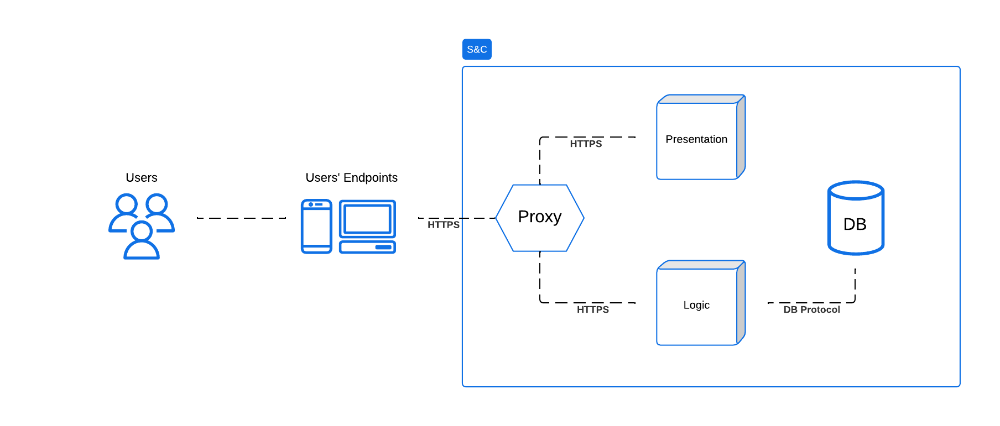

# Design Document

## 1 Introduction

### 1.1 Purpose

The purpose of the Student&Company (S\&C) platform is to enable students to enroll into internships that will enhance their education and strengthen their CVs while letting companies publish internship offers and select the best candidates thought interviews. More over S\&C allow students' universities to monitor each of their students' progress and intervene if needed.
The platform support and aid the users throughout the entire process by provide suggestion to the uploaded CVs and internship offers, automatically matches students and companies thanks to a proprietary algorithm, manage the distribution and collection of interviews and provides a space for filing and resolving complaints. The reader can find more information about the platform in the RASD document. <!-- non so se lasciare questa ultima frase, feedback? -->
In the remaining part of this chapter we will present a summary of the technical choice made for the creation of the platform, along with different tables including the Goals we are try to fullfil with this software and the Definition, Acronyms, Abbreviations used in this document.

### 1.2 Scope

This document, Design Document (DD), will provide a detailed description of the architecture of the S\&C platform from a more technical point of view. In particular it will provide a thorough description of the software with a special emphasis on its interfaces, system module, and architectural framework.
This document will also discuss the implementation, integration and testing plan describing the tools and methodologies that will be used during the development of the platform.
<!-- (Sam 1h)-->
#### 1.2.1 Product domain

#### 1.2.2 Main architectural choices

The architecture of the platform adopt a 3-tier architecture where the front-end is implemented using a web application that communicates with the back-end through a RESTful API.
The back-end, implemented using the Spring framework, will be responsible for the business logic of the platform, as well as the communication to the database, as it will be described in the following chapters while the front-end, following a lightweight architecture, is responsible only for the presentation of the data and the interaction with the user and will be implemented using the React framework.

### 1.3 Definitions, Acronyms, Abbreviations

#### 1.3.1 Definitions

The definition shared between this document and the RASD document are reported in the following table.

| **Term**                    | **Definition**                                                                                           |
|-----------------------------|----------------------------------------------------------------------------------------------------------|
| **University**              | A university that is registered on the S&C platform.                                                    |
| **Company**                 | A company that is registered on the S&C platform.                                                       |
| **Student**                 | A person who is currently enrolled in a University and is registered on the S&C platform.               |
| **User**                    | Any registered entity on the S&C platform.                                                              |
| **Internship Offer**        | The offer of an opportunity to enroll in an internship provided by a Company. The offer remains active on the platform indefinitely until the publishing Company removes it. |
| **Participant**             | An entity that interacts with the platform for the purpose of finding or offering an Internship Position Offer, such as Students and Companies. |
| **Recommendation Process**  | The process of matching a Student with an Internship offered by a Company based on the Student’s CV and the Internship’s requirements. |
| **Recommendation/Match**    | The result of the Recommendation Process, a match between a Student and an Internship.                  |
| **Spontaneous Application** | The process of a Student spontaneously applying for an Internship that was not matched through the Recommendation Process. |
| **Interview**               | The process of evaluating a Student’s application for an Internship conducted by a Company through the S&C platform. |
| **Feedback**                | Information provided by Participants to the S&C platform to improve the Recommendation Process.          |
| **Internship Position Offer** | The formal offer of an internship position presented to a student who has successfully passed the Interview, who can decide to accept or reject it. |
| **Suggestion**              | Information provided by the S&C platform to Participants to improve their CVs and Internship descriptions. |
| **Confirmed Internship**    | An Internship that has been accepted by both the Student and the offering Company.                       |
| **Ongoing Internship**      | An Internship that is currently in progress. All Ongoing Internships are Confirmed Internships, but the vice versa is not always true. |
| **Complaint**               | A report of a problem or issue that a Student or Company has with an Ongoing Internship. It can be published on the platform and handled by the University. |
| **Confirmed Match**         | A match that has been accepted by both a Student and a Company.                                          |
| **Rejected Match**          | A match that has been refused by either a Student or a Company.                                          |
| **Pending Match**           | A match that has been accepted only by a Student or a Company, waiting for a response from the other party. |
| **Unaccepted Match**        | A match that has been refused by either a Student or a Company.|

The definition specific to this document are reported in the following table.

| **Term**                    | **Definition**                                                                                           |
|-----------------------------|----------------------------------------------------------------------------------------------------------|
| **Front-end**               | The part of the software that is responsible for the presentation of the data and the interaction with the user. It is what the user sees and interacts with. |
| **Back-end**                | The part of the software that is responsible for the business logic of the platform and the storage and retrieval of data. It is composed by the servers and the database. It is what the user does not see. |
| **RESTful API**             | A set of rules that software engineer follow when creating an API that allows different software to communicate with each other. |
| **3-tier architecture**     | A software architecture that divides the software into three different layers: presentation layer that contains the logic for displaying data and retrieve input from the user, application layer where the main logic of the software is present, and data layer that contains the data and the logic to access it. |

### 1.3.2 Acronyms

The acronyms shared between this document and the RASD document are reported in the following table.

| **Acronym** | **Definition**                                  |
|-------------|-------------------------------------------------|
| **RASD**    | Requirements Analysis & Specification Document  |
| **CV**      | Curriculum Vitae                                |

The acronyms specific to this document are reported in the following table.

| **Acronym** | **Definition**                                  |
|-------------|-------------------------------------------------|
| **DD**      | Design Document                                 |
| **S&C**     | Student&Company                                 |
| **UI**      | User Interface                                  |
| **UX**      | User Experience                                 |
| **DB**      | Database                                        |
| **API**     | Application Programming Interface               |

### 1.3.3 Abbreviations

The abbreviations shared between this document and the RASD document are reported in the following table.

| **Abbreviation** | **Definition**        |
|-------------------|----------------------|
| **S&C**          | Students & Companies |

The abbreviations specific to this document are reported in the following table.

| **Abbreviation** | **Definition**        |
|-------------------|----------------------|

### 1.4 Revision history

| **Version** | **Date** | **Description** |
|-------------|----------|-----------------|
| 1.0         | ?-01-2025| Initial release of the document. |

### 1.5 Reference documents

- **Assignment RDD AY 2024-2025**: Provided assignment description.
- **Software Engineering 2 A.Y. 2024/2025 Slides**: "Creating DD."
- **RASD document**: The Requirements Analysis & Specification Document of the S&C platform.
<!-- (Sam 1h)-->

## 2 Architectural Design

The system employs a simple microservices architecture initially structured to emulate classical three-tier layer division consisting of the Presentation, Logic, and Data layers. The choice of a microservices structure enables the system to be scalable and to adapt to increasing demand. Additionally, this approach supports deeper decoupling and modularization in the future to handle growing service complexity.

The client access to server content is handled by the proxy, which routes the requests to the right service. In order to make development easier in its early stages, the data layer is meant to be shared between the servers. However, the microservices architecture enables the easy implementation of patterns that allow multiple DB services and ensure their data consistency.

## 4 Requirements Traceability
<!--
Possible Components at the moment: 
### Internal Components
- Recommendation Process
- Communication Manager
- Suggestion Mechanism
- FeedBack Mechanism
- Interviews Manager
- User Management
- Entity Manager

### External Components
- Email Provider API
- Notification Manager
-->
### R1
| **R1** | **The platform shall allow any unregistered students to register by providing personal information and selecting their University.** |
|---------|---------------------------------------|
| **C1**  | Internal Component1                   |
| **C2**  | Internal Component2                   |
| **E1**  | External Component1...                |

*Table: Requirement R1 - Traceability for Student Registration Process.*

### R2
| **R2** | **The platform shall allow any companies to register by providing company information.**                                         |
|---------|---------------------------------------|
| **C1**  | Internal Component1                   |
| **C2**  | Internal Component2                   |
| **E1**  | External Component1...                |

*Table: Requirement R2 - Traceability for Company Registration Process.*

### R3
| **R3** | **The platform shall allow any universities to register by providing university information.**                                    |
|---------|---------------------------------------|
| **C1**  | Internal Component1                                |
| **C2**  | Internal Component2                   |
| **E1**  | External Component1...                |

*Table: Requirement R3 - Traceability for University Registration Process.*

### R4
| **R4** | **The platform shall allow Users to log in using their email and password.**                                                   |
|---------|---------------------------------------|
| **C1**  | Internal Component1                                |
| **C2**  | Internal Component2                   |
| **E1**  | External Component1...                |

*Table: Requirement R4 - Traceability for User Login Functionality.*

### R5
| **R5** | **The platform shall send notifications to Users when relevant events occur.**                                                 |
|---------|---------------------------------------|
| **C1**  | Internal Component1                   |
| **C2**  | Internal Component2                   |
| **E1**  | External Component1...                |

*Table: Requirement R5 - Traceability for Notification Functionality.*

### R6
| **R6** | **The platform shall allow Companies to create and publish Internship offers specifying details.**                              |
|---------|---------------------------------------|
| **C1**  | Internal Component1                   |
| **C2**  | Internal Component2                   |
| **E1**  | External Component1...                |

*Table: Requirement R6 - Traceability for Internship Offer Creation.*

### R7
| **R7** | **The platform shall allow Companies to terminate their Internship offers at their own discretion.**                            |
|---------|---------------------------------------|
| **C1**  | Internal Component1                   |
| **C2**  | Internal Component2                   |
| **E1**  | External Component1...                |

*Table: Requirement R7 - Traceability for Internship Termination.*

### R8
| **R8** | **The platform shall provide Students with Matches automatically obtained by the Recommendation Process.**                     |
|---------|---------------------------------------|
| **C1**  | Internal Component1                   |
| **C2**  | Internal Component2                   |
| **E1**  | External Component1...                |

*Table: Requirement R8 - Traceability for Recommendation Matching.*

### R9
| **R9** | **The platform shall allow Students to view and navigate all available Internships.**                                          |
|---------|---------------------------------------|
| **C1**  | Internal Component1                   |
| **C2**  | Internal Component2                   |
| **E1**  | External Component1...                |

*Table: Requirement R9 - Traceability for Viewing Available Internships.*

### R10
| **R10** | **The platform shall enable Students to submit Spontaneous Applications to Internships they choose.**                         |
|---------|---------------------------------------|
| **C1**  | Internal Component1                   |
| **C2**  | Internal Component2                   |
| **E1**  | External Component1...                |

*Table: Requirement R10 - Traceability for Spontaneous Applications.*

### R11
| **R11** | **The platform shall allow Students to submit their CV.** |
|---------|---------------------------------------|
| **C1**  | Internal Component1                   |
| **C2**  | Internal Component2                   |
| **E1**  | External Component1...                |

*Table: Requirement R11 - Traceability for CV Submission.*

### R12
| **R12** | **The platform shall allow Students to modify their CV.** |
|---------|---------------------------------------|
| **C1**  | Internal Component1                   |
| **C2**  | Internal Component2                   |
| **E1**  | External Component1...                |

*Table: Requirement R12 - Traceability for CV Modification.*

### R13
| **R13** | **The platform shall allow Students to monitor the status of their Spontaneous Applications.** |
|---------|---------------------------------------|
| **C1**  | Internal Component1                   |
| **C2**  | Internal Component2                   |
| **E1**  | External Component1...                |

*Table: Requirement R13 - Traceability for Monitoring Spontaneous Applications.*

### R14
| **R14** | **The platform shall allow Students to monitor the status of their Recommendation.** |
|---------|---------------------------------------|
| **C1**  | Internal Component1                   |
| **C2**  | Internal Component2                   |
| **E1**  | External Component1...                |

*Table: Requirement R14 - Traceability for Monitoring Recommendations.*

### R15
| **R15** | **The platform shall display to Students all the Internships found by the Recommendation Process.** |
|---------|---------------------------------------|
| **C1**  | Internal Component1                   |
| **C2**  | Internal Component2                   |
| **E1**  | External Component1...                |

*Table: Requirement R15 - Traceability for Displaying Recommended Internships.*

### R16
| **R16** | **The platform shall display to Companies all the CVs of Matched Students obtained by the Recommendation Process.** |
|---------|---------------------------------------|
| **C1**  | Internal Component1                   |
| **C2**  | Internal Component2                   |
| **E1**  | External Component1...                |

*Table: Requirement R16 - Traceability for Displaying Matched Student CVs.*

### R17
| **R17** | **The platform shall allow Students and Companies to accept a Recommendation.** |
|---------|---------------------------------------|
| **C1**  | Internal Component1                   |
| **C2**  | Internal Component2                   |
| **E1**  | External Component1...                |

*Table: Requirement R17 - Traceability for Accepting Recommendations.*

### R18
| **R18** | **The platform shall allow Companies to accept a Spontaneous Application.** |
|---------|---------------------------------------|
| **C1**  | Internal Component1                   |
| **C2**  | Internal Component2                   |
| **E1**  | External Component1...                |

*Table: Requirement R18 - Traceability for Accepting Spontaneous Applications.*

### R19
| **R19** | **The platform shall start a Selection Process only if both the Company and the Student have accepted the Recommendation.** |
|---------|---------------------------------------|
| **C1**  | Internal Component1                   |
| **C2**  | Internal Component2                   |
| **E1**  | External Component1...                |

*Table: Requirement R19 - Traceability for Starting Selection Process via Recommendation.*

### R20
| **R20** | **The platform shall start a Selection Process only if the Company has accepted the Spontaneous Application.** |
|---------|---------------------------------------|
| **C1**  | Internal Component1                   |
| **C2**  | Internal Component2                   |
| **E1**  | External Component1...                |

*Table: Requirement R20 - Traceability for Starting Selection Process via Spontaneous Application.*

### R21
| **R21** | **The platform shall allow Companies to create Interviews.** |
|---------|---------------------------------------|
| **C1**  | Internal Component1                   |
| **C2**  | Internal Component2                   |
| **E1**  | External Component1...                |

*Table: Requirement R21 - Traceability for Creating Interviews.*

### R22
| **R22** | **The platform shall allow Companies to submit Interviews to Students they have initiated a Selection Process with.** |
|---------|---------------------------------------|
| **C1**  | Internal Component1                   |
| **C2**  | Internal Component2                   |
| **E1**  | External Component1...                |
 
*Table: Requirement R22 - Traceability for Submitting Interviews.*

### R23
| **R23** | **The platform shall allow Students to answer Interview questions and submit them.** |
|---------|---------------------------------------|
| **C1**  | Internal Component1                   |
| **C2**  | Internal Component2                   |
| **E1**  | External Component1...                |

*Table: Requirement R23 - Traceability for Answering and Submitting Interviews.*

### R24
| **R24** | **The platform shall allow Companies to manually evaluate Interview submissions.** |
|---------|---------------------------------------|
| **C1**  | Internal Component1                   |
| **C2**  | Internal Component2                   |
| **E1**  | External Component1...                |

*Table: Requirement R24 - Traceability for Evaluating Interview Submissions.*

### R25
| **R25** | **The platform shall allow Students and Companies to monitor the status of their Interviews.** |
|---------|---------------------------------------|
| **C1**  | Internal Component1                   |
| **C2**  | Internal Component2                   |
| **E1**  | External Component1...                |

*Table: Requirement R25 - Traceability for Monitoring Interview Status.*

### R26
| **R26** | **The platform shall enable Companies to complete the Interview process by submitting the final outcome to each candidate.** |
|---------|---------------------------------------|
| **C1**  | Internal Component1                   |
| **C2**  | Internal Component2                   |
| **E1**  | External Component1...                |

*Table: Requirement R26 - Traceability for Submitting Interview Outcomes.*

### R27
| **R27** | **The platform shall enable Companies to send an Internship Position Offer to a Student only if he previously passed the relative Interview.** |
|---------|---------------------------------------|
| **C1**  | Internal Component1                   |
| **C2**  | Internal Component2                   |
| **E1**  | External Component1...                |

*Table: Requirement R27 - Traceability for Sending Internship Position Offers.*

### R28
| **R28** | **The platform shall enable Students to accept or reject an Internship Position Offer sent by a Company only if he previously passed the relative Interview.** |
|---------|---------------------------------------|
| **C1**  | Internal Component1                   |
| **C2**  | Internal Component2                   |
| **E1**  | External Component1...                |

*Table: Requirement R28 - Traceability for Accepting or Rejecting Internship Position Offers.*

### R29
| **R29** | **The platform shall collect Feedback from both Students and Companies regarding the Recommendation Process.** |
|---------|---------------------------------------|
| **C1**  | Internal Component1                   |
| **C2**  | Internal Component2                   |
| **E1**  | External Component1...                |

*Table: Requirement R29 - Traceability for Collecting Feedback on Recommendation Process.*

### R30
| **R30** | **The platform shall provide Suggestions to Students on improving their CVs.** |
|---------|---------------------------------------|
| **C1**  | Internal Component1                   |
| **C2**  | Internal Component2                   |
| **E1**  | External Component1...                |

*Table: Requirement R30 - Traceability for Providing CV Improvement Suggestions.*

### R31
| **R31** | **The platform shall provide Suggestions to Companies on improving Internship descriptions.** |
|---------|---------------------------------------|
| **C1**  | Internal Component1                   |
| **C2**  | Internal Component2                   |
| **E1**  | External Component1...                |

*Table: Requirement R31 - Traceability for Improving Internship Descriptions.*

### R32
| **R32** | **The platform shall allow registered Universities to access and monitor Internship Communications related to their Students.** |
|---------|---------------------------------------|
| **C1**  | Internal Component1                   |
| **C2**  | Internal Component2                   |
| **E1**  | External Component1...                |

*Table: Requirement R32 - Traceability for Monitoring Internship Communications by Universities.*

### R33
| **R33** | **The platform shall provide a dedicated space for Students and Companies to exchange Communications about the current status of an Ongoing Internship.** |
|---------|---------------------------------------|
| **C1**  | Internal Component1                   |
| **C2**  | Internal Component2                   |
| **E1**  | External Component1...                |

*Table: Requirement R33 - Traceability for Communication Space for Ongoing Internships.*

### R34
| **R34** | **The platform shall allow registered Universities to handle Complaints and to interrupt an Internship at their own discretion.** |
|---------|---------------------------------------|
| **C1**  | Internal Component1                   |
| **C2**  | Internal Component2                   |
| **E1**  | External Component1...                |

*Table: Requirement R34 - Traceability for Handling Complaints and Internship Termination.*
<!-- (Matteo [2hr])-->