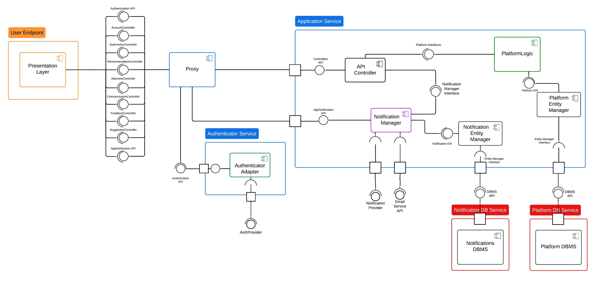
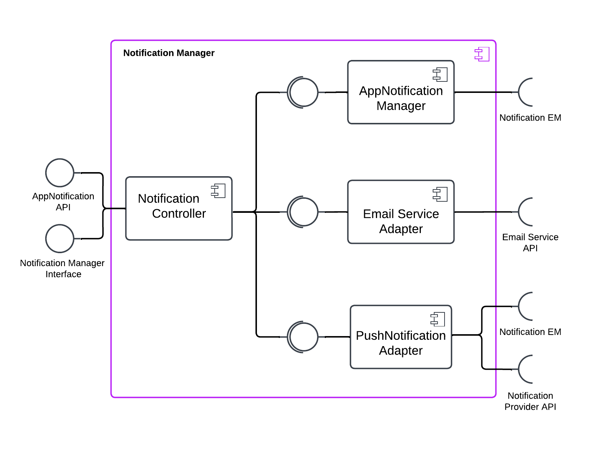

# Design Document

## 1 Introduction

### 1.1 Purpose

The purpose of the Student\&Company (S\&C) platform is to enable students to enroll into internships that will enhance their education and strengthen their CVs while letting companies publish internship offers and select the best candidates thought interviews. More over, S\&C allow students' universities to monitor each of their students' progress and intervene if needed.
The platform support and aid the users throughout the entire process by provide suggestion to the uploaded CVs and internship offers, automatically matches students and companies thanks to a proprietary algorithm, manage the distribution and collection of interviews and provides a space for filing and resolving complaints. The reader can find more information about the platform in the RASD document.
In the remaining part of this chapter we will present a summary of the technical choice made for the creation of the platform and different bullet point lists and table including the Goals that we are trying to accomplish with this software and the Definition, Acronyms, Abbreviations used in this document.

#### 1.1.1 Goals

| **Goal ID** | **Goal Description** |
|-------------|-----------------------|
| **G1**      | Companies would like to advertise the internships they offer. |
| **G2**      | Students would like to autonomously candidate for available internships. |
| **G3**      | Students would like to be matched with internships they might be interested in. |
| **G4**      | Companies would like to perform interviews with suitable students. |
| **G5**      | Students and companies would like to complain, communicate problems, and provide information about an ongoing internship. |
| **G6**      | Students and companies would like to be provided with suggestions about how to improve their submission. |
| **G7**      | Universities would like to handle complaints about ongoing internships. |
| **G8**      | Students would like to choose which internship to attend from among those for which they passed the interview. |
| **G9**      | Companies would like to select students for the internship position among those who passed the interview. |

### 1.2 Scope

This document, Design Document (DD), will provide a detailed description of the architecture of the S\&C platform from a more technical point of view. In particular it will provide a thorough description of the software with a special emphasis on its interfaces, system module, and architectural framework.
This document will also discuss the implementation, integration and testing plan describing the tools and methodologies that will be used during the development of the platform.
<!-- (Sam 1h)-->

#### 1.2.1 Main architectural choices

The chosen architectural style is a *microservices architecture*, as it enables a scalable and modular approach to development. The three main services are Presentation, Application, and Authenticator, which are responsible for the user interface, business logic, and authentication, respectively. Data-intensive service manage their data through autonomous databases, ensuring modularity and scalability. For now, the databases are not designed to scale horizontally, meaning that when services using them are duplicated, the database remains a single, centralized instance. The Presentation layer provides the client with a Single Page Application (SPA) for a smoother user experience. The Application layer contains modules that handle platform-specific logic services, which could be exported as independent services in the future. This setup facilitates reliability and fault tolerance, as each service is designed to be container-based and can be scaled vertically or horizontally using cloud orchestration tools during deployment.
<!-- 
The architecture of the platform adopt a 3-tier architecture where the front-end is implemented using a web application that communicates with the back-end through a RESTful API.
The back-end, implemented using the Spring framework, will be responsible for the business logic of the platform, as well as the communication to the database, as it will be described in the following chapters while the front-end, following a lightweight architecture, is responsible only for the presentation of the data and the interaction with the user and will be implemented using the React framework. -->

### 1.3 Definitions, Acronyms, Abbreviations

This section provides definitions and explanations of the terms, acronyms, and abbreviations used throughout the document, making it easier for readers to understand and reference them.

#### 1.3.1 Definitions

The definition shared between this document and the RASD document are reported in the following table.

| **Term**                    | **Definition**                                                                                           |
|-----------------------------|----------------------------------------------------------------------------------------------------------|
| **University**              | A university that is registered on the S&C platform.                                                    |
| **Company**                 | A company that is registered on the S&C platform.                                                       |
| **Student**                 | A person who is currently enrolled in a University and is registered on the S&C platform.               |
| **User**                    | Any registered entity on the S&C platform.                                                              |
| **Internship Offer**        | The offer of an opportunity to enroll in an internship provided by a Company. The offer remains active on the platform indefinitely until the publishing Company removes it. |
| **Participant**             | An entity that interacts with the platform for the purpose of finding or offering an Internship Position Offer, such as Students and Companies. |
| **Recommendation Process**  | The process of matching a Student with an Internship offered by a Company based on the Student’s CV and the Internship’s requirements. |
| **Recommendation/Match**    | The result of the Recommendation Process, a match between a Student and an Internship.                  |
| **Spontaneous Application** | The process of a Student spontaneously applying for an Internship that was not matched through the Recommendation Process. |
| **Interview**               | The process of evaluating a Student’s application for an Internship conducted by a Company through the S&C platform. |
| **Feedback**                | Information provided by Participants to the S&C platform to improve the Recommendation Process.          |
| **Internship Position Offer** | The formal offer of an internship position presented to a student who has successfully passed the Interview, who can decide to accept or reject it. |
| **Suggestion**              | Information provided by the S&C platform to Participants to improve their CVs and Internship descriptions. |
| **Confirmed Internship**    | An Internship that has been accepted by both the Student and the offering Company.                       |
| **Ongoing Internship**      | An Internship that is currently in progress. All Ongoing Internships are Confirmed Internships, but the vice versa is not always true. |
| **Complaint**               | A report of a problem or issue that a Student or Company has with an Ongoing Internship. It can be published on the platform and handled by the University. |
| **Confirmed Match**         | A match that has been accepted by both a Student and a Company.                                          |
| **Rejected Match**          | A match that has been refused by either a Student or a Company.                                          |
| **Pending Match**           | A match that has been accepted only by a Student or a Company, waiting for a response from the other party. |
| **Unaccepted Match**        | A match that has been refused by either a Student or a Company.|

The definition specific to this document are reported in the following table.

| **Term**                    | **Definition**                                                                                           |
|-----------------------------|----------------------------------------------------------------------------------------------------------|
| **Front-end**               | The part of the software that is responsible for the presentation of the data and the interaction with the user. It is what the user sees and interacts with. |
| **Back-end**                | The part of the software that is responsible for the business logic of the platform and the storage and retrieval of data. It is composed by the servers and the database. It is what the user does not see. |
| **RESTful API**             | A set of rules that software engineer follow when creating an API that allows different software to communicate with each other. |
| **3-tier architecture**     | A software architecture that divides the software into three different layers: presentation layer that contains the logic for displaying data and retrieve input from the user, application layer where the main logic of the software is present, and data layer that contains the data and the logic to access it. |
| **Proxy**                   | A server that acts as an intermediary for requests from clients seeking resources from other servers. It can redirect information based on different criteria. |

#### 1.3.2 Acronyms

The acronyms shared between this document and the RASD document are reported in the following table.

| **Acronym** | **Definition**                                  |
|-------------|-------------------------------------------------|
| **RASD**    | Requirements Analysis & Specification Document  |
| **CV**      | Curriculum Vitae                                |

The acronyms specific to this document are reported in the following table.

| **Acronym** | **Definition**                                  |
|-------------|-------------------------------------------------|
| **DD**      | Design Document                                 |
| **S&C**     | Student&Company                                 |
| **UI**      | User Interface                                  |
| **UX**      | User Experience                                 |
| **DB**      | Database                                        |
| **API**     | Application Programming Interface               |

#### 1.3.3 Abbreviations

The abbreviations shared between this document and the RASD document are reported in the following table.

| **Abbreviation** | **Definition**        |
|-------------------|----------------------|
| **S&C**          | Students & Companies |

The abbreviations specific to this document are reported in the following table.

| **Abbreviation** | **Definition**        |
|-------------------|----------------------|

### 1.4 Revision history

| **Version** | **Date** | **Description** |
|-------------|----------|-----------------|
| 1.0         | ?-01-2025| Initial release of the document. |

### 1.5 Reference documents

- **Assignment RDD AY 2024-2025**: Provided assignment description.
- **Software Engineering 2 A.Y. 2024/2025 Slides**: "Creating DD."
- **RASD document**: The Requirements Analysis & Specification Document of the S&C platform.
<!-- (Sam 1h)-->

### 1.6 Document structure

This document is structured as follows:
- Section 1: *Introduction*: P a short summary of the RASD, the purpose, definition and acronyms used in this document and a non-technical description of the technical choices made for the platform's implementation.
- Section 2: *Architectural Design*: presents a top-down description of the S&C architectural design starting from a high-level description of groups of components and their interactions, explaining the different areas of the platform and the design decisions made to realize them. \\
Following this, it offers a more detailed view of these groups, describing the components they consist of, their interfaces, and the architectural styles and patterns applied. \\
Finally, we present a deployment view of a full system deployment with redundant service and a different runtime views represented through sequence diagrams.
- Section 3: *User Interface Design*: Provides images and description of the user interface design of the platform. With respect to the RASD, this section will provide a more technical description of the user interface design.ù
- Section 4: *Requirements Traceability*: Contains a traceability matrix linking the requirements defined previously in the RASD to the components of the system that will implement them.
- Section 5: *Implementation, Integration and Test Plan*: Details the tools and methodologies that will be used during the development of the platform to test the correctness and ensure the quality of the software.
- Section 6: *Effort Spent*: Contains a table with the hours spent by each member of the group to develop this document. 
<!-- (Sam 0.5h)-->

## 2 Architectural Design

The purpose of this chapter is to present a top-down description of the S&C architectural design, covering and justifying every design decision.
We begin by introducing the high-level components and their interactions, followed by a detailed description of these components through the component view, focusing on their internal structure.
Next, we address the deployment and conclude with runtime views, represented through sequence diagrams, to illustrate the interactions between the components.

### 2.1 Overview: High-level components and their interaction

The system employs a simple microservices architecture composed of the Presentation, Application, and Authenticator services, along with databases to manage the Application data. This microservices structure enables the system to be scalable and adaptable to increasing demand. Additionally, it supports deeper decoupling and modularization in the future, facilitating the management of growing service complexity.

Client access to server content is handled by a proxy, which routes requests to the appropriate service. When users navigate to the platform's main domain using a browser, the proxy directs them to the Presentation service, which is responsible for the user interface and experience. The web interface communicates with the Application service via a RESTful API, which handles the business logic. The Application interacts with the databases through an API that manages the ORM, data life cycles, and querying processes.

The Authenticator service handles user authentication. Non-public API calls pass through the proxy, acting as an API gateway, to verify that users have the necessary permissions to access requested resources.

#### 2.1.1 Presentation Service

The Presentation service delivers static content to the client upon connection to the platform's main domain. It also provides the client with the web scripts needed to call the APIs of the Application service, enabling the retrieval of user-specific data and triggering the platform's logic. During runtime, API calls to other services are initiated directly from the client's endpoints, rather than being forwarded through the Presentation service.

#### 2.1.2 Authenticator Service

API calls can be either public or private. Public calls are accessible to non-authenticated users, while private calls handle personal user data or sensitive logic and require authentication before they can be executed. All API calls are routed through the proxy, which determines the appropriate service based on the call type: private calls are directed to the Authenticator service for validation, while public calls are forwarded directly to the target service. This centralized approach to authentication ensures consistency across all services, eliminating the need for each service to handle authentication independently.

#### 2.1.3 Application Service

The Application service contains the platform core functionalities such as the platform logic, the interaction with the database and the notification handling. It exposes different APIs for all the different services it offers.

### 2.2 Component view

This section presents a more in depth view of the software components part of the designed architecture and the needed interfaces between them.

#### 2.2.1 Entity Manager

This Entity Manager act as an API that enables the communication with a DBMS, simplifying ORM, querying, and data life cycles. It provides standard methods, independents from the specific DBMS used to handle the data. As shown by the diagram there are two entity managers. The \emph{Platform Entity Manager} provides its interface to the Platform Logic Module to let it interact with the \emph{Platform DBMS}. The \emph{Notification Entity Manager} act analogously with the \emph{Notification DBMS}.

#### 2.2.2 Platform Logic

This component exposes all the necessary interfaces to interact with the platform logic and also maintains up to date the database interacting with the Entity Manager. Its inner components are software pieces that enable managing every logic area of the platform, providing the right interfaces to other pieces that depend on them. Every \emph{Manager Component} autonomously operates the persistence and consistence of the relative relevant data within the DB using the interface provided by the Entity Manager. They also provide the \emph{API Controller} a set of methods to execute the logic without the need to care about the database interaction.

#### 2.2.3 API Controller

The API Controller contains a set of controllers whose methods, triggered by the user, interact and execute the platform logic. More information about the inner components and methods in section ADD LABEL

#### 2.2.4 Notification Manager

This component handles every need concerning the notifications, no matter what kind they are. It works as an adapter for external push notification provider and email service and provide an interface to fluently provide other service with those external features. It also creates and manage the corresponding in-app notifications that can be fetched by the user through a service specific API. This Component is a clear example of a service that could be easily exported to its own container in future by, for example, by providing its own RESTful API to the Platform logic instead of an interface object like the actual setup. 

### 2.3 Deployment view

Each service will be hosted on its own container being able to run independently on the same or on different machines. Containers, in addiction to make the development and deployment easier, also provide a good level of isolation and security.
The system will be hosted on the cloud and its container based nature allows to easily integrate orchestrator tools to decouple it from the cloud hosting provider and automatically manage scalability, reliability, fault tolerance and global security of the microservices cluster.

### 2.4 Runtime view

#### Note for Runtime view

- The authenticator creates, updates, validates the token. A unique userID is obtained through the token after Authenticator validation.
- Dire che anche le api call sono una sorta di pseudocodice
- success : void senza errori e update/inser/remove db e tutto il resto
- result non void (generico) tipicamente usato dopo alt
- result risultato generico (anche query db)

- specificare differenza UserData e Usercredential SD1
- come oggetto di ritorno per le notifiche mettiamo data (se non viene mandato un oggetto di ritorno)

#### notazione db SD

- success : update-insert-remove
- result : buildAndExecuteQuery-insert&query-update&query o query&update ecc. 

- alt per ogni codice di uscita (400, 200, 201, 500, 409, 401)
- controllare le alt

- spiegare parametro Data in notifyUser(UserIDs, Data) e controllare che sia Data generico ovunque!!!

- cerca le scritte rosse e rimuovile o spiegale (sendConfEmail)

### 2.5 Component interfaces (maybe before Runtime View)

### 2.6 Selected architectural styles and patterns

### 2.7 Other design decisions

## 3 User Interface Design

The web interface is a single page application (SPA) that allows a wide number of interaction without the need of refreshing the page, providing a smoother user experience.  

## 4 Requirements Traceability
<!--
Possible Components at the moment: 
### Internal Components
- Recommendation Process
- Communication Manager
- Suggestion Mechanism
- FeedBack Mechanism
- Interviews Manager
- User Management
- Entity Manager

### External Components
- Email Provider API
- Notification Manager
-->
### R1
| **R1** | **The platform shall allow any unregistered students to register by providing personal information and selecting their University.** |
|---------|---------------------------------------|
| **C1**  | Internal Component1                   |
| **C2**  | Internal Component2                   |
| **E1**  | External Component1...                |

*Table: Requirement R1 - Traceability for Student Registration Process.*

### R2
| **R2** | **The platform shall allow any companies to register by providing company information.**                                         |
|---------|---------------------------------------|
| **C1**  | Internal Component1                   |
| **C2**  | Internal Component2                   |
| **E1**  | External Component1...                |

*Table: Requirement R2 - Traceability for Company Registration Process.*

### R3
| **R3** | **The platform shall allow any universities to register by providing university information.**                                    |
|---------|---------------------------------------|
| **C1**  | Internal Component1                                |
| **C2**  | Internal Component2                   |
| **E1**  | External Component1...                |

*Table: Requirement R3 - Traceability for University Registration Process.*

### R4
| **R4** | **The platform shall allow Users to log in using their email and password.**                                                   |
|---------|---------------------------------------|
| **C1**  | Internal Component1                                |
| **C2**  | Internal Component2                   |
| **E1**  | External Component1...                |

*Table: Requirement R4 - Traceability for User Login Functionality.*

### R5
| **R5** | **The platform shall send notifications to Users when relevant events occur.**                                                 |
|---------|---------------------------------------|
| **C1**  | Internal Component1                   |
| **C2**  | Internal Component2                   |
| **E1**  | External Component1...                |

*Table: Requirement R5 - Traceability for Notification Functionality.*

### R6
| **R6** | **The platform shall allow Companies to create and publish Internship offers specifying details.**                              |
|---------|---------------------------------------|
| **C1**  | Internal Component1                   |
| **C2**  | Internal Component2                   |
| **E1**  | External Component1...                |

*Table: Requirement R6 - Traceability for Internship Offer Creation.*

### R7
| **R7** | **The platform shall allow Companies to terminate their Internship offers at their own discretion.**                            |
|---------|---------------------------------------|
| **C1**  | Internal Component1                   |
| **C2**  | Internal Component2                   |
| **E1**  | External Component1...                |

*Table: Requirement R7 - Traceability for Internship Termination.*

### R8
| **R8** | **The platform shall provide Students with Matches automatically obtained by the Recommendation Process.**                     |
|---------|---------------------------------------|
| **C1**  | Internal Component1                   |
| **C2**  | Internal Component2                   |
| **E1**  | External Component1...                |

*Table: Requirement R8 - Traceability for Recommendation Matching.*

### R9
| **R9** | **The platform shall allow Students to view and navigate all available Internships.**                                          |
|---------|---------------------------------------|
| **C1**  | Internal Component1                   |
| **C2**  | Internal Component2                   |
| **E1**  | External Component1...                |

*Table: Requirement R9 - Traceability for Viewing Available Internships.*

### R10
| **R10** | **The platform shall enable Students to submit Spontaneous Applications to Internships they choose.**                         |
|---------|---------------------------------------|
| **C1**  | Internal Component1                   |
| **C2**  | Internal Component2                   |
| **E1**  | External Component1...                |

*Table: Requirement R10 - Traceability for Spontaneous Applications.*

### R11
| **R11** | **The platform shall allow Students to submit their CV.** |
|---------|---------------------------------------|
| **C1**  | Internal Component1                   |
| **C2**  | Internal Component2                   |
| **E1**  | External Component1...                |

*Table: Requirement R11 - Traceability for CV Submission.*

### R12
| **R12** | **The platform shall allow Students to modify their CV.** |
|---------|---------------------------------------|
| **C1**  | Internal Component1                   |
| **C2**  | Internal Component2                   |
| **E1**  | External Component1...                |

*Table: Requirement R12 - Traceability for CV Modification.*

### R13
| **R13** | **The platform shall allow Students to monitor the status of their Spontaneous Applications.** |
|---------|---------------------------------------|
| **C1**  | Internal Component1                   |
| **C2**  | Internal Component2                   |
| **E1**  | External Component1...                |

*Table: Requirement R13 - Traceability for Monitoring Spontaneous Applications.*

### R14
| **R14** | **The platform shall allow Students to monitor the status of their Recommendation.** |
|---------|---------------------------------------|
| **C1**  | Internal Component1                   |
| **C2**  | Internal Component2                   |
| **E1**  | External Component1...                |

*Table: Requirement R14 - Traceability for Monitoring Recommendations.*

### R15
| **R15** | **The platform shall display to Students all the Internships found by the Recommendation Process.** |
|---------|---------------------------------------|
| **C1**  | Internal Component1                   |
| **C2**  | Internal Component2                   |
| **E1**  | External Component1...                |

*Table: Requirement R15 - Traceability for Displaying Recommended Internships.*

### R16
| **R16** | **The platform shall display to Companies all the CVs of Matched Students obtained by the Recommendation Process.** |
|---------|---------------------------------------|
| **C1**  | Internal Component1                   |
| **C2**  | Internal Component2                   |
| **E1**  | External Component1...                |

*Table: Requirement R16 - Traceability for Displaying Matched Student CVs.*

### R17
| **R17** | **The platform shall allow Students and Companies to accept a Recommendation.** |
|---------|---------------------------------------|
| **C1**  | Internal Component1                   |
| **C2**  | Internal Component2                   |
| **E1**  | External Component1...                |

*Table: Requirement R17 - Traceability for Accepting Recommendations.*

### R18
| **R18** | **The platform shall allow Companies to accept a Spontaneous Application.** |
|---------|---------------------------------------|
| **C1**  | Internal Component1                   |
| **C2**  | Internal Component2                   |
| **E1**  | External Component1...                |

*Table: Requirement R18 - Traceability for Accepting Spontaneous Applications.*

### R19
| **R19** | **The platform shall start a Selection Process only if both the Company and the Student have accepted the Recommendation.** |
|---------|---------------------------------------|
| **C1**  | Internal Component1                   |
| **C2**  | Internal Component2                   |
| **E1**  | External Component1...                |

*Table: Requirement R19 - Traceability for Starting Selection Process via Recommendation.*

### R20
| **R20** | **The platform shall start a Selection Process only if the Company has accepted the Spontaneous Application.** |
|---------|---------------------------------------|
| **C1**  | Internal Component1                   |
| **C2**  | Internal Component2                   |
| **E1**  | External Component1...                |

*Table: Requirement R20 - Traceability for Starting Selection Process via Spontaneous Application.*

### R21
| **R21** | **The platform shall allow Companies to create Interviews.** |
|---------|---------------------------------------|
| **C1**  | Internal Component1                   |
| **C2**  | Internal Component2                   |
| **E1**  | External Component1...                |

*Table: Requirement R21 - Traceability for Creating Interviews.*

### R22
| **R22** | **The platform shall allow Companies to submit Interviews to Students they have initiated a Selection Process with.** |
|---------|---------------------------------------|
| **C1**  | Internal Component1                   |
| **C2**  | Internal Component2                   |
| **E1**  | External Component1...                |
 
*Table: Requirement R22 - Traceability for Submitting Interviews.*

### R23
| **R23** | **The platform shall allow Students to answer Interview questions and submit them.** |
|---------|---------------------------------------|
| **C1**  | Internal Component1                   |
| **C2**  | Internal Component2                   |
| **E1**  | External Component1...                |

*Table: Requirement R23 - Traceability for Answering and Submitting Interviews.*

### R24
| **R24** | **The platform shall allow Companies to manually evaluate Interview submissions.** |
|---------|---------------------------------------|
| **C1**  | Internal Component1                   |
| **C2**  | Internal Component2                   |
| **E1**  | External Component1...                |

*Table: Requirement R24 - Traceability for Evaluating Interview Submissions.*

### R25
| **R25** | **The platform shall allow Students and Companies to monitor the status of their Interviews.** |
|---------|---------------------------------------|
| **C1**  | Internal Component1                   |
| **C2**  | Internal Component2                   |
| **E1**  | External Component1...                |

*Table: Requirement R25 - Traceability for Monitoring Interview Status.*

### R26
| **R26** | **The platform shall enable Companies to complete the Interview process by submitting the final outcome to each candidate.** |
|---------|---------------------------------------|
| **C1**  | Internal Component1                   |
| **C2**  | Internal Component2                   |
| **E1**  | External Component1...                |

*Table: Requirement R26 - Traceability for Submitting Interview Outcomes.*

### R27
| **R27** | **The platform shall enable Companies to send an Internship Position Offer to a Student only if he previously passed the relative Interview.** |
|---------|---------------------------------------|
| **C1**  | Internal Component1                   |
| **C2**  | Internal Component2                   |
| **E1**  | External Component1...                |

*Table: Requirement R27 - Traceability for Sending Internship Position Offers.*

### R28
| **R28** | **The platform shall enable Students to accept or reject an Internship Position Offer sent by a Company only if he previously passed the relative Interview.** |
|---------|---------------------------------------|
| **C1**  | Internal Component1                   |
| **C2**  | Internal Component2                   |
| **E1**  | External Component1...                |

*Table: Requirement R28 - Traceability for Accepting or Rejecting Internship Position Offers.*

### R29
| **R29** | **The platform shall collect Feedback from both Students and Companies regarding the Recommendation Process.** |
|---------|---------------------------------------|
| **C1**  | Internal Component1                   |
| **C2**  | Internal Component2                   |
| **E1**  | External Component1...                |

*Table: Requirement R29 - Traceability for Collecting Feedback on Recommendation Process.*

### R30
| **R30** | **The platform shall provide Suggestions to Students on improving their CVs.** |
|---------|---------------------------------------|
| **C1**  | Internal Component1                   |
| **C2**  | Internal Component2                   |
| **E1**  | External Component1...                |

*Table: Requirement R30 - Traceability for Providing CV Improvement Suggestions.*

### R31
| **R31** | **The platform shall provide Suggestions to Companies on improving Internship descriptions.** |
|---------|---------------------------------------|
| **C1**  | Internal Component1                   |
| **C2**  | Internal Component2                   |
| **E1**  | External Component1...                |

*Table: Requirement R31 - Traceability for Improving Internship Descriptions.*

### R32
| **R32** | **The platform shall allow registered Universities to access and monitor Internship Communications related to their Students.** |
|---------|---------------------------------------|
| **C1**  | Internal Component1                   |
| **C2**  | Internal Component2                   |
| **E1**  | External Component1...                |

*Table: Requirement R32 - Traceability for Monitoring Internship Communications by Universities.*

### R33
| **R33** | **The platform shall provide a dedicated space for Students and Companies to exchange Communications about the current status of an Ongoing Internship.** |
|---------|---------------------------------------|
| **C1**  | Internal Component1                   |
| **C2**  | Internal Component2                   |
| **E1**  | External Component1...                |

*Table: Requirement R33 - Traceability for Communication Space for Ongoing Internships.*

### R34
| **R34** | **The platform shall allow registered Universities to handle Complaints and to interrupt an Internship at their own discretion.** |
|---------|---------------------------------------|
| **C1**  | Internal Component1                   |
| **C2**  | Internal Component2                   |
| **E1**  | External Component1...                |

*Table: Requirement R34 - Traceability for Handling Complaints and Internship Termination.*
<!-- (Matteo [2hr])-->

## 6 Effort Spent

### Lorenzo Ricci

| **Section** | **Hours** |
|-------------|-----------|
| Introduction | X |
| Architectural Design | X |
| User Interface Design | X |
| Requirements Traceability | X |
| Implementation, Integration and Test Plan | X |
| Misc Activities | 5 |

### Matteo Giovanni Paoli

| **Section** | **Hours** |
|-------------|-----------|
| Introduction | X |
| Architectural Design | 2 |
| User Interface Design | X |
| Requirements Traceability | 2 |
| Implementation, Integration and Test Plan | X |
| Misc Activities | X |

### Samuele Grisoni

| **Section** | **Hours** |
|-------------|-----------|
| Introduction | X |
| Architectural Design | X |
| User Interface Design | X |
| Requirements Traceability | X |
| Implementation, Integration and Test Plan | X |
| Misc Activities | X |