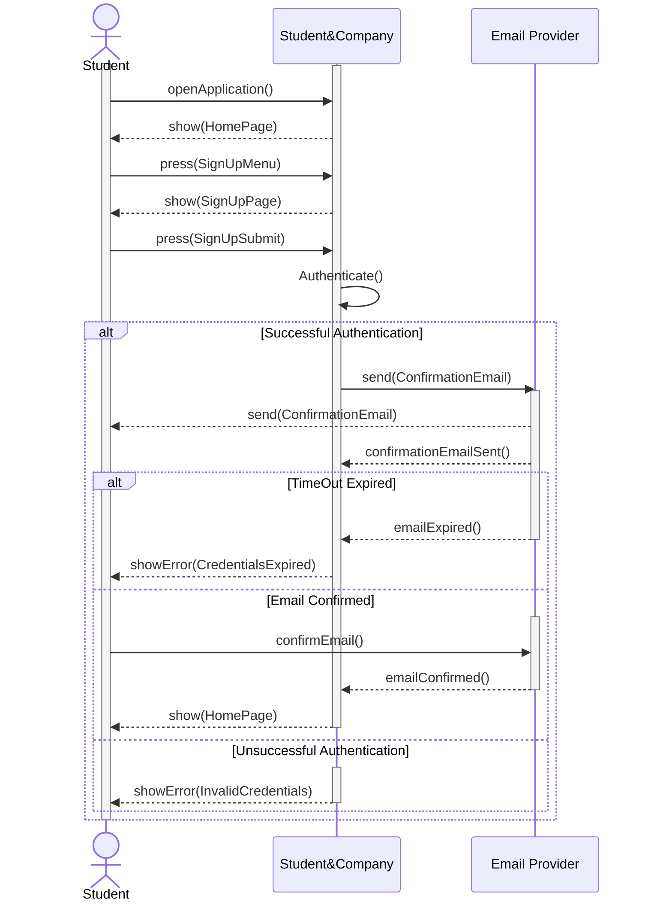

```mermaid

%% Student Signup
sequenceDiagram
    actor  Student
    participant Student&Company
    participant  Email Provider
    activate Student 
    activate Student&Company
    Student ->> Student&Company: openApplication()
    Student&Company -->> Student: show(HomePage)
    Student ->> Student&Company: press(SignUpMenu)
    Student&Company -->> Student: show(SignUpPage)
    Student ->> Student&Company: press(SignUpSubmit)
    Student&Company ->> Student&Company: Authenticate()
    alt Successful Authentication
    Student&Company ->> Email Provider: send(ConfirmationEmail)
    activate Email Provider
    Email Provider -->> Student: send(ConfirmationEmail)
    Email Provider -->> Student&Company: confirmationEmailSent()
    alt TimeOut Expired
        Email Provider -->> Student&Company: emailExpired()
        deactivate Email Provider
        Student&Company -->> Student: showError(CredentialsExpired)
    else Email Confirmed
        activate Email Provider
        Student ->> Email Provider: confirmEmail()
        Email Provider -->> Student&Company: emailConfirmed()
        deactivate Email Provider
    Student&Company -->> Student: show(HomePage)
    deactivate Student&Company
    else Unsuccessful Authentication
    activate Student&Company
    Student&Company -->> Student: showError(InvalidCredentials)
    deactivate Student&Company
    end
    end
    deactivate Student
```

```mermaid
%% Student Signup
sequenceDiagram
    
```