# StudentSignup
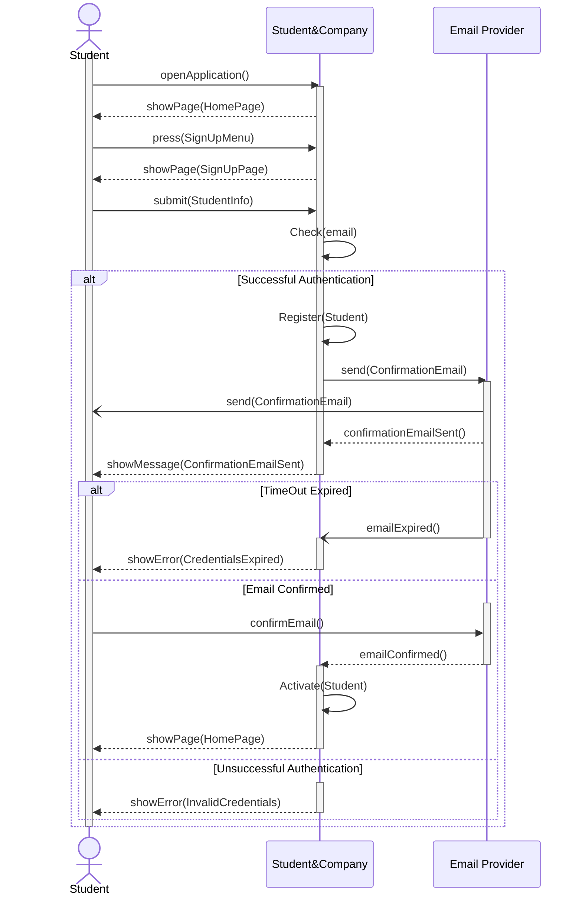

# CompanySignUp

# UniversitySignUp
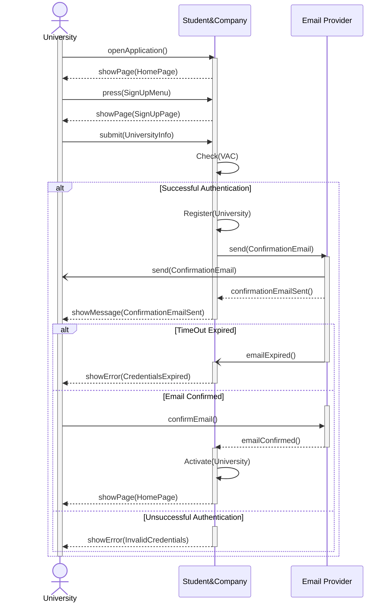

# UserSignIn
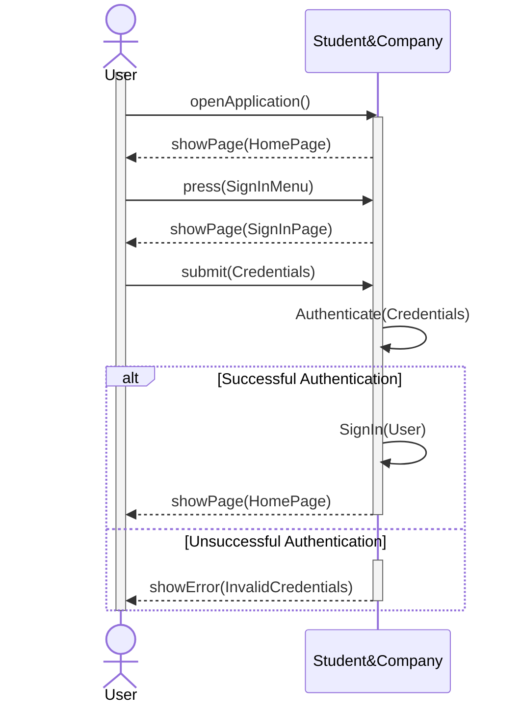

# LoadCurriculum
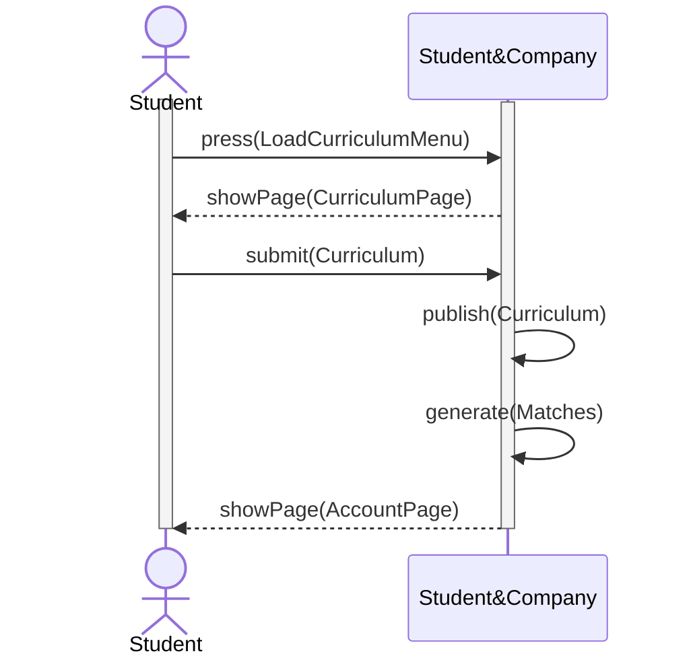

# AdvertiseInternship
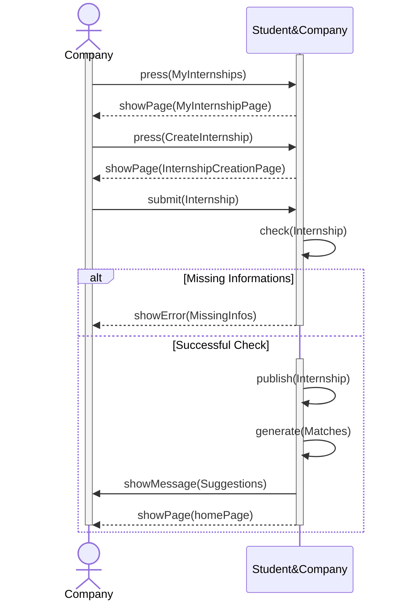

# SpontaneousApplication
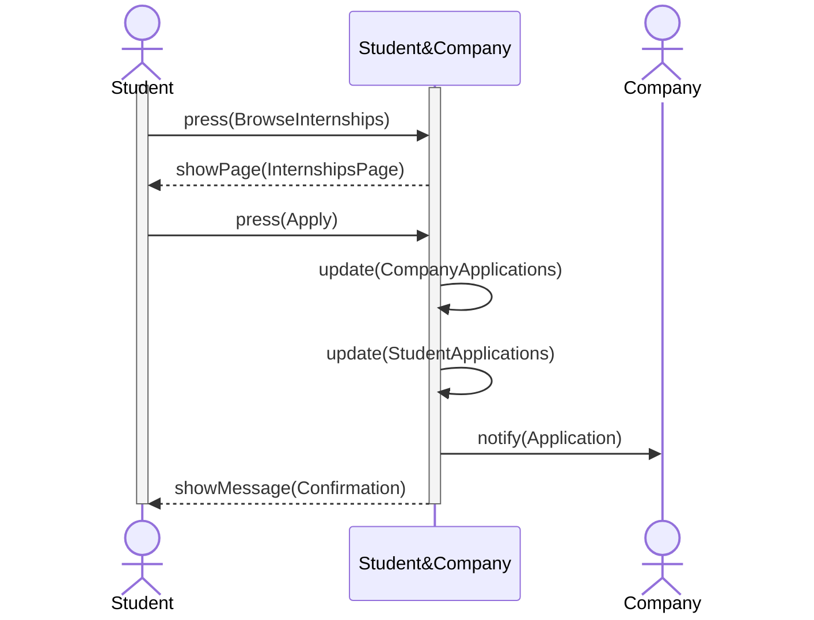
%% Should Company be active or not?
%% Do the update functions make sense?

# AcceptMatch
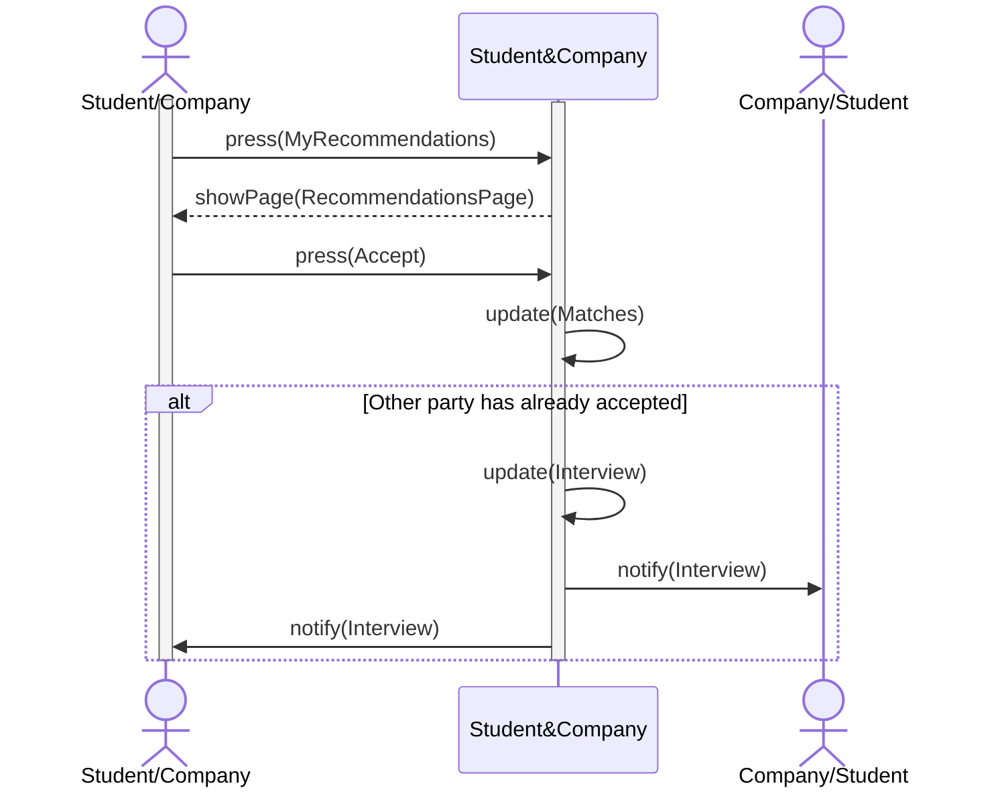

# FeedbackMechanism
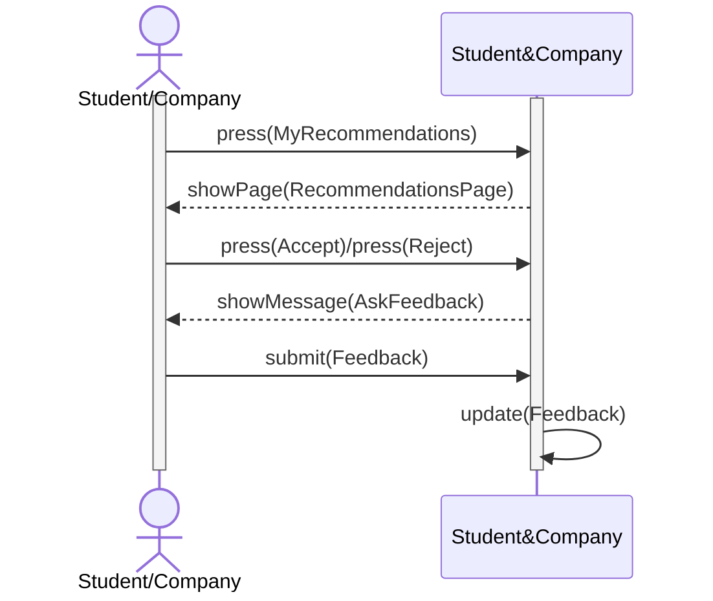

# AssignInterview
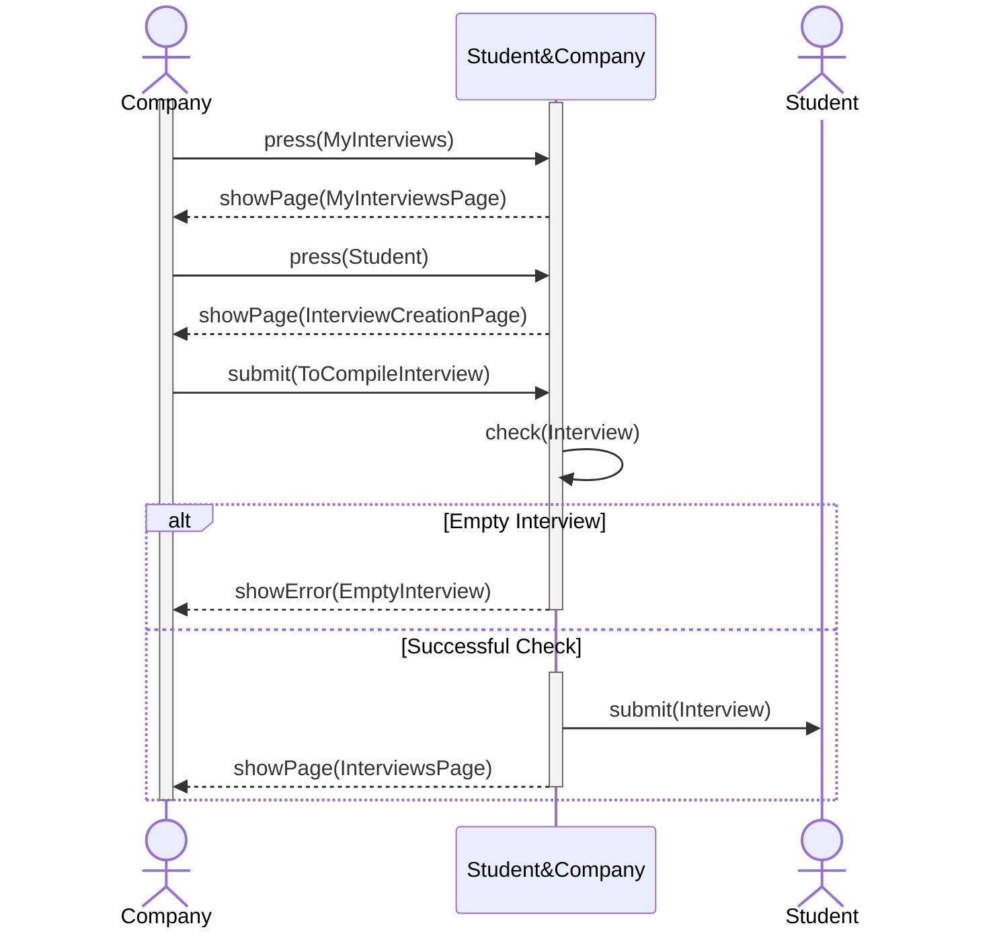

# PublishComplaint
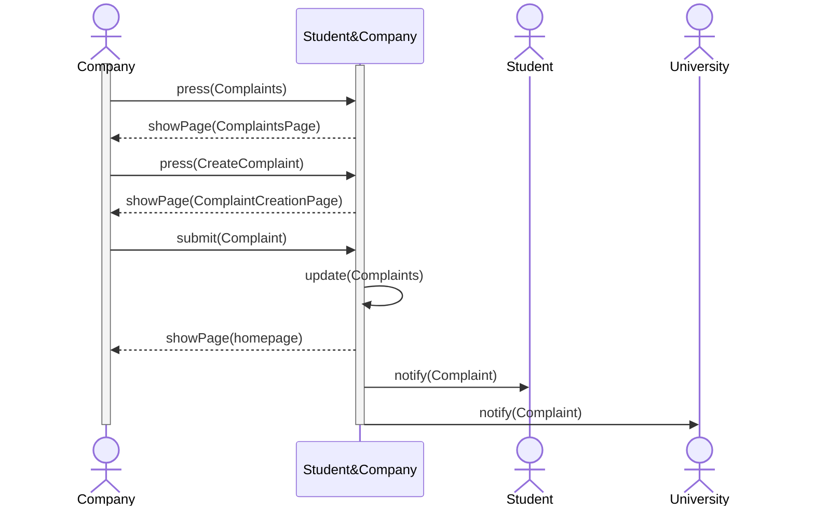

# RespondToComplaint
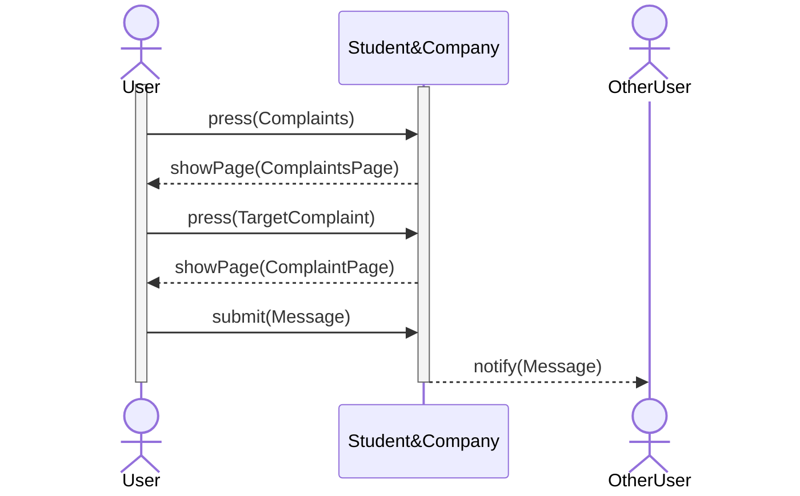

# TerminateInternship
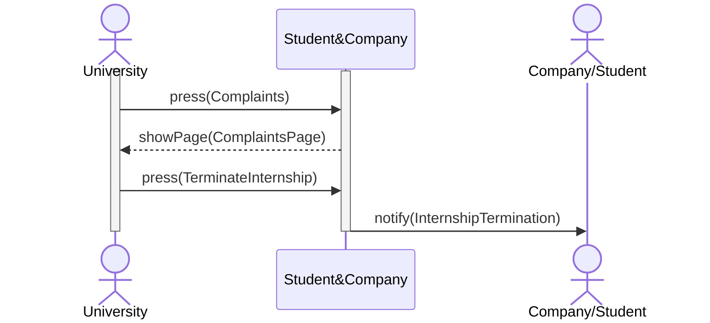