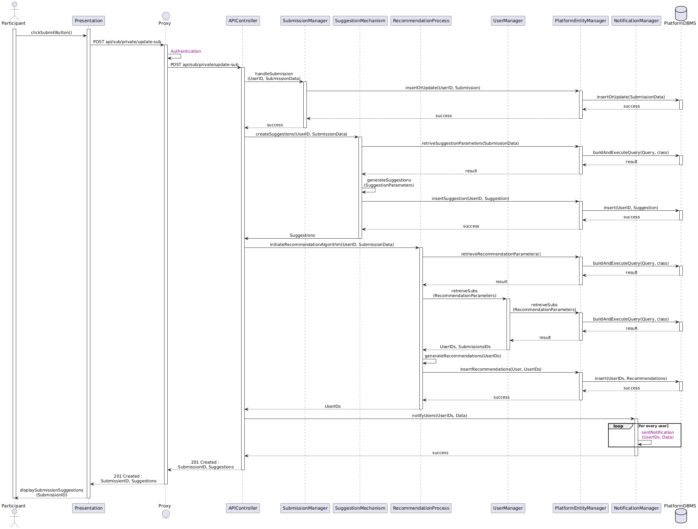
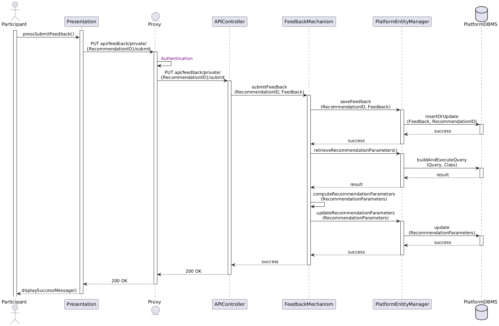
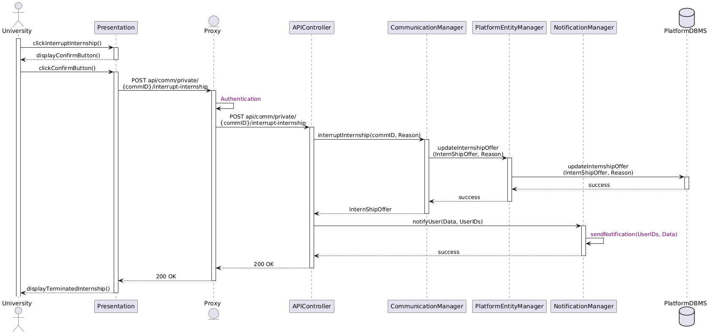
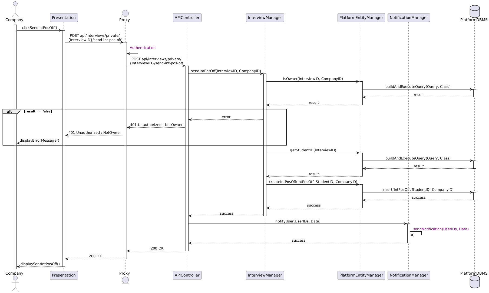
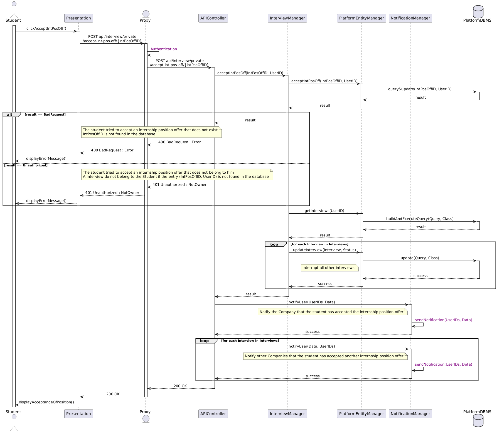
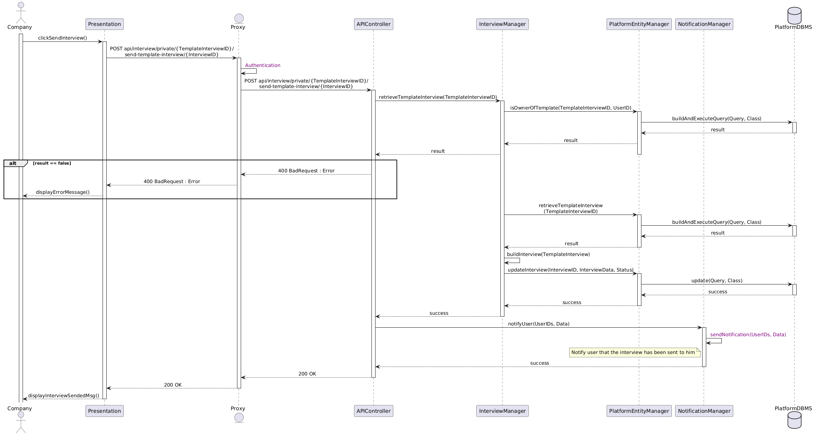

# Sequence Diagrams Descriptions

This section describes the interactions between system components during Students&Company runtime, depicting their call stacks at a high level of abstraction. For this purpose, sequence diagrams will be used.

The call stacks are often similar, as they follow the patterns established in the previous sections. All calls are triggered by the user through the Presentation layer, which sends API calls to the Proxy. The Proxy, in turn, forwards the requests to the appropriate service and, depending on the request, may add a middleware API call before reaching the final target.

For API requests that need to pass data to the services, the data type—always a JSON object—is not directly specified in the arrow representing the API call but can be inferred from the parameters of the subsequent call stack methods.

By analyzing the API endpoints, the Proxy determines where to redirect the requests, triggering middleware procedures such as those for authentication. These procedures will be described in advance, as they form the foundation for understanding the diagrams presented later in the section.

Every database interaction is performed through Entity Managers, which are responsible for querying the respective DBMS. These interactions are often omitted in the text description but are always depicted in the diagrams. All the steps described in purple are explained in detail in different runtime views.

Before proceeding to other diagrams, it is highly recommended to review the *UserRegistration* and *UserLogin* diagrams, as they are the most complex and thoroughly described ones. The other diagrams are more intuitive and, for this reason, less detailed, as they should be easily understood after gaining a general understanding of the first two.

It would be confusing to represent every return code or message for each call. However, since failure behaviors are often shared between components, we have distributed the possible alternatives across all the diagrams rather than including all possibilities in each one.

## 1UserRegistration

The User Registration view is the most complex one, as it involves the initial procedure for all the features of our web application, such as authentication, session validation, and notifications.

When the User clicks the SignUp Button, the Presentation Layer sends a POST request to the Proxy with the `UserData` object in its body. The Proxy recognizes the request as public based on the endpoint and forwards it to the Application Service's API Controller.

The API Controller accesses the `AccountManager`, which queries the databases through the `Platform Entity Manager` to check for user existence. If the User exists, the call stack proceeds backward, returning an error to the User. This could happen, for instance, if the user enters an email or a VAT that is already in use. If the `UserData` is unique and valid, the `AccountManager` creates a new User and stores it in the database.

A success API call code and a `UserIndex` object are returned to the Presentation Layer, which saves the object locally. The `UserIndex` is required to modify the `UserData` in the next step.

Then, the Presentation Layer sends a POST request with the `UserCredential` object to the Authenticator to generate the session token. The Proxy adds a middleware request to the Authenticator to insert the `UserCredentials`, a required step to allow the Authenticator to generate the token. See the <diagram link> for a detailed view of the *InsertCredentials* and *GenerateToken* steps.

After the token is generated, the Authenticator returns it to the Presentation Layer, which saves it for future private calls. The Presentation Layer then sends a request to obtain a `DeviceToken`, which will be needed to notify its endpoint device. See <diagram link> for an in-depth view of the *RequestDeviceToken* step.

The final call triggered by the button click is a POST request responsible for sending the email confirmation. Since the request is to a private endpoint, the Proxy adds a middleware request to the Authenticator service to authenticate the user using the previously obtained token, provided in the header of every private API call. To understand how the Authentication works in detail, see the <diagram link>.

After validation, the Proxy forwards the request to the `NotificationManager`, which sends the email by communicating with the `EmailServiceProvider`. The communication with the `EmailServiceProvider` is not shown in the diagram to avoid unnecessary complexity, as it consists of a simple call to an external service. For this reason, it is depicted in red text.

The `EmailServiceProvider` sends the email to the User and returns a success message to the `NotificationManager`, which forwards it to the Presentation Layer, ultimately returning control to the User.

The User receives the email and clicks the link to confirm their email using their EmailClient. The EmailClient link opens a Presentation Layer page, which sends a POST request to the Proxy. The Proxy authenticates the user as described earlier and forwards the request to the Application Service's API Controller, which accesses the `AccountManager` to activate the User. The `AccountManager` updates the User's status in the database and returns a success message to the Presentation Layer, which displays it to the User.

The User is now successfully registered and can use the web application features.

### InsertCredentials - GenerateToken

By adding the *InsertCredentials* middleware call, the Proxy simply calls the POST method of the Authenticator service with the `UserCredentials` object in its body.  
The Authenticator communicates with the external `AuthProvider`, which adds the `UserCredentials` to its database.  

Every call to an external service provider can generate errors that do not depend on our system. These errors typically correspond to response codes starting with `5--` and should be handled properly.  
However, there can also be errors that depend on our system, such as a malformed `UserCredentials` object. These errors typically have codes starting with `4--`, and this type of error is depicted in the diagram as a failure example.  

If the call is successful, the `AuthProvider` returns a success message to the Authenticator, which forwards it to the Proxy. The Proxy then proceeds with the *GenerateToken* step, which consists of a POST call to another Authenticator endpoint responsible for generating the token associated with the `UserCredentials` object.  

The Authenticator communicates with the `AuthProvider` to generate the token and returns it to the Proxy. The Proxy forwards the token to the Presentation Layer, which saves it for future private calls, as shown in the previous diagram.

### Authentication

When a private request is sent to the Proxy by the Presentation Layer, the Proxy adds a middleware call to the Authenticator to authenticate the user. The Authenticator receives a GET request and checks the token in the header.

If the token is valid, the Authenticator returns a success message to the Proxy, which forwards the request to the Application service.  
If the token is invalid, the Authenticator returns an error message to the Proxy, which then forwards the error message to the Presentation Layer.

The Presentation Layer first attempts to refresh the token using the `RefreshToken` provided when the authentication token was originally issued.  
If the `RefreshToken` is valid, the Presentation Layer will request a new token from the Authenticator.  
If the `RefreshToken` is also invalid, the Presentation Layer will save the current page and redirect the user to the login page to re-authenticate and obtain a new authentication token and `RefreshToken`.

After the UserLogin process is completed, the Presentation Layer will save the newly obtained token and redirect the user to the previously saved page.

For more details about the *ValidateCredentials* step, see the *UserLogin* diagram. <diagrams link>

### RequestDeviceToken

The *RequestDeviceToken* step begins with the Presentation Layer directly communicating with the `NotificationProvider`, which is responsible for handling the token associated with the user's endpoint device.  

To obtain the `DeviceToken`, some device information—retrievable through browser methods—is sent to the external service provider. The `NotificationProvider` returns the `DeviceToken` to the Presentation Layer, which sends it to the Application service so that the `NotificationManager` can store it in its database and bind it to the User.  

Since a user can access S&C on multiple devices, a `DeviceID` object is required to inform the server which device the token is associated with. As a consequence, each device has its own `DeviceToken`, and a user can have multiple `DeviceTokens`, each bound to a unique `DeviceID`.  

After the `NotificationManager` has stored the `DeviceToken`, it returns a success message to the Presentation Layer, which saves it locally.

The DeviceToken can expire or be invalidated by the external service provider. In that case is the Presentation Layer the one responsible to update the DeviceToken as shown next.

### CheckDeviceToken

The *CheckDeviceToken* step is scheduled by the Presentation Layer. It consist of a direct communication to the NotificationProvider to check the actual locally saved token. If the token is invalid, the Presentation Layer will request a new one as shown in the *RequestDeviceToken* step. If the token is valid, the Presentation Layer will do nothing.

## User Login - ValidateCredentials

By clicking the LogIn button the user sends the typed UserCredentials from the Presentation Layer to the Proxy. The triggered call is a POST public request that that reaches the Proxy.
The Proxy adds a middleware call to the Authenticator to validate the UserCredentials. The Authenticator receives the request and checks the credentials in the AuthProvider. If the credentials are valid, the Proxy forwards the request again to the Authenticator that generate the token relative to the provided credentials. The ValidateCredentials is different from the InsertCredential ones because to be able to be correctly validated, credentials shall has been previously "inserted" to the AuthProvider.
After the token is generated, the Authenticator returns it to the Presentation Layer, which saves it for future private calls.

## ParticipantSubmission

By clicking the Submit button, the Participant sends the submission data from the Presentation Layer to the Proxy. The triggered call is a `POST` private request, which the Proxy authenticates using the Authenticator. Once authenticated, the Proxy forwards the request to the `APIController`.

The `APIController` processes the submission by calling the `SubmissionManager`, which updates or inserts the data into the `PlatformDBMS` through the `PlatformEntityManager`. Afterward, the `SuggestionMechanism` generates suggestions for the submission, querying and updating the database as needed.

The `APIController` then triggers the `RecommendationProcess`, which identifies relevant users and submissions through the `UserManager`. Recommendations are generated, stored, and passed back to the `APIController`.

Finally, the `NotificationManager` notifies the identified users, and the `APIController` returns the `SubmissionID` and suggestions to the Presentation Layer, which displays them to the Participant.

### SendNotification

The process begins when the Presentation Layer triggers a **Notification Triggering API Request (NTAR)** to the Proxy. The Proxy authenticates the request and forwards it to the `APIController`.

The `APIController` processes the request with the required logic and calls the `NotificationManager` to notify the specified users. The `NotificationManager` first builds the notification data and retrieves the device tokens of the users from the `NotificationDB` through the `NotificationEntityManager`.

After retrieving the device tokens, the `NotificationManager` stores the notification data in the `NotificationDB` and sends the notifications to the users' devices via the `NotificationProvider`.

If any invalid device tokens are detected during this process, the `NotificationProvider` returns an error, prompting the `NotificationManager` to remove these invalid tokens from the `NotificationDB` for each associated user.

Once the notifications are successfully sent, or all invalid tokens are handled, the `NotificationManager` returns the result to the `APIController`. The `APIController` forwards the result back to the Proxy, which then returns it to the Presentation Layer.

Note that the NotificationManager simply removes the invalid tokens from the `NotificationDB`. Is the Presentation Layer the one responsible to update the DeviceToken as shown in the *CheckDeviceToken* step.

## UserOpensCompanyIntOff

By clicking the *View Company Internships* button, the User triggers a `GET` private request from the Presentation Layer to the Proxy. The Proxy authenticates the request using the Authenticator and forwards it to the `APIController` in the Application Service.

The `APIController` calls the `SubmissionManager` to retrieve the internships associated with the specified `CompanyID`. The `SubmissionManager` queries the database via the `PlatformEntityManager`, which executes the query in the `PlatformDBMS` and returns the results.

The `SubmissionManager` sends the list of internships back to the `APIController`, which forwards it to the Proxy. The Proxy then returns the response to the Presentation Layer, which displays the internships to the User.

## UserOpensStudentCV

By clicking the *View Student CV* button, the User triggers a `GET` private request from the Presentation Layer to the Proxy. The Proxy authenticates the request using the Authenticator and forwards it to the `APIController` in the Application Service.

The `APIController` invokes the `SubmissionManager` to retrieve the CV of the specified `StudentID`. The `SubmissionManager` queries the database through the `PlatformEntityManager`, which executes the query in the `PlatformDBMS` and returns the result.

The `SubmissionManager` sends the CV back to the `APIController`, which forwards it to the Proxy. The Proxy then returns the CV to the Presentation Layer, which displays it to the User.

## ParticipantAcceptsMatch

By pressing the *Accept Recommendation* button, the Participant triggers a `POST` private request from the Presentation Layer to the Proxy. The Proxy authenticates the request and forwards it to the `APIController` in the Application Service.

The `APIController` calls the `RecommendationManager` to process the acceptance of the recommendation. The `RecommendationManager` updates and retrieves the recommendation data by interacting with the `PlatformEntityManager`, which queries the `PlatformDBMS`.

If the other party has already accepted the recommendation, the `APIController` notifies the second user through the `NotificationManager` and initiates the creation of an interview using the `InterviewManager`. The `InterviewManager` inserts the interview data into the `PlatformDBMS` through the `PlatformEntityManager`.

If the FeedbackMechanism is triggered, the `APIController` returns a `201 Created` response with a prompt for feedback, which the Presentation Layer displays to the Participant as a feedback form. Otherwise, the `APIController` simply returns a success message, which the Presentation Layer displays to the Participant.

## ParticipantSubmitsFeedback

When the Participant presses the *Submit Feedback* button, the Presentation Layer sends a `PUT` request with the `RecommendationID` and feedback data to the Proxy.

The Proxy authenticates the request and forwards it to the `APIController`. The `APIController` invokes the `FeedbackMechanism` to handle the feedback submission. The `FeedbackMechanism` saves the feedback data by interacting with the `PlatformEntityManager`, which updates the `PlatformDBMS`.

Once the feedback is saved, the `FeedbackMechanism` retrieves recommendation parameters from the database through the `PlatformEntityManager`. It computes updated recommendation parameters and saves them back into the database via the `PlatformEntityManager`.

After processing the feedback and updating the recommendation data, the `FeedbackMechanism` returns a success message to the `APIController`. The `APIController` forwards the response to the Proxy, which then sends it to the Presentation Layer. Finally, the Presentation Layer displays a success message to the Participant.

## StudentSendsSpontaneousApplication

By clicking the *Submit Spontaneous Application* button, the Student triggers a `POST` private request from the Presentation Layer to the Proxy. The Proxy authenticates the request and forwards it to the `APIController` in the Application Service.

The `APIController` calls the `SubmissionManager` to handle the spontaneous application submission. The `SubmissionManager` insert the users' ID into the database, to represent the application, by interacting with the `PlatformEntityManager`, which performs the insertion in the `PlatformDBMS`.

Once the application is successfully stored, the `APIController` invokes the `NotificationManager` to notify the company about the new application. The `NotificationManager` sends the notification to the specified company and confirms the success of the operation.

Finally, the `APIController` returns a `200 OK` response to the Proxy, which forwards it to the Presentation Layer. The Presentation Layer displays a success message to the Student.

## CompanyAcceptsSpontaneousApplication

By clicking the *Accept Spontaneous Application* button, the Company triggers a `POST` private request from the Presentation Layer to the Proxy. The Proxy authenticates the request and forwards it to the `APIController` in the Application Service.

The `APIController` calls the `SubmissionManager` to process the acceptance of the spontaneous application. The `SubmissionManager` updates the application status and retrieves the `StudentID` by interacting with the `PlatformEntityManager`, which queries and updates the `PlatformDBMS`.

With the `StudentID` retrieved, the `APIController` invokes the `InterviewManager` to create an interview for the student and company. The `InterviewManager` inserts the interview data into the `PlatformDBMS` through the `PlatformEntityManager`.

Once the interview is successfully created, the `APIController` calls the `NotificationManager` to notify the student about the acceptance of their application. The `NotificationManager` sends the notification and confirms the success of the operation.

Finally, the `APIController` returns a `200 OK` response to the Proxy, which forwards it to the Presentation Layer. The Presentation Layer displays a success message to the Company.

## StudentSubmitInterview

By clicking the *Send Interview Answer* button, the Student triggers a `POST` private request from the Presentation Layer to the Proxy. The Proxy authenticates the request and forwards it to the `APIController` in the Application Service.

The `APIController` verifies the API call parameters. If the parameters are invalid, it returns a `400 Bad Request` error to the Proxy, which forwards it to the Presentation Layer. The Presentation Layer then displays an error message to the Student.

If the parameters are valid, the `APIController` calls the `InterviewsManager` to save the interview answers. The `InterviewsManager` updates the database by interacting with the `PlatformEntityManager`, which executes the required query in the `PlatformDBMS`.

After the interview answers are successfully stored, the `APIController` invokes the `NotificationManager` to notify relevant users about the submission. The `NotificationManager` sends the notification and confirms its success.

Finally, the `APIController` returns a `200 OK` response to the Proxy, which forwards it to the Presentation Layer. The Presentation Layer displays a success message to the Student, indicating that the interview answers have been submitted.

## CompanySubmitInterview

By clicking the *Send Interview* button, the Company triggers a `POST` private request from the Presentation Layer to the Proxy. The Proxy authenticates the request and forwards it to the `APIController` in the Application Service.

The `APIController` invokes the `InterviewsManager` to handle the interview submission. The `InterviewsManager` first builds the interview template data from the provided `InterviewData`. Each time a company creates a new interview, it is saved as a template before being sent to the student.

The `InterviewsManager` saves the interview template to the database via the `PlatformEntityManager`, which performs the insertion in the `PlatformDBMS`. After successfully saving the template, the `InterviewsManager` submits the interview by updating the relevant data in the `PlatformDBMS` through the `PlatformEntityManager`.

Once the interview is successfully stored, the `APIController` calls the `NotificationManager` to notify the student about the new interview. The `NotificationManager` sends the notification and confirms its success.

Finally, the `APIController` returns a `201 Created` response to the Proxy, which forwards it to the Presentation Layer. The Presentation Layer displays a success message to the Company, indicating that the interview has been sent.

## CompanyCreateTemplateInterview

By clicking the *Save Interview* button, the Company triggers a `POST` private request from the Presentation Layer to the Proxy. The Proxy authenticates the request and forwards it to the `APIController` in the Application Service.

The `APIController` invokes the `InterviewsManager` to handle the saving of the interview template. The `InterviewsManager` saves the provided `InterviewTemplate` to the database via the `PlatformEntityManager`. The `PlatformEntityManager` inserts the template data into the `PlatformDBMS`.

Once the interview template is successfully stored, the `APIController` returns a `201 Created` response to the Proxy, which forwards it to the Presentation Layer. The Presentation Layer displays a success message to the Company, indicating that the interview template has been saved.

## CompanyEvaluatesInterview

By clicking the *Evaluate Interview* button, the Company triggers a `POST` private request from the Presentation Layer to the Proxy. The Proxy authenticates the request and forwards it to the `APIController` in the Application Service.

The `APIController` calls the `InterviewsManager` to handle the evaluation of the interview. The `InterviewsManager` processes the evaluation and updates the database through the `PlatformEntityManager`. The `PlatformEntityManager` performs an insert or update operation in the `PlatformDBMS` with the evaluation data.

After successfully saving the evaluation, the `APIController` triggers a notification to the student through the `NotificationManager`. The `NotificationManager` sends the notification and confirms its success.

The `APIController` returns a `201 Created` response to the Proxy, which forwards it to the Presentation Layer. The Presentation Layer displays a success message to the Company, confirming that the interview has been evaluated.

If the Company needs to evaluate individual questions within the interview, they can access the interview through the dashboard. By navigating to the *Dashboard Interviews* page, the Company sends a `GET` request to retrieve a list of interviews. Once the interviews are displayed, the Company can click on a specific interview to access the detailed evaluation page.

## StudentSeeSpontaneousApplications

By clicking the *Dashboard Spontaneous Applications* page, the Student triggers a `GET` private request from the Presentation Layer to the Proxy. The Proxy authenticates the request and forwards it to the `APIController` in the Application Service.

The `APIController` calls the `SubmissionsManager` to retrieve the list of spontaneous applications related to the Student. The `SubmissionsManager` queries the database through the `PlatformEntityManager`. The `PlatformEntityManager` executes the query in the `PlatformDBMS` and retrieves the results.

The results are returned step-by-step: from the `PlatformEntityManager` to the `SubmissionsManager`, from the `SubmissionsManager` to the `APIController`, and finally to the Proxy. The Proxy sends a `200 OK` response with the list of applications back to the Presentation Layer.

The Presentation Layer displays the retrieved spontaneous applications to the Student, allowing them to review their submissions.

## 14ParticipantSeesMatches

By clicking the *Dashboard Recommendation* page, the Participant triggers a `GET` private request from the Presentation Layer to the Proxy. The Proxy authenticates the request and forwards it to the `APIController` in the Application Service.

The `APIController` calls the `RecommendationManager` to retrieve matches associated with the Participant's `UserID`. The `RecommendationManager` queries the database through the `PlatformEntityManager`. The `PlatformEntityManager` executes the query in the `PlatformDBMS` and retrieves the results.

The results are returned step-by-step: from the `PlatformEntityManager` to the `RecommendationManager`, from the `RecommendationManager` to the `APIController`, and finally to the Proxy. The Proxy sends a `200 OK` response with the list of matches back to the Presentation Layer.

The Presentation Layer displays the retrieved matches to the Participant, allowing them to review their recommendations.

## UserRespondsToComm 

By clicking the *Publish Answer* button, the User initiates a `POST` private API call from the Presentation Layer to the Proxy. The request contains the `CommID`, the User's message, and their authentication token.

The Proxy first validates the token using its authentication middleware and forwards the request to the `APIController`. The `APIController` processes the request by calling the `CommunicationManager` to handle the submission.

The `CommunicationManager` interacts with the `PlatformEntityManager`, which constructs a query to insert the answer (identified by `CommID` and associated with the `UserID`) into the database (`PlatformDBMS`). Upon successful insertion, a confirmation is passed back through the `PlatformEntityManager` and `CommunicationManager` to the `APIController`.

Subsequently, the `APIController` invokes the `NotificationManager` to notify relevant users about the new message. The `NotificationManager` sends notifications and confirms the operation's success.

Finally, the `APIController` returns a `201 Created` response to the Proxy, which forwards it to the Presentation Layer. The Presentation Layer displays a success message to the User, confirming the answer has been published successfully.

## UserOpensComplaint

When the User clicks on a complaint, a `GET` private API call is sent from the Presentation Layer to the Proxy. The request includes the `CommID` and optional URL parameters that specify the type of data to retrieve.

The Proxy validates the User's authentication token and forwards the request to the `APIController`. The `APIController` verifies the call parameters to ensure they are correct. If any parameter is invalid, the `APIController` responds with a `400 Bad Request` error, which is forwarded by the Proxy to the Presentation Layer. The Presentation Layer displays an error message to the User.

If the parameters are valid, the `APIController` processes the request based on the specified URL parameter:

1. If the parameter requests only the communication type, the `APIController` calls the `CommunicationManager` to retrieve the type of communication associated with the `CommID`.
2. If the parameter requests only the communication messages, the `APIController` retrieves the messages through the `CommunicationManager`.
3. If the parameter requests all communication data, the `APIController` retrieves the complete communication details via the `CommunicationManager`.

The `CommunicationManager` queries the `PlatformDBMS` through the `PlatformEntityManager` to fetch the requested data. Once the database query is executed successfully, the result is passed back to the `APIController`.

The `APIController` returns a `200 OK` response containing the requested data to the Proxy. The Proxy forwards this response to the Presentation Layer, which displays the result to the User.

## ParticipantCreatesAComplaint

When the Participant initiates the creation of a new complaint by clicking the corresponding button, the Presentation Layer sends a `POST` request to the Proxy. The Proxy authenticates the request and forwards it to the `APIController`.

The `APIController` invokes the `CommunicationManager` to handle the creation of the new complaint. The `CommunicationManager` interacts with the `PlatformEntityManager` to insert the complaint data into the database. The `PlatformEntityManager` performs this operation by communicating with the `PlatformDBMS`.

Once the complaint is successfully stored in the database, the `CommunicationManager` returns a success response to the `APIController`. Subsequently, the `APIController` triggers the `NotificationManager` to notify relevant users about the new complaint. After the notifications are sent, a success response propagates back through the Proxy to the Presentation Layer.

Finally, the Presentation Layer displays the newly created complaint to the Participant.

## UserSeesHisCommunicationsPage

When the User clicks the "Dashboard Communication Page" button, the Presentation Layer sends a `GET` private API call to the Proxy.

The Proxy validates the User's authentication token and forwards the request to the `APIController`. The `APIController` triggers the `CommunicationManager` to fetch the list of communications associated with the `UserID`.

The `CommunicationManager` sends a query to the `PlatformEntityManager`, which interacts with the `PlatformDBMS` to retrieve the requested data. Once the database returns the results, the `PlatformEntityManager` forwards them back to the `CommunicationManager`.

The `CommunicationManager` passes the fetched communications to the `APIController`, which returns a `200 OK` response to the Proxy, including the list of communications. The Proxy forwards this response to the Presentation Layer.

Finally, the Presentation Layer displays the list of communications to the User.

## UniversityInterruptsInternship

When the University initiates the process to interrupt an internship by clicking the appropriate button, the Presentation Layer displays a confirmation button. Upon confirmation, the Presentation Layer sends a `POST` request to the Proxy.

The Proxy authenticates the request and forwards it to the `APIController`. The `APIController` invokes the `CommunicationManager`, which interacts with the `PlatformEntityManager` to update the internship offer in the database. The `PlatformEntityManager` performs the update operation by communicating with the `PlatformDBMS`.

After successfully updating the internship data, the `CommunicationManager` returns the updated internship details to the `APIController`. The `APIController` then triggers the `NotificationManager` to notify relevant users about the interruption. Once the notifications are sent, a success response propagates back through the Proxy to the Presentation Layer.

Finally, the Presentation Layer displays the confirmation of the terminated internship to the University.

## UserTerminatesCommunication

When the User clicks the "Terminate Communication" button, the Presentation Layer sends a `POST` private API call to the Proxy.

The Proxy authenticates the request and forwards it to the `APIController`. The `APIController` calls the `CommunicationManager` to terminate the specified communication (`CommID`).

The `CommunicationManager` first verifies if the User is the owner of the communication by querying the `PlatformEntityManager`. The `PlatformEntityManager` checks the ownership in the `PlatformDBMS` and returns the result. 

If the User is not the owner (`result == false`), an error message (`401 Unauthorized: NotOwner`) is returned through the chain to the Presentation Layer, which displays an error message to the User.

If the User is the owner, the `CommunicationManager` updates the communication's status to "terminated" by interacting with the `PlatformEntityManager`, which performs the update in the `PlatformDBMS`. Upon success, the update is confirmed back up the chain.

The `APIController` then triggers the `NotificationManager` to notify all relevant users about the termination of the communication. The `NotificationManager` sends notifications and confirms their delivery.

Finally, the `APIController` sends a `200 OK` response to the Proxy, which forwards it to the Presentation Layer. The Presentation Layer displays a confirmation message to the User indicating that the communication has been successfully terminated.

## CompanySendsIntPosOff

When the Company initiates the process to send an internship position offer by clicking the relevant button, the Presentation Layer sends a `POST` request to the Proxy.

The Proxy authenticates the request and forwards it to the `APIController`. The `APIController` invokes the `InterviewManager`, which first verifies if the Company is the owner of the specified interview by querying the `PlatformEntityManager`. The `PlatformEntityManager` communicates with the `PlatformDBMS` to perform the ownership check.

If the Company is not the owner, an error is returned through the APIController, Proxy, and Presentation Layer, displaying an error message to the Company. If ownership is confirmed, the `InterviewManager` retrieves the Student ID related to the interview and creates a new internship position offer by interacting with the `PlatformEntityManager`. The `PlatformEntityManager` inserts the offer into the database via the `PlatformDBMS`.

After successfully creating the internship position offer, the `InterviewManager` returns a success response to the `APIController`. The `APIController` then triggers the `NotificationManager` to notify relevant users about the new offer. Once notifications are sent, the success response propagates back through the Proxy to the Presentation Layer.

Finally, the Presentation Layer displays confirmation of the sent internship position offer to the Company.

## StudentAcceptsInternshipPositionOffer

When a Student clicks to accept an internship position offer, the Presentation Layer sends a `POST` request to the Proxy.

The Proxy authenticates the request and forwards it to the `APIController`. The `APIController` invokes the `InterviewManager` to handle the acceptance process. The `InterviewManager` checks the ownership of the offer by interacting with the `PlatformEntityManager`, which queries the `PlatformDBMS`. If the offer does not exist (`BadRequest`) or does not belong to the Student (`Unauthorized`), an error response is returned to the Presentation Layer, and an error message is displayed.

If the ownership is validated, the `InterviewManager` retrieves all interviews associated with the Student by querying the `PlatformEntityManager`. For each of these interviews, the `InterviewManager` interrupts them by updating their status in the `PlatformDBMS`.

Once all other interviews are updated, the `InterviewManager` confirms the acceptance of the internship position offer. The `APIController` triggers the `NotificationManager` to notify the relevant Company about the Student's acceptance. Additional notifications are sent to other Companies, informing them that the Student has accepted a different offer.

Finally, a success response is returned through the Proxy to the Presentation Layer, which displays a confirmation message to the Student.

## CompanySendTemplateInterview

When a Company clicks to send a saved interview, the Presentation Layer sends a `POST` request containing the `InterviewID` and `TemplateInterviewID` to the Proxy.

The Proxy authenticates the request and forwards it to the `APIController`. The `APIController` invokes the `InterviewManager` to retrieve the template interview. The `InterviewManager` checks if the Company owns the specified template by querying the `PlatformEntityManager`, which interacts with the `PlatformDBMS`. If the ownership check fails, an error response is returned, and an error message is displayed to the Company.

If the ownership check succeeds, the `InterviewManager` retrieves the template data from the database and constructs the interview based on the template. The updated interview data is then stored in the database by the `PlatformEntityManager`.

After the interview is successfully updated, the `APIController` triggers the `NotificationManager` to notify the Student that the interview has been sent. A success response is then returned through the Proxy to the Presentation Layer, which displays a confirmation message to the Company.

## CompanyClosesInternshipOffer

When a Company clicks the "Close Internship" button, the Presentation Layer sends a `POST` private API call to the Proxy. The request contains the `InternshipID`.

The Proxy authenticates the request and forwards it to the `APIController`. The `APIController` calls the `SubmissionManager` to delete the internship submission associated with the `InternshipID`. 

The `SubmissionManager` retrieves the user IDs of all students involved in the internship by querying the `UserManager`. The `UserManager` interacts with the database through the `PlatformEntityManager` and `PlatformDBMS` to fetch the relevant user IDs.

Once the user IDs are retrieved, the `SubmissionManager` deletes the internship from the database using the `PlatformEntityManager` and `PlatformDBMS`.

After successfully deleting the internship, the `APIController` triggers the `NotificationManager` to notify all involved students about the closure of the internship. Notifications are sent for each user involved in the internship.

Finally, a `200 OK` response is returned through the Proxy to the Presentation Layer, which displays a confirmation message.
