<!--Warning Mermeid is not case-sensitive, so it will give 
problems when trying to name an actor Participant. to fix, copy&paste an 
invisible character before and after the name:  THIS->(ㅤ)<-THIS    -->

# StudentSignup
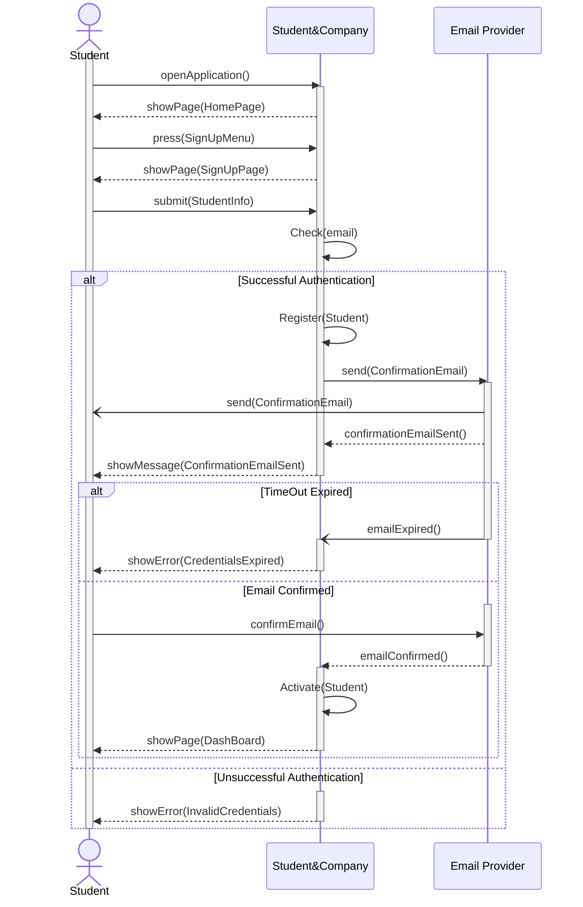

# CompanySignUp

# UniversitySignUp
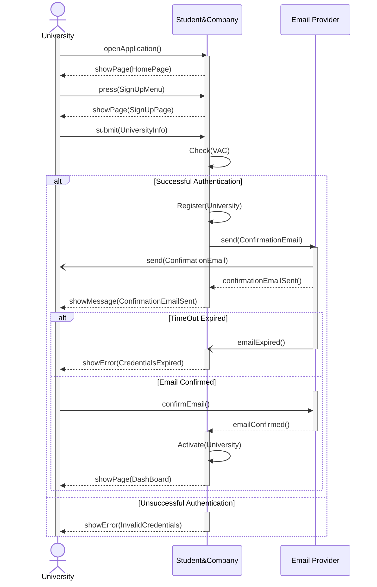

# UserSignIn
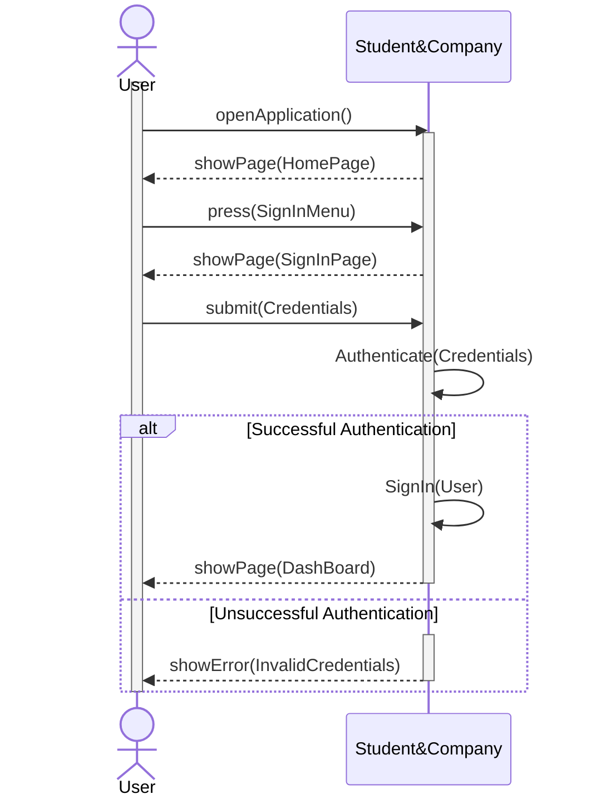

# LoadCurriculum
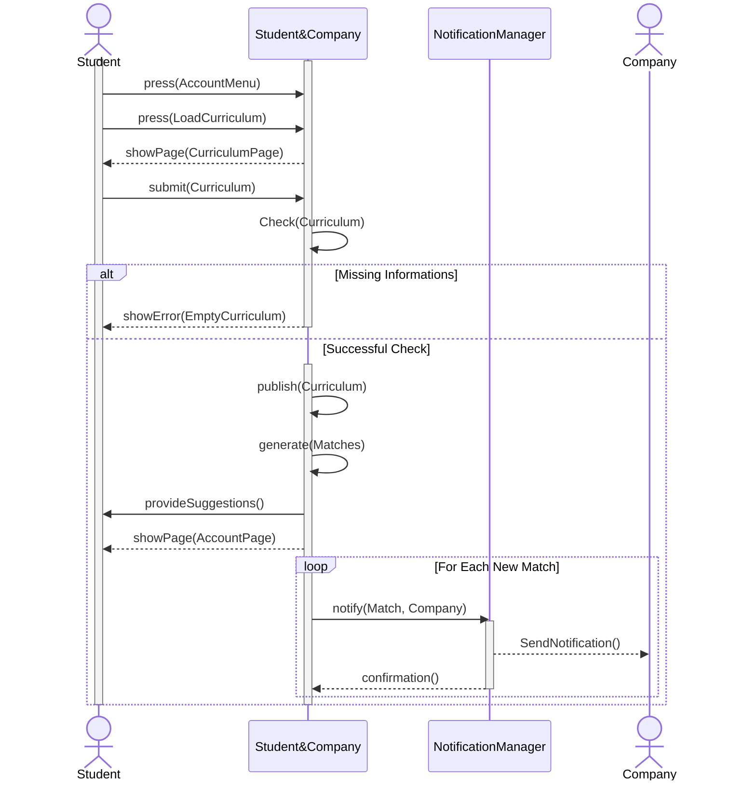

# AdvertiseInternship
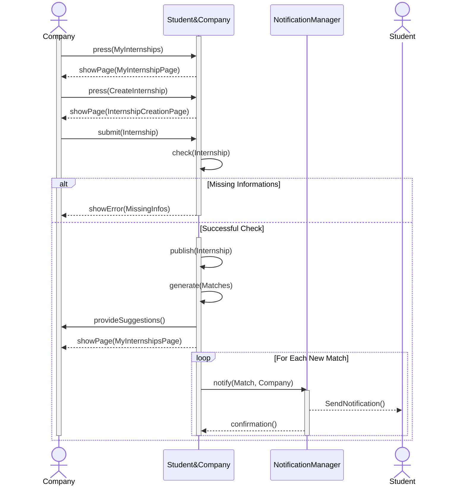

# SpontaneousApplication
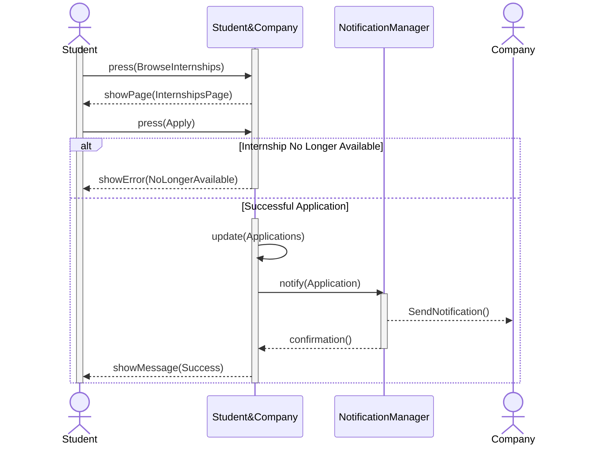

# AcceptMatch
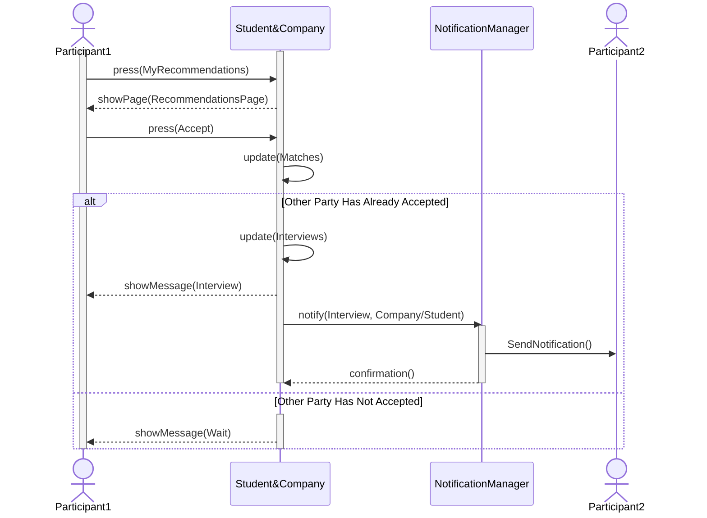

# FeedbackMechanism
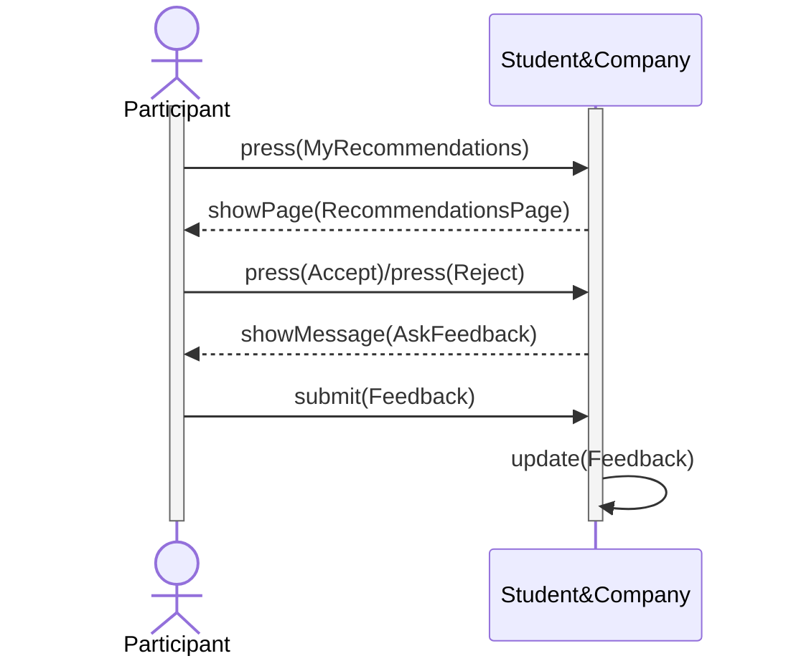

# AssignInterview
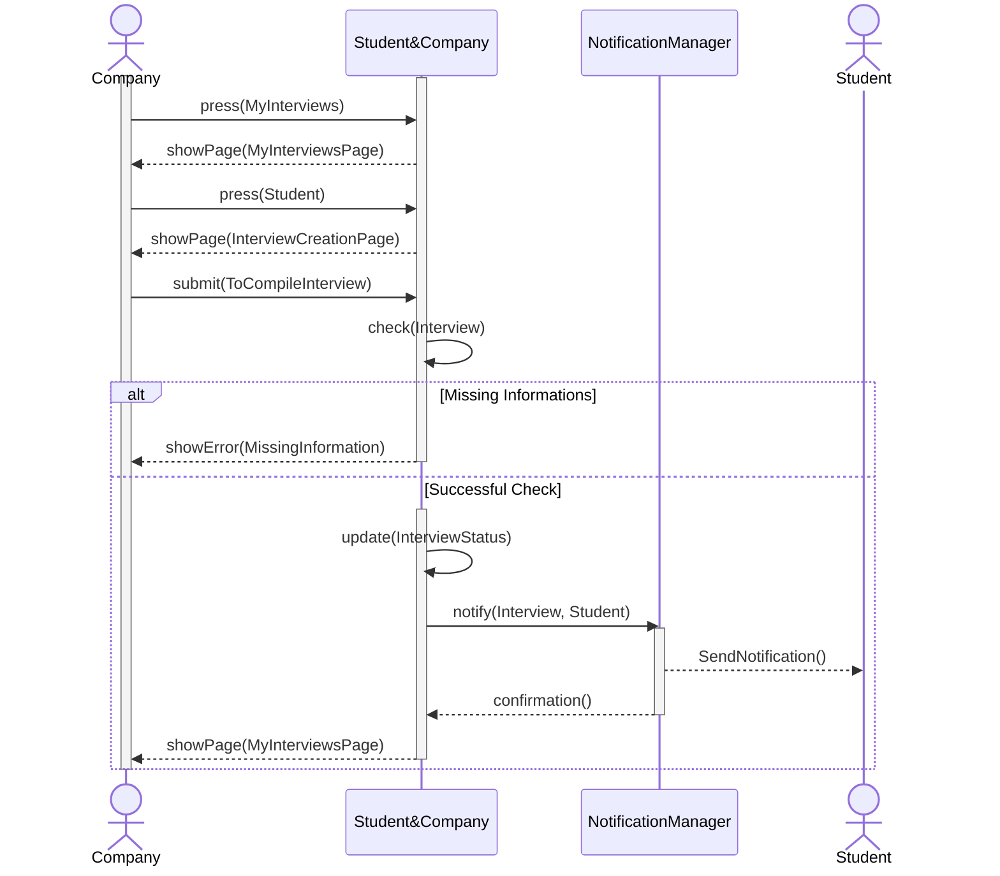

# PublishComplaint
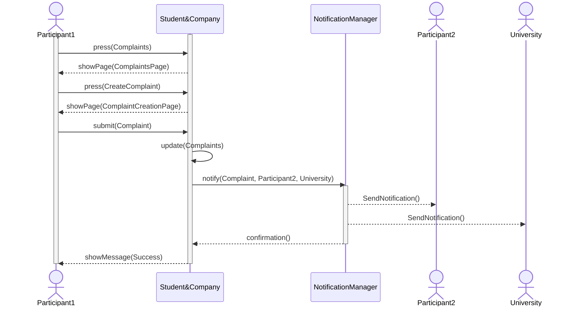

# RespondToComplaint
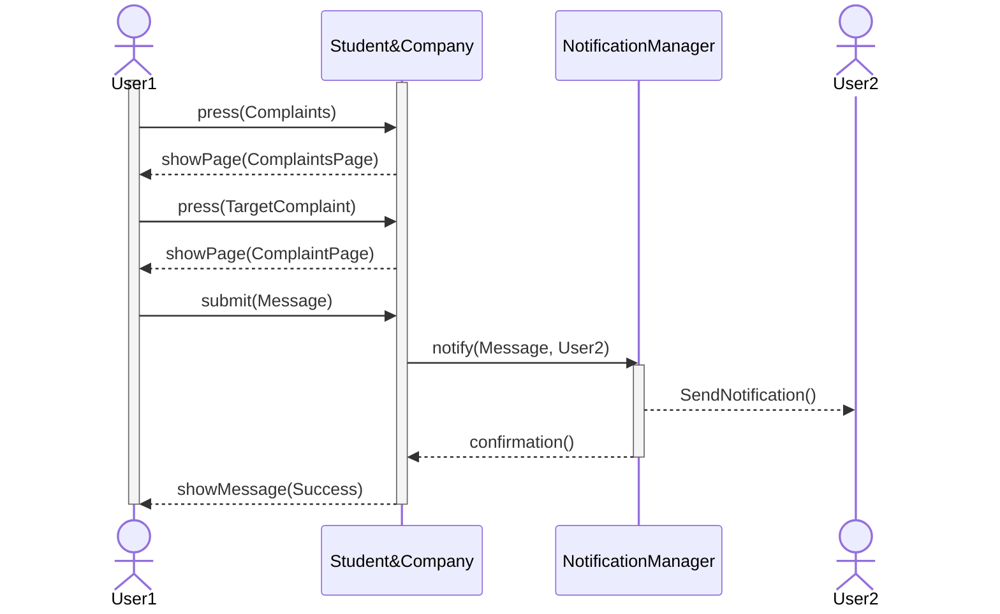
# HandleComplaint
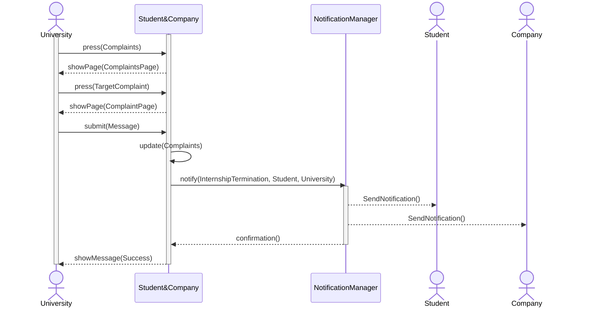

# TerminateInternship
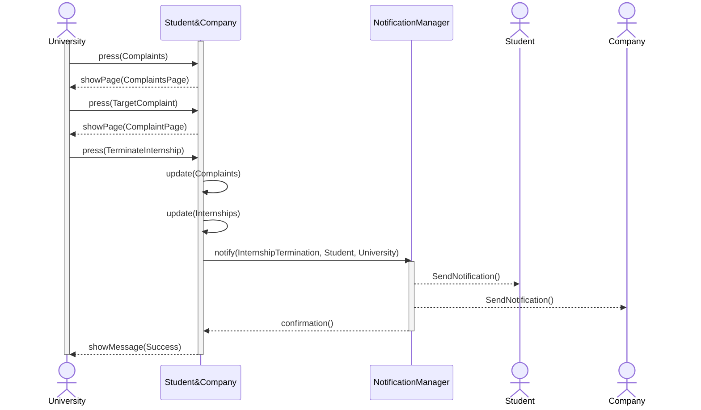