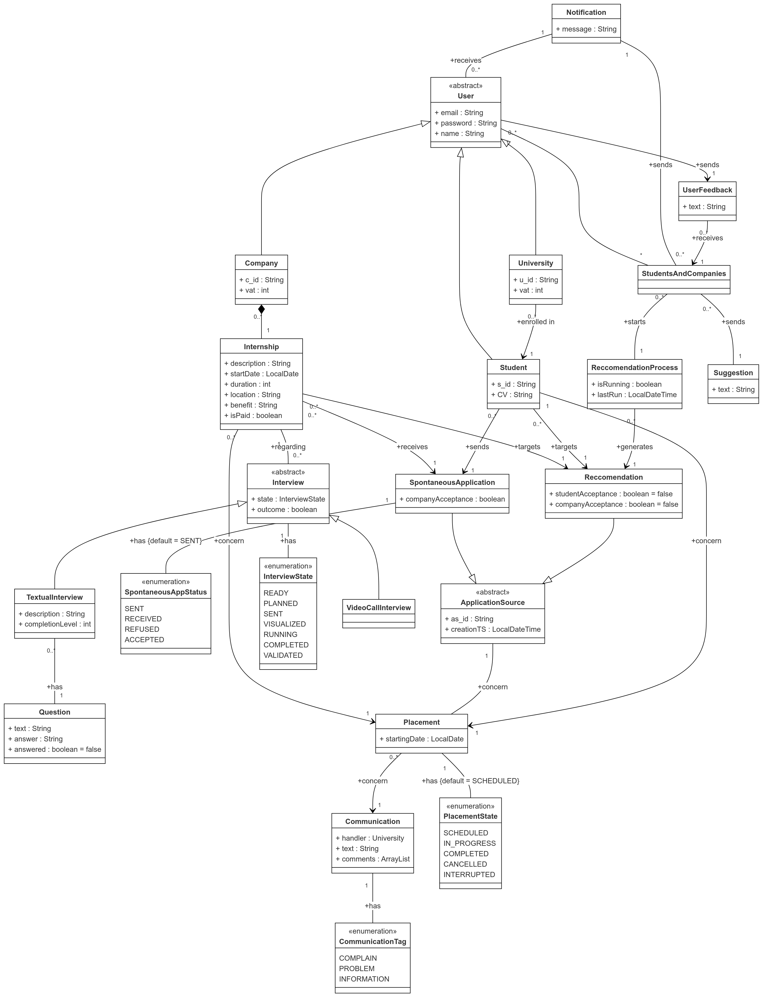

# RASD

## Assignment

Students&Companies (S&C) is a platform that helps match university students looking for internships and companies offering them. The platform should ease the matching between students and companies based on:

- the experiences, skills and attitudes of students, as listed in their CVs;
- the projects (application domain, tasks to be performed, relevant adopted technologies-if any-etc.) and terms offered by companies (for example, some company might offer paid internships and/or provide both tangible and intangible benefits, such as training, mentorship, etc.).

The platform is used by companies to advertise the internships that they offer, and by students to look for internships. Students can be proactive when they look for internships (i.e., they initiate the process, go through the available internships, etc.). Moreover, the system also has mechanisms to inform students when an internship that might interest them becomes available and can inform companies about the availability of student CVs corresponding to their needs. We refer to this process as “recommendation”.

Recommendation in S&C can employ mechanisms of various level of sophistication to match students with internships, from simple keyword searching, to statistical analyses based on the characteristics of students and internships.

When suitable recommendations are identified and accepted by the two parties, a contact is established. After a contact is established, a selection process starts. During this process, companies interview students (and collect answers from them, possibly through structured questionnaires) to gauge their fit with the company and the internship. S&C supports this selection process by helping manage (set up, conduct, etc.) interviews and also finalize the selections.

To feed statistical analysis applied during recommendation, S&C collects various kinds of information regarding the internships, for example by asking students and companies to provide feedback and suggestions.

Moreover, S&C should be able to provide suggestions both to companies and to students regarding how to make their submissions (project descriptions for companies and CVs for students) more appealing for their counterparts.

In general, S&C provides interested parties with mechanisms to keep track and monitor the execution and the outcomes of the matchmaking process and of the subsequent internships from the point of view of all interested parties. For example, it provides spaces where interested parties can complain, communicate problems, and provide information about the current status of the ongoing internship. The platform is used by students at different universities. Universities also need to monitor the situation of internships; in particular, they are responsible for handling complaints, especially ones that might require the interruption of the internship.

## 1.1.1 Goals

1. Companies would like to advertise the internship they offer
2. Students would like to autonomously candidate for available internships
3. Students would like to be matched with internships they might be interested in
4. Companies would like to perform interviews with matched students
5. Students and Companies would like to complain, communicate problems, provide information about an ongoing internship
6. Students and Companies would like to be provided with suggestions about how to improve their submission
7. Universities would like to handle complains about ongoing internships

## 1.2.1 World Phenomena

1. A Company wants to advertise its internship
2. A Student wants to look for an internship
3. A Company wants to accept a suitable recommendation
4. A Student wants to accept a suitable recommendation
5. A Company wants to interview a Student during selection process
6. A Company wants to manage interviews
7. A Students wants to answer questions concerning a selection process
8. A Company wants to complain, communicates problem, provide information about an ongoing internship
9. A Students wants to complain, communicates problem, provide information about an ongoing internship
10. A University wants to monitor an ongoing internship
11. A University wants to handle complains about an ongoing internship
12. A University wants to interrupt an ongoing internship

## 1.2.2 Shared Phenomena

### Controlled By the World

1. A Company publish an internship offer
2. A Student inserts his CV
3. A Student sends a spontaneous application for an internship
4. A Student or a Company accepts a suitable recommendation(swipe)
5. A Company configures interviews for a specific internship
6. A Company conducts a previously set up interview
7. A Company finalizes a previously conducted interview
8. A Student or Company complains, communicates problem, provides information about an ongoing internship
9. A Student answers questions related to an interview
10. A Students or Company monitors his Recommendation Process
11. A University handles complaints about ongoing internships
12. A University interrupts an internship

### Controlled By the Machine

1. The Platform shows to Students available internships
2. The Platform shows to Companies available candidates  for their internships
3. The Platform shows to Students the status of spontaneous applications
4. The Platform shows to Students the current status of the Recommendation Process
5. The Platform shows to Companies the current status of the Recommendation Process for a given internship
6. The Platform shows to Companies information about Interviews
7. The Platform shows to Universities information about an ongoing internship
8. The Platform notifies Students and Companies when a suitable Recommendation is found
9. The Platform provides Students and Companies suggestions about how to make their submissions
10. The Platform asks for Feedback to improve the Recommendation Process

<!-- 1. The Platform presents the interface for Companies' internship data submission
2. The Platform presents the interface for Students' CV submission
3. The Platform presents the interface for actively searching available internships
4. The Platform presents the interface for monitoring recommendation
5. The Platform presents the interface for a Company to set up an Interview
6. The Platform presents the interface for a Company to conduct previously set up Interviews
7. The Platform presents the interface for a Company to finalize previously conducted Interviews
8. The Platform displays the interface for a Student to answer Interview questions
9. The Platform presents the interface for complaining, communicating problems, providing information about an ongoing internship
10. The Platform presents the interface for a University to handle complains
11. The Platform presents the interface for a University to Monitor an ongoing internship
12. The Platform presents the interface for a University to interrupt an ongoing internship -->

## 2.4.1 Domain Assumption

1. Students and Companies provide the Platform with correct and truthful information
2. Companies remove published internship if they are no longer available
3. Students, Companies and Universities receive every notification
4. Students, Companies and Universities has a working internet connection
5. Universities interrupt an ongoing internship only if no solution to complaints/problems are found

## 2.1.1 User Scenario

1. **Student Sign-up**
    Mario Rossi is a student that want to improve his ability and education by doing an internship before graduating. He opens the S&C platform and select "Student SignUp". He proved the required personal information such as his Name, Surname and Date of birth, an email and a password that he will use as login credential and he select from the list of available university the university he goes to.
    If the email address has never been used on the site, Mario will receive an eMail for confirming the mail address and the registration of the account. Once the registration is confirmed the account is created.
    If the email address is already in use the platform will show an error that ask to insert a new email.

2. **Company Sign-up**
    FastRedCar SPA is a world-leading car company that aims to launch an internship program to train new mechanical engineers in their final year of a Bachelor’s or Master’s degree. The company open the S&C platform and select "Company SignUp" where they provide the required information such as the company name, company headquarters address, company VAT number and also an email address and a password that will be used as login credential.
    If the VAT number has never been used on the site, FastRedCar SPA will receive an eMail for confirming the mail address and the registration of the account. Once the registration is confirmed the account is created.
    If the VAT number is already in use the platform will show an error indicating the the company is already registered on the platform.

3. **University Sign-up**
    The Technical University of Milan is a prestigious university that wants his students to complete an internship before graduating, believing this experience will enhance their skills and knowledge. The university opens the S&C platform and selects "University SignUp" where they provide the required information such as the university name, the university description, the university VAT number, the name of the university office that will manage the internship program and also an email address and a password that will be used as login credential.
    If the VAT number has never been used on the site, the Technical University of Milan will receive an eMail for confirming the mail address and the registration of the account. Once the registration is confirmed the account is created.
    If the VAT number is already in use the platform will show an error indicating the the university is already registered on the platform.

4. **User Login**
    A platform user that has already registered an account can login by providing the email and password used during the registration. If the email and password are correct, matching and entry in the platform DB, the user is redirected to the platform home page. If the email or password are incorrect the platform will show an error message indicating that the login credentials are wrong.

5. **Student Load Curriculum**  
    Stefano is a student who has already registered an account on S&C and wants to complete his profile by uploading his CV. From the platform's homepage, he clicks on the "Upload CV" button. He is then redirected to a page where he can enter his curriculum information, including his current level of education, languages he knows, technical skills, and, optionally, details about past work experience along with contact information for previous employers.
    He also add a photo of himself, a brief description of his interests and hobbies and, as soon as he click on the "Submit CV" button the platform elaborate it and try to find some matching job internship based on the given information.
    A list of five different internship, for which Stefano is a match, is shown to the student in the platform's homepage where he can decide to apply for one of them, starting the selection process.
    While computing the matching, the platform also provides Stefano with some suggestions on how to improve his CV and matching probability, based on a grammar and lexical analyses and a direct comparing of Stefano's CV with other similar candidate

6. **Company Submit an Internship Insertion**
    AnanasPhone is a major tech company, specialized in the production of smartphone and table, that has an account on the S&C company. They want to create an internship program aim to software engineers student in their final year of Master Degree.
    They open the S&C platform and select "My Internship" where a list of all the internship already present on S&C are shown and then they click on "Insert Internship" where they provide the required information such as the internship title, the internship description, the start date and duration, the office address, a list of the required skills student need to have in order to be considered for the internship (??) and possibly a list of benefits offered to the intern.  Once the internship is created by clicking on the "Submit Internship" button, the platform will match the internship with all the student that are a match for the internship based on the given information.
    The platform will also provide AnanasPhone with some suggestion on how to improve the internship description, and matching probability, based on a grammar and lexica analyses and a direct comparing of AnanasPhone's Internship proposal with other similar companies.

7. **Company create structured interview to submit to possible candidate**
    MacroHard is a world-leading tech company, known for creating its secure and reliable operating system, "Door". The company has an account on the S&C platform and has already set up an internship program for software engineering students pursuing a Master’s degree. The company wants to create a structured interview to evaluate the technical skills and motivation of the students who apply for the internship.
    MacroHard opens the platform and, on the page displaying the lists of matched students and applicants, clicks on the "Create Interview" button. This option allows them to create structured interviews to submit to candidates. The company sets up an "InterviewTemplate," a collection of questions that includes both quizzes, which the platform can automatically evaluate, and open-ended questions that require manual review. They may also include one or more video calls in the template, with outcomes that can be recorded on the platform in the form of a grade. The InterviewTemplate tracks each interview’s outcomes in a global store, allowing both candidates and the company to monitor interview progress.
    MacroHard create multiple InterviewTemplates for the same internship, allowing them to submit different templates to different students based on factors such as the student’s CV, method of application (matched or spontaneous), or other criteria. Each template is created only once and can be reused for different students or internship opportunities.
    For this internship in particular, MacroHard has created two InterviewTemplates: one for matched students, which includes only a quiz to assess technical skills, and another for spontaneous applicants, which includes both a quiz and a video call to evaluate the student’s motivation.

8. **Student accept a matched internship**
    Sara is a economic major student that has already uploaded her CV on the S&C platform and is looking for an internship. She has received a notification and by clicking on it she see that a new internship is available for her.
    Sara reads the internship information and description and she decide to accept it. A notification is sent to the company who has created the internship about the acceptance of the match by Sara. If the company also accept the match, the platform require the company to initiate the selection process by creating or assigning a structured interview to Sara who will be notified about it.

9. **Student manually apply for an internship**
    Marco is a chemistry student that has already uploaded his CV on the S&C platform and is looking for an internship. Unfortunately the matching Internships provided by the platform do not fully satisfy his needs and he decide to proactively search for another internship.
    He opens the platform's homepage and click on the "Browse all Internship" button. Here he can see all the internship that are available on the platform and he can filter them by field of study, required skills, location and other parameters.
    He find an internship that is not in the matching list provided by the platform but that is perfect for him. and he click on the "manually apply" button.
    The platform notify the company that Marco has applied for the internship and will inform the Student if and when the company will start the application process by sending him a structured interview. There is no need for Marco to accept the interview as a spontaneous application is considered as an implicit acceptance of the match by the student.

10. **Student see his application & interview status**
    Stefano is a student who has applied for various internships through the S&C platform. He has submitted applications both by matching with companies through the platform's automated feature and by manually applying. He is currently waiting for updates from the different companies. For those where he has been matched and accepted, he is waiting to be assigned a structured interview while for others, he is waiting for the companies to manually review his interview answers and inform him whether he has been accepted or rejected for the position.
    When Stefano logs into the platform, he navigates to the "My Applications" section. In this section, he can view the status of each of his applications, including whether the company has assigned him an interview, whether his interview has been reviewed, and whether he has been accepted or rejected for the position or if the platform is running the recommendation process.

11. **Company see the status of the selection process**
    CosmoX, a renowned private space company that specialized in the reuse of rocket, has created an internship on the S&C platform for aspirants Aerospace engineer and has received multiple manual applications from students and different match. The company has already accepted all manual applications and all the matches for every student and has assigned structured interviews to everyone.
    CosmoX is now waiting for the students to complete the interviews and for the platform to automatically evaluate the quiz answers  before company to manually review the open-ended questions and grading the different video calls.
    When CosmoX logs into the platform, they navigate to the "My Interview" section. In this section, they can view the status of each of their interview and the status of each student such as "SENT" if the student receive the interview but not opened it yet, "COMPLETED" if the student has completed the interview and "REVIEWED" if the company has started the review process of the non automatic part of the interview.

12. **Company publish a complaint about a student**
    PlaneHearts is a company famous for its innovative and multi-platform IDE for the development of mobile application. The company has created an internship on the S&C platform for software engineering students and selected Giovanni, a computer science student, for the internship. However, after the internship started, PlaneHeart noticed that Giovanni was not performing as expected, did not have the required skills, and was not motivated to learn. The company decided to publish a complaint about Giovanni on the platform to inform the student's university
    To publish the complaint, PlaneHearts logs into the platform and navigates to the "Complaints" section. Here, they can view all the complaints they have published and can create a new complaint by providing the student's name, the internship title, and describe the problem that has arose. Once the complaint is submitted, the platform will notify Giovanni and his university.

13. **Student respond to a complaint**
    Giovanni has received a notification from the S&C platform that a complaint has been published about him by PlaneHearts, the company where he is currently doing an internship. The complaint states that Giovanni is not performing as expected, does not have the required skills, and is not motivated to learn during this experience.
    The Student will have the opportunity to respond to the complaint and provide his version of the events by navigating to the "Complaints" section of the platform. Here, he can view all the complaints published about him and can respond to each one by providing a description of the situation from his perspective.

14. **University handle a complaint**
    The University of Rome, a prestigious university that has students enrolled in the S&C platform, has received a complaint from a about one of their students. The university open the S&C platform and navigate to the "Complaints" section. Here, they can view all the complaints published about their students and can handle each one by reviewing the complaint, contacting the student and the company involved, and taking appropriate action to resolve the issue.
    In this particular case the university has decided to interrupt the internship of the student to protect the student and the company from further issues. The university do so by clicking on the "Interrupt Internship" button in the complaint page. The platform will notify the student and the company about the interruption of the internship and will close the complaint.

(?? non c'è alcun riferimento ai Feedback negli usercase)

## 2.2.1 Requirements
<!-- Login -->
1. The system shall allow any unregistered students to register by providing personal information and selecting their University.
2. The system shall allow any companies to register by providing company information.
3. The system shall allow any universities to register by providing university information.
4. The system shall send a confirmation email upon registration.
5. The system shall allow Users to log in using their email and password.
6. The system shall provide error messages if login credentials are incorrect.
    <!-- Application advertisement and Applications -->
7. The system shall allow Companies to create and publish Internship offers specifying details.
8. The system shall allow Companies to terminate their Internship offers at their own discretion.
9. The system shall provide Students with automatically Matched Internships obtained by the Recommendation Process.
10. The system shall allow Students to view and navigate all available Internships.
11. The system shall enable Students to submit Spontaneous Applications to Internships they find interesting.
12. The system shall allow Students to submit their CV.
13. The system shall allow Students to modify their CV.
14. The system shall allow Students to monitor the status of their Spontaneous Applications.
15. The system shall allow Students to monitor the status of their Recommendation.
    <!-- Recommendation System -->
16. The system shall notify Students when an Internship that suits their profile becomes available.
17. The system shall notify Companies when a registered Student’s CV suits an Internship requirement.
18. The system shall notify a registered Company and a Student when they both accept a Recommendation.
19. The system shall notify Students when their Spontaneous Application has been accepted by a Company.
20. The system shall notify Students when the Selection Process has been initiated.
21. The system shall display to Companies all the CVs of Matched Students obtained by the Recommendation Process.
22. The system shall allow Students and Companies to accept a Recommendation.
23. The system shall allow Companies to accept a Spontaneous Application.
24. The system shall start a Selection Process only if both the Company and the Student have accepted the Recommendation.
25. The system shall start a Selection Process only if the Company has accepted the Spontaneous Application.
    <!-- Selection and Interview Management -->
26. The system shall allow Companies to create Template Interviews. 
27. The system shall allow Companies to submit Template Interviews to Students they have initiated a Selection Process with.
28. The system shall allow Students to answer Interview questions and submit them.
29. The system shall allow Companies to manually evaluate Interview submissions.
30. The system shall allow Companies to insert the correct answers to a Quiz with the corresponding score to enable automatic evaluation.
31. The system shall allow Students and Companies to monitor the status of their Interviews.
32. The system shall enable Companies to complete the Interview process by submitting the final outcome to each candidate.
    <!-- Feedback and Suggestions for Improvements -->
33. The system shall collect Feedback from both Students and Companies regarding the Recommendation Process.
34. The system shall provide Suggestions to Students on improving their CVs.
35. The system shall provide Suggestions to Companies on improving Internship descriptions.
    <!-- Universities Oversight and Complaint Management -->
36. The system shall allow registered Universities to access and monitor Internship data related to their Students.
37. The system shall provide a platform to Students and Companies to complain, communicate problems, or provide information about the current status of an ongoing Internship.
38. The system shall notify registered Universities of any Complaint issued on their Students.
39. The system shall allow registered Universities to handle Complaints and to interrupt an Internship at their own discretion.

## 2.1.2 Class Diagram

## 1.3.1 Definitions

- **University**: An institution that is registered on the S&C platform
- **Company**: A company that is registered on the S&C platform
- **Student**: A person who is currently enrolled in a University and is registered on the S&C platform.
- **User**: Any registered entity on the S&C platform
- **Internship**: The offer of a position provided by a company to one or more students. The position for a single student is temporary but the offer remains active until it is removed from the platform.
- **Recommendation Process**: The process of matching a Student with an Internship offered by a Company based on the Student's CV and the Internship's requirements made by the S&C platform.
- **Recommendation/Match**: The result of the Recommendation Process. It's the match between a Student and an Internship.
- **Spontaneous Application**: The process of a Student manually applying for an Internship that was not Match through the Recommendation Process.
- **Template Interview**: A collection of open-ended questions, quizzes and call that a Company can create. Each time a Company wants to interview a Student, they can select a Template Interview, or create a new one, and assign it to the Student.
- **Interview**: The process of evaluating a Student's application for an Internship, done through a Template Interview.
- **Feedback**: Information provided by Students and Companies to the S&C platform to improve the Recommendation Process
- **Suggestion**: Information provided by the S&C platform to Students and Companies to improve their CVs and Internship descriptions
- **Complaint**: A report of a problem or issue that a Student or Company has with an ongoing Internship. It can be published on the platform and handled by the University.

## 1.6 Document Structure
This document is composed of six sections:
1. **Introduction**: This section provides an overview of the document and the system. Here the purpose of the platform is explained, along with the goals and phenomena of the system. Finally essential definitions are provided.
2. **Overall Description**: In this section it is provided a high-level perspective of the system, describing its overall purpose, functionality, and user interactions. It includes an outline of the system's intended features, user profiles, and assumptions about the domain.
3. **Specific Requirements**: In this section we focussed on the technical and functional details of the system. Here are specified the external interfaces as well as the functional and non-functional requirements of the system. Diagrams, such as use case and sequence diagrams, have been used to provide a visual representation of the system's functionality.
4. **Alloy**: This section illustrate code and diagrams of the Alloy formal specification language that has been used to ensure the consistency and correctness of the system's formalized requirements.
5. **Efford Spent**: This section provides an overview of the time spent by each group member on the project.
6. **References**: This section provides a list of references used in the document.
   <!--(1.5h)-->
