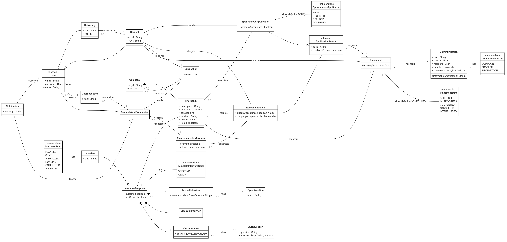

# RASD

## Assignment

Students&Companies (S&C) is a platform that helps match university students looking for internships and companies offering them. The platform should ease the matching between students and companies based on:

- the experiences, skills and attitudes of students, as listed in their CVs;
- the projects (application domain, tasks to be performed, relevant adopted technologies-if any-etc.) and terms offered by companies (for example, some company might offer paid internships and/or provide both tangible and intangible benefits, such as training, mentorships, etc.).

The platform is used by companies to advertise the internships that they offer, and by students to look for internships. Students can be proactive when they look for internships (i.e., they initiate the process, go through the available internships, etc.). Moreover, the system also has mechanisms to inform students when an internship that might interest them becomes available and can inform companies about the availability of student CVs corresponding to their needs. We refer to this process as “recommendation”.

Recommendation in S&C can employ mechanisms of various level of sophistication to match students with internships, from simple keyword searching, to statistical analyses based on the characteristics of students and internships.

When suitable recommendations are identified and accepted by the two parties, a contact is established. After a contact is established, a selection process starts. During this process, companies interview students (and collect answers from them, possibly through structured questionnaires) to gauge their fit with the company and the internship. S&C supports this selection process by helping manage (set up, conduct, etc.) interviews and also finalize the selections.

To feed statistical analysis applied during recommendation, S&C collects various kinds of information regarding the internships, for example by asking students and companies to provide feedback and suggestions.

Moreover, S&C should be able to provide suggestions both to companies and to students regarding how to make their submissions (project descriptions for companies and CVs for students) more appealing for their counterparts.

In general, S&C provides interested parties with mechanisms to keep track and monitor the execution and the outcomes of the matchmaking process and of the subsequent internships from the point of view of all interested parties. For example, it provides spaces where interested parties can complain, communicate problems, and provide information about the current status of the ongoing internship. The platform is used by students at different universities. Universities also need to monitor the situation of internships; in particular, they are responsible for handling complaints, especially ones that might require the interruption of the internship.

## Goals

1. Companies can advertise the internship they offer
2. Students can autonomously candidate for available internships
3. Students are matched with internships they might be interested in
4. Companies can perform interviews with matched students
5. Students and Companies can complain, communicate problems, provide information about an ongoing internship
6. Students and Companies are provided with suggestions about how to improve their submission
7. Universities can handle complains about ongoing internships

## World Phenomena

1. A Company wants to advertise its internship
2. A Student wants to look for an internship
3. A Company wants to accept a suitable recommendation
4. A Student wants to accept a suitable recommendation
5. A Company wants to interview a Student during selection process
6. A Company wants to manage interviews
7. A Students wants to answer questions concerning a selection process
8. A Company wants to complain, communicates problem, provide information about an ongoing internship
9. A Students wants to complain, communicates problem, provide information about an ongoing internship
10. A University wants to monitor an ongoing internship
11. A University wants to handle complains about an ongoing internship
12. A University wants to interrupt an ongoing internship

## Shared Phenomena

### Controlled By the World

1. A Company publish an internship offer
2. A Student inserts his CV
3. A Student sends a spontaneous application for an internship
4. A Student or a Company accepts a suitable recommendation(swipe)
5. A Company configures interviews for a specific internship
6. A Company conducts a previously set up interview
7. A Company finalizes a previously conducted interview
8. A Student or Company complains, communicates problem, provides information about an ongoing internship
9. A Student answers questions related to an interview
10. A Students or Company monitors his recommendation process
11. A University handles complaints about ongoing internships
12. A University interrupts an internship

### Controlled By the Machine

1. The Platform shows to Students available internships
2. The Platform shows to Companies available candidates  for their internships
3. The Platform shows to Students the status of spontaneous applications
4. The Platform shows to Students the current status of the recommendation process
5. The Platform shows to Companies the current status of the recommendation process for a given internship
6. The Platform shows to Companies information about Interviews
7. The Platform shows to Universities information about an ongoing internship
8. The Platform notifies Students and Companies when a suitable recommendation is found
9. The Platform provides Students and Companies suggestions about how to make their submissions
10. The Platform asks for feedback and suggestions to improve the recommendation process

<!-- 1. The Platform presents the interface for Companies' internship data submission
2. The Platform presents the interface for Students' CV submission
3. The Platform presents the interface for actively searching available internships
4. The Platform presents the interface for monitoring recommendation
5. The Platform presents the interface for a Company to set up an Interview
6. The Platform presents the interface for a Company to conduct previously set up Interviews
7. The Platform presents the interface for a Company to finalize previously conducted Interviews
8. The Platform displays the interface for a Student to answer Interview questions
9. The Platform presents the interface for complaining, communicating problems, providing information about an ongoing internship
10. The Platform presents the interface for a University to handle complains
11. The Platform presents the interface for a University to Monitor an ongoing internship
12. The Platform presents the interface for a University to interrupt an ongoing internship -->

## Domain Assumption

1. Students and Companies provide the Platform with correct and truthful information
2. Companies remove published internship if they are no longer available
3. Students, Companies and Universities receive every notification
4. Students, Companies and Universities has a working internet connection
5. Universities interrupt an ongoing internship only if no solution to complaints/problems are found

## User Scenario

1. **Student Sign-up**

Mario Rossi is a student that want to improve his ability and education by doing an internship before graduating. He opens the S&C platform and select "Student SignUp". He proved the required personal information such as his Name, Surname and Date of birth, an email and a password that he will use as login credential and he select from the list of available university the university he goes to. 
If the email address has never been used on the site, Mario will receive an eMail for confirming the mail address and the registration of the account. Once the registration is confirmed the account is created.
If the email address is already in use the platform will show an error that ask to insert a new email. 

2. **Company Sign-up**

FastRedCar SPA is a world-leading car company that aims to launch an internship program to train new mechanical engineers in their final year of a Bachelor’s or Master’s degree. The company open the S&C platform and select "Company SignUp" where they provide the required information such as the company name, company headquarters address, company VAT number and also an email address and a password that will be used as login credential.
If the VAT number has never been used on the site, FastRedCar SPA will receive an eMail for confirming the mail address and the registration of the account. Once the registration is confirmed the account is created.
If the VAT number is already in use the platform will show an error indicating the the company is already registered on the platform.

3. **University Sign-up**

The Technical University of Milan is a prestigious university that wants his students to complete an internship before graduating, believing this experience will enhance their skills and knowledge. The university opens the S&C platform and selects "University SignUp" where they provide the required information such as the university name, the university description, the university VAT number, the name of the university office that will manage the internship program and also an email address and a password that will be used as login credential.
If the VAT number has never been used on the site, the Technical University of Milan will receive an eMail for confirming the mail address and the registration of the account. Once the registration is confirmed the account is created.
If the VAT number is already in use the platform will show an error indicating the the university is already registered on the platform.

4. **Actor Login**

A platform user that has already registered an account can login by providing the email and password used during the registration. If the email and password are correct, matching and entry in the platform DB, the user is redirected to the platform home page. If the email or password are incorrect the platform will show an error message indicating that the login credentials are wrong.

5. **User Load Curriculum** (Load a cv-file that is analyzed? Or simply ask a user a set of questions to fill in the profile?)

Stefano is a student who has already registered an account on S&C and wants to complete his profile by uploading his CV. From the platform's homepage, he clicks on the "Upload CV" button. He is then redirected to a page where he can enter his curriculum information, including his current level of education, languages he knows, technical skills, and, optionally, details about past work experience along with contact information for previous employers. 
He also add a photo of himself, a brief description of his interests and hobbies and, in a an apposite section of the page, he write all the thighs he would like to learn and improve during his internship as well as all the thighs he would like to avoid doing. Stefano is pretty thorough in filling this section because he knows that he is doing an internship to improve his skills and ability and he wants to avoid spending his "internship-time" doing task that will not help him in a future job. 
As soon as (? non specifico abbastanza) he click on the "Submit CV" button the platform elaborate it and try to find some matching job internship based on the given information. 
A list of five different internship, for which Stefano is a match, is shown to the student in the platform's homepage where he can decide to apply for one of them, starting the selection process.
While computing the matching, the platform also provides Stefano with some suggestions on how to improve his CV based on the "missed internship" to which he cant apply because he miss some skills, or keywords, in his CV.

6. **Company Submit an Internship Insertion**

AnanasPhone is a major tech company, specialized in the production of smartphone and table, that has an account on the S&C company. They want to create an internship program aim to software engineers student in their final year of Master Degree. They open the S&C platform and select "Insert Internship" where they provide the required information such as the internship title, the internship description, the internship domain, a list of the required skills and a list of all the task that the student will have to do during the internship. 
The company also define the selection process that will be used to select the student that will do the internship in the case in which they are match by the platform and in the case in which they manually apply to the insertion. 
Once the internship is created by clicking on the "Submit Internship" button, the platform will match the internship with all the student that are a match for the internship based on the given information. 
The platform will also provide AnanasPhone with some suggestion on how to improve the internship description, and matching probability, based on the "missed student" to which they are not match because they are require them to do task that are especially excluded by the student during they CV submission or because the Company cannot provide to the student a sufficient training on the required skills.

## Requirements
<!--Login-->
1. The system shall allow Students to register by providing personal information and selecting their university
2. The system shall allow Companies to register by providing company information
3. The system shall allow Universities to register by providing university information
4. The system shall send a confirmation email upon registration (??)
5. The system shall prevent duplicate registrations (??)
6. The system shall allow registered Users to log in using their email and password. 
7. The system shall provide error messages if login credentials are incorrect. (??)
    <!-- Application advertisement and Applications-->
8. The system shall allow registered Companies to create and publish Internship offers specifying details like application domain, tasks, adopted technologies, and terms.
9. The system shall allow registered Companies to terminate their Internship offers at their own discretion. 
10. The system shall provide registered Students a set of Internship offers they might find interesting.
11. The system shall allow registered Students to view and navigate available internsihps (Unite 9 and 10??)
12. The system shall enable registered Students to submit spontaneous applications to Internships they find interesting.
13. The system shall allow registered Students to submit their CVs and maintain their profiles (Two different requirements??)
14. The system shall allow registered Students to monitor the status of their applications.
    <!--Recommendation System-->
15. The system shall notify registered Students when an Internship that matches their profile becomes available.
16. The system shall notify registered Companies when a registered Student’s CV matches an Internship requirement.
17. The system shall display to registered Companies CVs of Students they are interested in. 
18. The system shall allow registered Students and Companies to accept a Recommendation, starting an Interview process between them. (??)
    <!--Selection and Interview Management-->
19. The system shall allow registered Companies to create Interview questionnaires or structured questions for Students they have initiated and Interview process with.
20. The system shall allow registered Students to answer Interview questions and submit them.
21. The system shall allow registered Students to monitor the status of their Interviews.
22. The system shall enable registered Companies to complete the Interview process by recording and submitting the final outcome for each candidate. 
    <!--Feedback and Suggestions for Improvements-->
23. The system shall collect feedback from both registered Students and Companies regarding the recommendation and Internship experience
24. The system shall provide suggestions to registered Students on improving their CVs
25. The system shall provide suggestions to registered Companies on improving project descriptions
    <!--Universities Oversight and Complain Management-->
26. The system shall allow registered Universities to access and monitor internship data related to their students.
27. The system shall provide a platform to registered Students and Companies to  complain, communicate problems, or provide information about the current status of the ongoing internship. 
28. The system shall notify registered Universities of any complaint or problem issued on their students
29. The system shall allow registered Universities to handle complaints and to interrupt an internship at their own discretion.
<!---->
## Class Diagram

