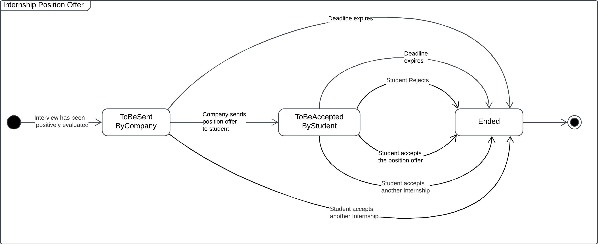
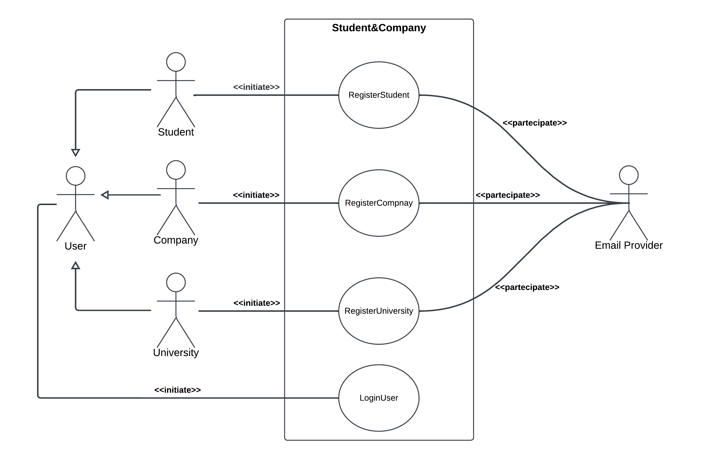

# RASD

## Assignment

Students&Companies (S&C) is a platform that helps match university students looking for internships and companies offering them. The platform should ease the matching between students and companies based on:

- the experiences, skills and attitudes of students, as listed in their CVs;
- the projects (application domain, tasks to be performed, relevant adopted technologies-if any-etc.) and terms offered by companies (for example, some company might offer paid internships and/or provide both tangible and intangible benefits, such as training, mentorship, etc.).

The platform is used by companies to advertise the internships that they offer, and by students to look for internships. Students can be proactive when they look for internships (i.e., they initiate the process, go through the available internships, etc.). Moreover, the system also has mechanisms to inform students when an internship that might interest them becomes available and can inform companies about the availability of student CVs corresponding to their needs. We refer to this process as “recommendation”.

Recommendation in S&C can employ mechanisms of various levels of sophistication to match students with internships, from simple keyword searching, to statistical analyses based on the characteristics of students and internships.

When suitable recommendations are identified and accepted by the two parties, a contact is established. After a contact is established, a selection process starts. During this process, companies interview students (and collect answers from them, possibly through structured questionnaires) to gauge their fit with the company and the internship. S&C supports this selection process by helping manage (set-up, conduct, etc.) interviews and also finalize the selections.

To feed statistical analysis applied during recommendation, S&C collects various kinds of information regarding the internships, for example, by asking students and companies to provide feedback and suggestions.

Moreover, S&C should be able to provide suggestions both to companies and to students regarding how to make their submissions (project descriptions for companies and CVs for students) more appealing for their counterparts.

In general, S&C provides interested parties with mechanisms to keep track and monitor the execution and the outcomes of the matchmaking process and of the subsequent internships from the point of view of all interested parties. For example, it provides spaces where interested parties can complain, communicate problems, and provide information about the current status of the ongoing internship. The platform is used by students at different universities. Universities also need to monitor the situation of internships; in particular, they are responsible for handling complaints, especially ones that might require the interruption of the internship.

## 1.1.1 Purpose

The purpose of the Student&Company (S&C) Platform is to create a system that allows Students to find Internships to enhance their education and improve their curriculum, while allowing Companies to find suitable candidates for their internship programs. All of this is done in a simple and efficient way by providing a series of tools to help both parties in the process.
S&C will support the entire lifecycle of the Internship process for both Students and Companies: from the initial matchmaking that can be done automatically by the system through a proprietary Recommendation Process, or obtained by a Student with a Spontaneous Application to a specific internship offer, to the final selection process done through structured interviews created and submitted by Companies directly on the platform.
In the meantime, Student&Company will also provide a series of Suggestions to improve CVs published by Students and internship offers published by Companies. The platform will also allow the Universities of students who are actually doing an internship to monitor the progress of such activities and handle any Complaints if necessary, even by terminating the internship if no other solution to the complaint can be found.
<!-- 0.5hours (Sam) -->

## 1.1.1 Goals

1. Companies would like to advertise the Internships they offer
2. Students would like to autonomously candidate for available Internships
3. Students would like to be Matched with Companies that offer Internships they might be interested in
4. Companies would like to perform Interviews with Matched Students
5. Students and Companies would like to complain, communicate problems, provide information about an ongoing Internship
6. Students and Companies would like to be provided with Suggestions about how to improve their submission
7. Universities would like to handle Complaints about ongoing Internships
8. Students would like to choose which internship to attend from among those for which they passed the interview.
9. Companies would like to select students for the internship position among those who passed the interview

## 1.2 Scope

1. Advertise Internship: Companies can publish Internships offers that:
    - Students can spontaneously apply to
    - Recommendation Process considers while looking for Matches
2. Insert CV: Students can provide the platform with their CV that Recommendation process will consider while looking for Matches
3. Spontaneous Application: Students can autonomously apply for an available Internship offer.
4. Spontaneous Application Acceptance: Companies can accept a Spontaneous Application sent by a Student
5. Recommendation Process: The platform automatically finds Matches between available CV and Internships. At the end of the process provide Students and Companies with a Match they can accept or refuse.
6. Interview Management:
    Companies can Interview both Students whose Spontaneous Application has been accepted, and Students that accepted a match found by Recommendation Process the Company has accepted too, by providing them with Interview. The outcome of the Interview finalizes the selection process that can lead to a confirmed Internship experience.
    Companies can delete previously created Template-Interviews only if all the Interviews concerning that Template are in a refused/accepted/negatively-evaluated state
7. Internship Handling:
    Students and Companies can complain, communicate problems, provide information about a confirmed Internship.
    University can monitor a confirmed Internship and handle Complaints, provided problems and visualize provided information.
    Handling a complaint, the University can decide to interrupt the Internship.
8. Suggestion Mechanism:
    The platform provides suggestion to both Students and Companies about the manner they respectively provide it with their CV and Internships. The suggestion achievement is to allow Students and Companies to perform better in the Recommendation Process.

## 1.2.1 World Phenomena

1. A Company wants to advertise its Internship
2. A Student wants to look for an Internship
3. A Company wants to accept a suitable Recommendation
4. A Student wants to accept a suitable Recommendation
5. A Company wants to interview a Student during a selection process
6. A Company wants to manage Interviews
7. A Student wants to answer questions concerning a selection process
8. A Company wants to complain, communicate problems, provide information about an ongoing Internship
9. A Students wants to complain, communicate problems, provide information about an ongoing Internship
10. A University wants to monitor an ongoing Internship
11. A University wants to handle Complaints about an ongoing Internship
12. A University wants to interrupt an ongoing Internship

## 1.2.2 Shared Phenomena

### Controlled By the World

1. A Company publishes an Internship
2. A Student or a Company accepts a suitable Recommendation(swipe)
3. A Company configures Interviews for a specific Internship
4. A Company conducts a previously set up Interview
5. A Company finalizes a previously conducted Interview
6. A Student or Company complains, communicates problems, provides information about an ongoing Internship
7. A Student answers questions related to an Interview
8. A Student or Company monitors his Recommendation Process
9. A University handles Complaints about ongoing Internships
10. A University interrupts an Internship

### Controlled By the Machine

1. The Platform shows to Students available Internships
2. The Platform shows to Companies available candidates for their Internships
3. The Platform shows to Students the status of Spontaneous Applications
4. The Platform shows to Students the current status of the Recommendation Process
5. The Platform shows to Companies the current status of the Recommendation Process for a given Internship
6. The Platform shows to Companies information about Interviews
7. The Platform shows to Universities information about an ongoing Internship
8. The Platform notifies Students and Companies when a suitable Recommendation is found
9. The Platform provides Students and Companies Suggestions about how to make their submissions
10. The Platform asks for Feedback to improve the Recommendation Process

<!-- 1. The Platform presents the interface for Companies' Internship data submission
2. The Platform presents the interface for Students' CV submission
3. The Platform presents the interface for actively searching available Internships
4. The Platform presents the interface for monitoring recommendation
5. The Platform presents the interface for a Company to set up an Interview
6. The Platform presents the interface for a Company to conduct previously set-up Interviews
7. The Platform presents the interface for a Company to finalize previously conducted Interviews
8. The Platform displays the interface for a Student to answer Interview questions
9. The Platform presents the interface for complaining, communicating problems, providing information about an ongoing Internship
10. The Platform presents the interface for a University to handle Complaints
11. The Platform presents the interface for a University to Monitor an ongoing Internship
12. The Platform presents the interface for a University to interrupt an ongoing Internship -->

## 1.5 Reference Documents
<!-- 0.25 hours (Sam) -->

## 1.3.1 Definitions

- **University:** An institution that is registered on the S&C platform.
- **Company:** A company that is registered on the S&C platform.
- **Student:** A person who is currently enrolled in a University and is registered on the S&C platform.
- **User:** Any registered entity on the S&C platform.
- **Internship Offer:** The offer of an opportunity to enroll in a internship provided by a Company. The offer remains active on the platform indefinitely until it is removed by the publishing Company and each Company can have publish multiple Internship Offers.
- **Internship Position Offer:** The formal offer of an internship position presented to a student who has successfully passed the Interview Process, who can decide to accept or reject it.
- **Recommendation Process:** The process of matching a Student with an Internship Offer publish by a Company based on the Student's CV and the Internship's requirements made by the S&C platform.
- **Recommendation/Match:** The result of the Recommendation Process. It is the match between a Student and an Internship Offer.
- **Spontaneous Application:** The process of a Student manually applying for an Internship Offer that was not matched through the Recommendation Process.
- <!--**Template Interview:** A collection of open-ended questions, quizzes, and calls that a Company can create. Each time a Company wants to interview a Student, they can select a Template Interview, or create a new one, and assign it to the Student.-->
- **Interview:** The process of evaluating a Student's application for an Internship Offer done by a Company through the S&C platform. 
- **Feedback:** Information provided by Students and Companies to the S&C platform to improve the Recommendation Process.
- **Suggestion:** Information provided by the S&C platform to Students and Companies to improve their CVs and Internship Offer descriptions.
- **Communication:** All of the interactions between Companies and University 
- **Confirmed Match:** A match that has been accepted by both a Student and a Company.
- **Rejected Match:** A match that has been refused by either a Student or a Company.
- **Pending Match:** A match that has been accepted only by a Student or a Company, and it's waiting for a response from the other party.
- **Unaccepted Match:** A match that has been refused by either a Student or a Company.
- **Confirmed Internship:** An Internship Offer that has been accepted by the Student.
- **Complaint:** A report of a problem or issue that a Student or Company has with an ongoing Confirmed Internship. It can be published on the platform and handled by the University.
<!--(1.5h)Sam-->

## 1.6 Document Structure

This document is composed of six sections:

1. **Introduction**: This section provides an overview of the document and the system. Here the purpose of the platform is explained, along with the goals and phenomena of the system. Finally, essential definitions are provided.
2. **Overall Description**: In this section it is provided a high-level perspective of the system, describing its overall purpose, functionality, and user interactions. It includes an outline of the system's intended features, user profiles, and assumptions about the domain.
3. **Specific Requirements**: In this section we focussed on the technical and functional details of the system. Here are specified the external interfaces as well as the functional and non-functional requirements of the system. Diagrams, such as use case and sequence diagrams, have been used to provide a visual representation of the system's functionality.
4. **Alloy**: This section illustrates code and diagrams of the Alloy formal specification language that has been used to ensure the consistency and correctness of the system's formalized requirements.
5. **Effort Spent**: This section provides an overview of the time spent by each group member on the project.
6. **References**: This section provides a list of references used in the document.
   <!--[(1.5h) Matteo]-->

## 2.1 Product Perspective
This section provides a high-level description of the Student&Company platform, outlining its main features and functionalities thought the use of Text Description such as User Scenarios, and a more in-depth analysis of the system's structure through the use of Class Diagrams and State Charts.

## 2.1.1 User Scenario

1. **Student Sign-up**
   Mario Rossi is a student that wants to improve his ability and education by doing an internship before graduating. He opens the SC platform and selects “Student SignUp”. He proved the required personal information such as his name, surname, date of birth, an email, and a password that he will use as login credential. He also selects from the list of available university the university he goes to.\\
   If the email address has never been used on the site, Mario will receive an email for confirming the mail address and the registration of the account. Once the registration is confirmed by Mario the account is created. If the email address is already in use, the platform will show an error that asks to insert a new email address.

2. **Company Sign-up**
   FastRedCar SPA is a world-leading car company that aims to launch an internship program to train new mechanical engineers in their final year of a Bachelor’s or Master’s degree. The company opens the S&C platform and selects “Company SignUp” where they provide the required information such as the company name, company headquarters address, company VAT number and also an email address and a password that will be used as login credential.
   If the VAT number has never been used on the site, FastRedCar SPA will receive an email for confirming the mail address and the registration of the account. Once the registration is confirmed the account is created.
   If the VAT number is already in use on S&C an error will be shown indicating that the company already has an account registered on the platform.

3. **University Sign-up**
   The Technical University of Milan is a prestigious university that wants his students to complete an internship before graduating, believing this experience will enhance their skills and knowledge. The university opens the SC platform and selects “University SignUp” where they provide the required information such as the university name, the university description, the university VAT number, the name of the university office that will manage the internship program and also an email address and a password that will be used as login credential.\\
   If the VAT number has never been used on the site, the Technical University of Milan will receive an email for confirming the mail address and the registration of the account. Once the registration is confirmed, the account is created.
   If the VAT number is already in use, the platform will show an error indicating the university is already registered on the platform.

4. **User Login**
   A platform user that has already registered an account can log in by providing the email and password used during the registration. If the email and password are correct, matching and entry in the platform DB, the user is redirected to the platform home page. If the email or password are incorrect, the platform will show an error message indicating that the login credentials are wrong.

5. **Student Load Curriculum**  
   Stefano is a student who has already registered an account on SC and wants to complete his profile by uploading his CV. From the platform's homepage, he clicks on the “Upload CV” button. He is then redirected to a page where he can enter his curriculum information, including his current level of education, languages he knows, technical skills, and, optionally, details about past work experience along with contact information for previous employers.
   He also adds a photo of himself, a brief description of his interests and hobbies and, as soon as he clicks on the “Submit CV” button, the platform elaborates it and try to find some matching internship based on the given information.\\
   A list of five different internships, for which Stefano is a match, is shown to the student in the platform's homepage where he can decide to apply for one of them, notifying the company.
   While computing the matching, the platform also provides Stefano with some suggestions on how to improve his CV and matching probability, based on a grammar and lexical analyses and a direct comparing of Stefano's CV with another similar candidate

6. **Company Submit an Internship Insertion**
   AnanasPhone is a major tech company, specialized in the production of smartphone and tablet, that has an account on the S&C site. The company wants to create an internship program aim to a software engineers student in their final year of Master Degree.\\
   A Human Resource employee opens the S&C platform and selects “My Internship” where a list of all the internship already present on S&C is shown. Here he clicks on “Insert Internship” where he provides the required information such as the internship title, the internship description, the start date and duration, the office address, a list of the required skills student need to have in order to be considered for the internship and, possibly, a list of benefits offered to the future intern. Once the internship is created, by clicking on the “Submit Internship” button, the platform will start the recommendation process with the aim to match the internship with all the students that are compatible with such opportunity, based on the given information of both parties.\\
   The platform will also provide AnanasPhone with some suggestion on how to improve the internship description, and matching probability, based on a grammar and lexical analyses and a direct comparing of AnanasPhone's Internship proposal with other similar companies.

   <!--7. **Company create structured interview to submit to possible candidate**
   MacroHard is a world-leading tech company, known for creating its secure and reliable operating system, “Door”. The company has an account on the S&C platform and has already set up an internship program for software engineering students pursuing a Master’s degree. The company wants to create a structured interview to evaluate the technical skills and motivation of the students who apply for the internship.\\
   MacroHard opens the platform and, on the page displaying the lists of matched students, clicks on the “Create Interview” button. This option allows the company to create structured interviews that will be submitted to candidates. The business sets up an “InterviewTemplate”, a collection of questions that includes both quizzes, which the S&C platform can automatically evaluate, and open-ended questions that require manual review. They may also include one or more video calls in the template, the outcomes of which can be recorded on the platform as a grade. The InterviewTemplate tracks each interview’s outcomes, allowing both the candidate and the company to monitor the interview progress.\\
   MacroHard create multiple InterviewTemplates for the same internship, allowing them to submit different templates to different students based on factors such as the student’s CV, method of application (matched or spontaneous), or other criteria. Each template is created only once and can be reused for different students or internship opportunities.\\
   For this internship in particular, MacroHard has created two InterviewTemplates: one for matched students, which includes only a quiz to assess technical skills, and another for spontaneous applicants, which includes both a quiz and a video call to evaluate the student’s motivation.-->

7. **Student accepts a matched internship**
   Sara is an economic major student that has already uploaded her CV on the S&C platform and is looking for an internship. She has received a notification and, by clicking on it, she sees that a new internship is available for her.\\
   Sara reads the internship information, and she decides to accept it. A notification is sent to the company who has created the internship about the acceptance of the match by Sara. If the company also accepts the match, the platform requires the company to initiate the selection process by assigning a interview to Sara, who will be notified about it.
   To both parties, feedback is requested by the platform to improve the Recommendation Process by asking both to rate the matching

8. **Student manually applies for an internship**
   Marco is a chemistry student that has already uploaded his CV on the S&C platform and is looking for an internship. Unfortunately, the matching internships provided by the platform do not fully satisfy his needs, and he decides to proactively search for another one.\\
   He opens the platform's homepage and click on the “Browse all Internships” button. Here he can see all the internships that are available on the platform, and he can filter them by field of study, required skills, location and other parameters.
   He finds an internship that is not in the matching list provided by the platform, but that is perfect for him, so he clicks on the “Spontaneous Application” button.\\
   The platform notify the company that Marco has applied for the internship and will inform the student if and when the company will start the application process by sending him a interview. There is no need for Marco to accept the interview, as a spontaneous application is considered as an implicit acceptance of the match by the student.

9. **Student sees his application & interview status**
    Stefano is a student who has applied for various internships through the S&C platform. He has submitted applications both by matching with companies through the platform's automated feature and by manually applying, and with some of them he is already in a selection phase, and he is currently waiting for updates from the different companies.\\
    When Stefano logs into the platform, he navigates to the “My Applications”. In this section, he can view the status of each of his applications like: if any company has accepted his match or his spontaneous application,
    if some company has assigned him an interview and if any company has offered him an internship that he can accept or refuse.\\ 

10. **Company see the status of the selection process and accept a Internship**
    CosmoX, a renowned private space company that specialized in the reuse of rocket, has created an internship on the S&C platform for aspirants Aerospace engineer, has received multiple manual applications from different students and has been matched numerous times. The company has already accepted all worthy manual applications and all the matches and has assigned an interview to everyone.
    CosmoX is now waiting for the students to complete the interviews and for the platform to automatically evaluate the quiz answers,  while the company is manually reviewing the open-ended questions and grading the different video calls.\\
    When a CosmoX employee logs into the platform, he can navigate to the “My Interview” section. In this section, he can view the status of each interview and the status of each student such as: “SENT” if the student has received the interview but not opened yet, “OPENED” if the student has opened the interview but not submitted the answer yet and, more importantly, if the student has accepted internship after being positively evaluated or if the interview has been reject either by the student itself or by the platform because the student has already accepted another internship with another company.\\

11. **Student refuses/accepts an internship**
    Paula is an Art Mayor that has been matched by S&C with different museums and private art galleries in the city of Florence. She happily accepted all the matched and completed the interviews with all the companies. She did not expect to pass all the interviews, and now she has to choose between the different offers.\\
    Paula open the platform and navigate to the “My Applications” section where she can see all of her internships and the status of each one. To refuse an internship, for which she passed the Interview, Paula clicks on it and then clicks on the “Refuse” button. The platform will notify the company about the decision of the student. By doing the same process, but clicking on the “Accept” button, the platform will notify the company that Paula has accepted the internship and will and block any other interview process that the student was undertaking, informing the respective companies. Paula can only accept an internship if she is not currently doing another internship with a different company, as the platform will inform her.\\ 

12. **Company publish a complaint about a student**
    PlaneHearts is a company famous for its innovative and multi-platform IDE for the development of mobile application. The company has created an internship on the S&C platform for software engineering students and selected Giovanni, a computer science student, for the internship. However, after the internship started, employees at PlaneHearts noticed that Giovanni was not performing as expected, did not have the required skills, and was not motivated to learn. The company decided to publish a complaint about Giovanni on the platform to inform the student's university.\\
    For publish the complaint, the people managing PlaneHearts account on S&C, log into the platform and navigates to the “Complaints” section. Here, they can view all the complaints they have published and can create a new complaint by providing the student's name, the internship title, and describe the problem that has arisen. Once the complaint is submitted, the platform will notify Giovanni and his university.

13. **Student respond to a complaint**
    Giovanni has received a notification from the S&C platform that a complaint has been published about him by PlaneHearts, the company where he is currently doing an internship. The complaint states that Giovanni is not performing as expected, does not have the required skills, and is not motivated to learn during this experience.\\
    The Student will have the opportunity to respond to the complaint and provide his version of the events by navigating to the “Complaints” section of the platform. Here, he can view all the complaints published about him and can respond to each one by providing a description of the situation from his perspective.

14. **University handles a complaint**
    The University of Rome, a prestigious university that has students enrolled in the S&C platform, has received a complaint about one of their students. The carrier advisor at the university opens the S&C platform and navigate to the “Complaints” section. Here, he can view all the complaints published about his students and can handle each one by reviewing the complaint, contacting the student and the company involved, and taking appropriate action to resolve the issue.
    In this particular carrier advisor and the university have decided to interrupt the internship of the student to protect the student and the company from further issues. The university does so by clicking on the “Interrupt Internship” button in the complaint page. The platform will notify the student and the company about the interruption of the internship and will close the complaint.
<!-- 7 hours (Sam) -->

## 2.1.2 Class Diagram

## 2.1.3 State Charts 

The following section presents a series of state diagrams illustrating the progression of the main phases of the Student&Company platform. These diagrams include representations of the Recommendation Process and its Spontaneous Application variant, the Interview Process that may result in an Internship Position Offer, and finally, a Selection Process diagram that highlights the relationship between the latter two processes.

- **Recommendation Process** 
  - The Recommendation Process is the core of the Student&Company platform. It is the process that matches Students with Internships 
    based on the Student's CV and the Internship's requirements. It is initiated by the platform when it detects a potential Match. 
    The process then evolves to a "WaitingForConfirmation" state, where the system waits for the Student and the Company to accept the Match. 
    If one of the two parties rejects the Match, the process is terminated. If both parties accept the Match, an Interview is initiated, and the process is terminated.

- **Spontaneous Application Process**
  - Unlike the Recommendation Process, the Spontaneous Application process is initiated by the Student. 
    When a Student submits a Spontaneous Application for an Internship, the process evolves to a "WaitingForConfirmation" state, 
    where the system waits for the Company to accept the Application. If the Company rejects the Application, the process is terminated. 
    If the Company accepts the Application, an Interview Process is initiated, and the process is terminated.

- **Interview Process**
  - The Interview Process is initiated when a Match is accepted by both the Student and the Company, or when the Company 
    accepts a Spontaneous Application. The process starts in the "Interview Creation" state, where the Company is 
    asked to create and submit an Interview. Here, the Company is required to specify a deadline for the Interview. 
    The Interview process evolves into the "InterviewSubmitted" state once the Company sends the Interview to the Student, 
    who answers the questions and submits the Interview. If the Student fails to submit the answers within the deadline, 
    he will be considered rejected, and the process is progressed to an "Evaluated" state and terminates.
    Otherwise, after the Interview has been sent back by the student, the process evolves to a "ToBeEvaluated" state. 
    In this state, the Company can manually evaluate the Student's answers and mark the interview as "Accepted" or "Rejected".  
    In case the Student has been rejected, he will be notified of the outcome, and the process is terminated. Otherwise,
    if the Student has been accepted, an Internship Position Offer process is initiated and the process is terminated.
    If anywhere in the process, the Student accepts another Internship, the process is terminated and the Student will be considered rejected.

- **Internship Position Offer**
  - The Internship Position Offer process begins when a student successfully completes the Interview Process. Initially, the process enters the "ToBeAcceptedByCompany" state.
    This state allows companies to evaluate and select the most suitable candidates when more students than required have passed the interview.
    If the company rejects the student or the deadline expires, the process concludes and the student will be considered rejected.
    If the company accepts the student, the process transitions to the "ToBeAcceptedByStudent" state, where the student decides to either accept or reject the offer.
    If the student rejects the offer or lets the deadline expire, the process concludes and the student will be considered rejected.
    If the student accepts the offer, the process concludes, and all the student’s other ongoing interviews are terminated with the student being marked as rejected in those interviews.
    If anywhere in the process, the Student accepts another Internship, the process is terminated and the Student will be considered rejected.
    

- **Selection Process**
  - The Selection Process diagram illustrates the relationship between the Interview Process and the Internship Position Offer Process.
    The Selection Process terminates if the Match is rejected, if the Student is rejected during the Interview Process or the Internship Position Offer Process, or if the Student accepts another Internship.
    If the Student is accepted during the Interview Process, the process transitions to the Internship Position Offer Process.
    If the Student accepts the Internship Position Offer, the process also concludes. 
  
    <!-- [(5.0h) Matteo] -->

    
## 2.2 Product Functions

This section outlines the essential functionalities and detailed requirements of the platform, structured to support the key objectives defined in the product scope.
1. **User Management**
   The platform allows Students, Companies, and Universities to register and log in. It also provides Students with the ability to upload and modify their CVs, and Companies with the ability to view and manage their internships.
2. **Internship Creation and Management:**
   Companies can create, publish, and manage Internship offers on the platform. They define details such as job description, requirements, deadlines and benefits. Companies also have the ability to terminate Internship offers when they are no longer needed.
3. **Student Application Process:**
   Students can browse available Internships and apply to Internships either through automatic matching or by submitting Spontaneous Applications. They can also track the status of their Applications throughout the process.
4. **Automated Recommendations**
   The platform matches Students with suitable Internships based on their CVs and the specific requirements set by Companies. Once a match is found, both Students and Companies are notified, and they can accept or decline the Recommendation.
5. **Interview Management**
   Companies can create and assign Template Interviews to Students, which include quizzes, questions, and calls to assess their suitability for an Internship. Both Students and Companies can track the Interview progress, and Companies can evaluate Student responses manually or automatically.
6. **Feedback and Suggestions for Improvement**
   The platform collects Feedback from Students and Companies to improve the Recommendation Process. It also provides Suggestions to Students on how to enhance their CVs and to Companies on how to improve their Internship descriptions.
7. **Complaint Management**
   Students and Companies can publish Complaints about ongoing Internships, which are then handled by Universities. Universities can monitor Complaints and interrupt Internships if necessary.
8. **Notification System**
   Notifications are sent to Students, Companies, and Universities when relevant events occur, such as new Internships, matched Recommendations, Interview assignments, Internship Position Offers,Complaints, Sign-up confirmation or Communications.
   <!-- [(2.0h) Matteo] -->

## 2.2.1 Requirements
 
1. The system shall allow any unregistered students to register by providing personal information and selecting their University.
2. The system shall allow any companies to register by providing company information.
3. The system shall allow any universities to register by providing university information.
4. The system shall allow Users to log in using their email and password.
5. The system shall send notifications to Users when relevant events occur.
    <!-- Internship advertisement and Applications -->
6. The system shall allow Companies to create and publish Internship offers specifying details.
7. The system shall allow Companies to terminate their Internship offers at their own discretion.
8. The system shall provide Students with Matches automatically obtained by the Recommendation Process.
9. The system shall allow Students to view and navigate all available Internships.
10. The system shall enable Students to submit Spontaneous Applications to Internships they choose.
11. The system shall allow Students to submit their CV.
12. The system shall allow Students to modify their CV.
13. The system shall allow Students to monitor the status of their Spontaneous Applications.
14. The system shall allow Students to monitor the status of their Recommendations.
    <!-- Recommendation System -->
15. The system shall display to Students all the Internships found by the Recommendation Process.
16. The system shall display to Companies all the CVs of Matched Students obtained by the Recommendation Process.
17. The system shall allow Students and Companies to accept a Recommendation.
18. The system shall allow Companies to accept a Spontaneous Application.
19. The system shall start an Interview only if both the Company and the Student have accepted the Recommendation.
20. The system shall start an Interview only if the Company has accepted the Spontaneous Application.
    <!-- Selection and Interview Management -->
21. The system shall allow Companies to create Interviews.
22. The system shall allow Companies to submit Interviews to Students they have initiated a Selection Process with.
23. The system shall allow Students to answer Interview questions and submit them.
24. The system shall allow Companies to manually evaluate Interview submissions.
25. The system shall allow Students and Companies to monitor the status of their Interviews.
26. The system shall enable Companies to complete the Interview process by submitting the final outcome to each candidate.
    <!-- Internship Position Offer -->
27. The system shall enable Companies to send an Internship Position Offer to a Student only if he previously passed the relative Interview
28. The system shall enable Students to accept or reject an Internship Position Offer sent by a Company only if he previously passed the relative Interview
    <!-- Feedback and Suggestions for Improvements -->
29. The system shall collect Feedback from both Students and Companies regarding the Recommendation Process.
30. The system shall provide Suggestions to Students on improving their CVs.
31. The system shall provide Suggestions to Companies on improving Internship descriptions.
    <!-- Universities Oversight and Complaint Management -->
32. The system shall allow registered Universities to access and monitor Internship Communications related to their Students.
33. The system shall provide a dedicated space for Students and Companies to exchange Communications about the current status of an ongoing Internship.
34. The system shall allow registered Universities to handle Complaints and to interrupt an Internship at their own discretion.
<!-- [(6.0h) Matteo] -->

## 2.4.1 Domain Assumption

1. Students and Companies provide the Platform with correct and truthful information
2. Companies remove published Internship if they are no longer available
3. Students, Companies and Universities receive every notification
4. Students, Companies and Universities have a working internet connection
5. Universities interrupt an ongoing Internship only if no solution to complaints is found

<!-- This is a RASD document primarily read by non-technical stakeholder. My idea is not to mention in the PWA 
implementation approach in this document as we will have a lot of occasion in later docs -->
## 3.1.2 Hardware Interfaces
The platform is a web application that can be accessed from any device with a web browser and an internet connection like a PC, a tablet, or a smartphone. No specific hardware requirements are needed to interact with the Student&Company platform.

## 3.1.3 Software Interfaces
<!-- if a notification Manager is used in other part of the Document, we need to put it here-->
A Email Provider, thought its interface, is used by the platform to send a confirmation email to Users upon registration. At this stage of development, no other external software interfaces are required.

<!-- Again, if not necessary I would avoid putting here the use of the REST protocol or PWA stuffs in a non-technical doc -->
## 3.1.4 Communication Interfaces
The platform uses standard internet communication protocols to interact with Users and the backend server. At this stage of development other specific communication interfaces are not defined yet.

<!-- 0.5 hours (Sam) all 3 interface-->

## 3.2.1 Use Case Diagrams

<!-- (4.5h) (Sam)-->

## 3.2 Functional Requirements

This chapter provides a comprehensive overview of the system's use cases, detailing the various interactions between users and the system.
Use Case Diagrams, detailed Use Case Descriptions, Sequence Diagrams and Requirement Mapping are provided for each use case.
<!-- [(0.5h) Matteo] -->

## 3.2.2 Use Cases

### RegisterStudent
### RegisterCompany
### RegisterUniversity
### LoginUser
### LoadCurriculum
### AdvertiseInternships
### SpontaneousApplication
### AcceptMatch
### (SuggestionMechanism)
### AssignInterview

## 3.2.4 Requirements Mapping

### [G1] Companies would like to advertise the Internship they offer
- [D1], [D2], [D3], [D4]
- [R1], [R2], [R3], [R4], [R5], [R6], [R7], [R9]
### [G2] Students would like to autonomously candidate for available Internships
- [D1], [D2], [D3], [D4]
- [R1], [R2], [R3], [R4], [R5], [R6], [R7], [R9], [R10], [R13], [R18]
### [G3] Students would like to be Matched with Companies that offer Internships they might be interested in
- [D1], [D2], [D3], [D4]
- [R1], [R2], [R3], [R4], [R5], [R6], [R7], [R8],[R11],[R14], [R15], [R16], [R17]
### [G4] Companies would like to perform Interviews with suitable Students
- [D1], [D2], [D3], [D4]
- [R1], [R2], [R3], [R4], [R5], [R19], [R20], [R21], [R22], [R23], [R24], [R26]
### [G5] Students and Companies would like to complain, communicate problems, provide information about an ongoing Internship
- [D1], [D2], [D3], [D4]
- [R1], [R2], [R3], [R4], [R5], [R28], [R33]
### [G6] Students and Companies would like to be provided with Suggestions about how to improve their submission
- [D1], [D4]
- [R1], [R2], [R3], [R4], [R6], [R7], [R12], [R29], [R30], [R31]
### [G7] Universities would like to handle Complaints about ongoing Internships
- [D1], [D2], [D3], [D4], [D5]
- [R1], [R2], [R3], [R4], [R5], [R32], [R33], [R34]
### [G8] Students would like to choose which internship to attend from among those for which they passed the interview.
- [D1], [D2], [D4]
- [R1], [R2], [R3], [R4], [R6], [R7], [R17], [R18], [R22], [R23], [R26], [R28]
### [G9] Companies would like to select students for the internship position among those who passed the interview.
- [D1], [D2], [D4]
- [R1], [R2], [R3], [R4], [R6], [R7], [R17], [R18], [R22], [R23], [R26], [R27]
<!-- [(7h) Matteo] -->

## 3.4.1 Standard Compliance
Student&Company will handle and process highly sensitive data, including but not limited to personal information, CVs of Student and proprietary information of Company and University.\\
Because of that the Platform must not only be able to comply with the General Data Protection Regulation (GDPR) and any other Data/Privacy Law present in the countries where the Platform will be used (e.g California Consumer Privacy Act "CCPA" or similar law), but also have to be flexible enough to adopt custom policy set by Companies and Universities to protect their data and the data of their own users.\\
<!-- Sam 0.75h -->
## 3.4.2 Hardware limitations
The platform is a web application that can be accessed from any device with a web browser and an internet connection. No special hardware is required a part from a device with a network card

