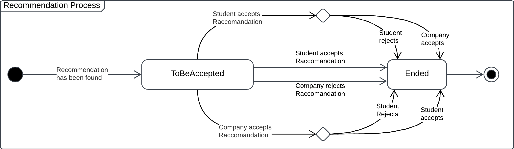
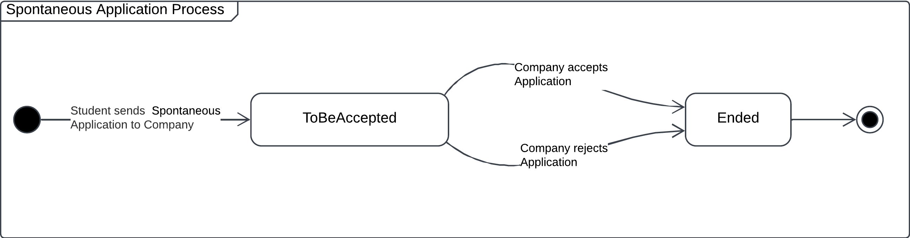
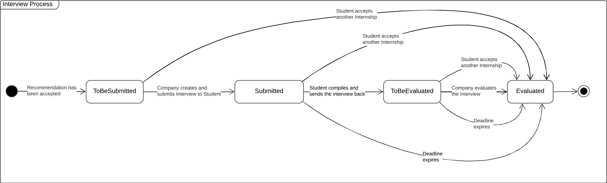
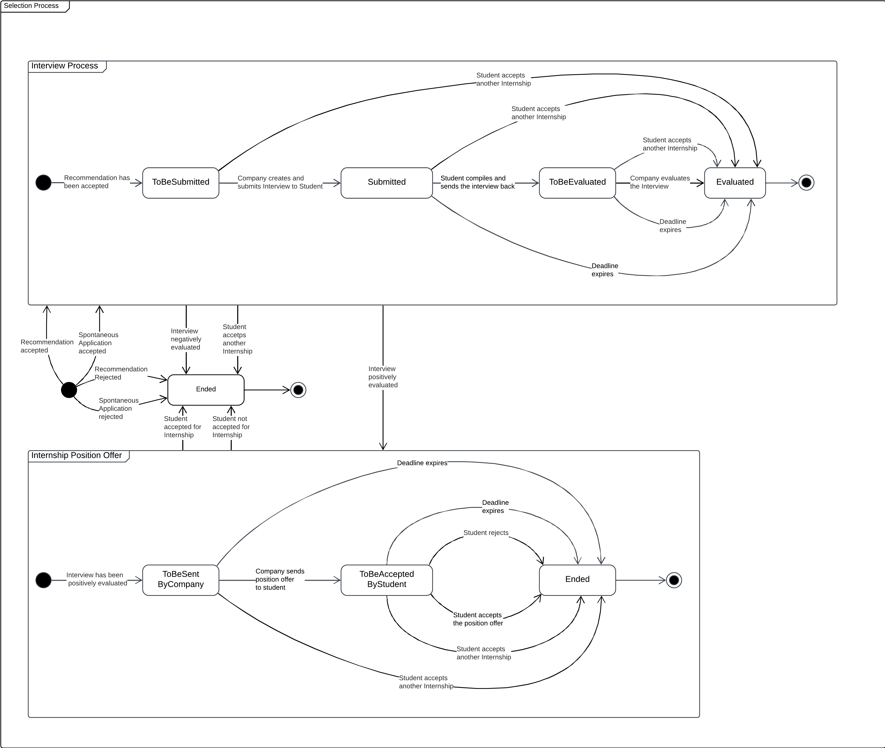

# Requirements and Analysis Specification Document

## Table of Contents

1. [Introduction](#introduction)
    - [Purpose](#purpose)
    - [Goals](#goals)
    - [Scope](#scope)
    - [World Phenomena](#world-phenomena)
    - [Shared Phenomena](#shared-phenomena)
    - [Definitions, Acronyms, Abbreviations](#definitions-acronyms-abbreviations)
      - [Definition](#definition)
      - [Acronyms](#acronyms)
      - [Abbreviations](#abbreviations)
    - [Revision History](#revision-history)
    - [Reference Documents](#reference-documents)
    - [Document Structure](#document-structure)

2. [Overall Description](#overall-description)
    - [Product Prospective](#product-prospective)
        - [User Scenarios](#user-scenarios)
        - [Class Diagrams](#class-diagrams)
        - [State Charts](#state-charts)
    - [Product Functions](#product-functions)
        - [Requirements](#requirements)   
    - [User Characteristics](#user-characteristics)
    - [Assumptions, dependencies and constraints](#assumptions-dependencies-and-constraints)
        - [Domain Assumptions](#domain-assumptions)
        - [Dependencies](#dependencies)


3. [Specific Requirements](#specific-requirements)
    - [External Interface Requirements](#external-interface-requirements)
      - [User Interfaces](#user-interfaces)
      - [Hardware Interfaces](#hardware-interfaces)
      - [Software Interfaces](#software-interfaces)
      - [Communication Interfaces](#communication-interfaces)
    - [Functional Requirements](#functional-requirements)
      - [Use Case Diagrams](#use-case-diagrams)
      - [Use Cases](#use-cases)
      - [Sequence Diagrams](#sequence-diagrams)
      - [Requirements Mapping](#requirements-mapping)
    - [Performance Requirements](#performance-requirements)
    - [Design Constraints](#design-constraints)
      - [Standards Compliance](#standards-compliance)
      - [Hardware Limitations](#hardware-limitations)
    - [Software System Attributes](#software-system-attributes)
      - [Reliability & Availability](#reliability--availability)
      - [Security](#security)
      - [Maintainability](#maintainability)
      - [Portability](#portability)

4. [Formal Analysis Using Alloy](#formal-analysis-using-alloy)
    - [Signatures](#signatures)
    - [Facts](#facts)
    - [Assertions](#assertions)
    - [Model Visualization](#model-visualization)

5. [Effort Spent](#effort-spent)

A. [Assignment Description](#assignment-description)

## Introduction

### Purpose

The purpose of the Student&Company (S&C) Platform is to create a system that allows Students to find
Internships to enhance their education and improve their curriculum, while allowing Companies to find
suitable candidates for their internship programs. All of this is done in a simple and efficient way by
providing a series of tools to help both parties in the process.
S&C will support the entire lifecycle of the Internship process for both Students and Companies. The
matchmaking can be done both automatically by the system through a proprietary Recommendation Pro-
cess or by a Student with a Spontaneous Application to a specific internship offer. The final selection
process is done through interviews created and submitted by Companies directly on the platform.
In the meantime, Student&Company will also provide Students and Companies with a series of sugges-
tions to improve their respectively published CVs and internship offers. The platform will also allow
Universities whose Students are actually doing an internship to monitor the progress of such activities
and handle any Complaints that may arise, even by terminating the internship if no other solution to the
problem can be found.

### Goals

| **Goal ID** | **Goal Description** |
|-------------|-----------------------|
| **G1**      | Companies would like to advertise the internships they offer. |
| **G2**      | Students would like to autonomously candidate for available internships. |
| **G3**      | Students would like to be matched with internships they might be interested in. |
| **G4**      | Companies would like to perform interviews with suitable students. |
| **G5**      | Students and companies would like to complain, communicate problems, and provide information about an ongoing internship. |
| **G6**      | Students and companies would like to be provided with suggestions about how to improve their submission. |
| **G7**      | Universities would like to handle complaints about ongoing internships. |
| **G8**      | Students would like to choose which internship to attend from among those for which they passed the interview. |
| **G9**      | Companies would like to select students for the internship position among those who passed the interview. |

### Scope

The S&C platform enables interactions among students, companies, and universities through the following features:

- **Advertise Internship**:
  - Companies can publish internship offers that students can spontaneously apply to.
  - Published offers are also considered by the Recommendation Process while looking for matches.

- **Insert CV**:
  - Students can provide their CV to the platform.
  - The Recommendation Process considers the CV while matching available internships.

- **Spontaneous Application**:
  - Students can autonomously apply for available internship offers.

- **Recommendation Process**:
  - The platform automatically matches students with internships based on the provided CVs and requirements of the internships.
  - Students and companies receive matches that they can accept or refuse.

- **Interview Process**:
  - Companies can interview students who have either accepted a match or submitted a spontaneous application that the company has approved.
  - The outcome of the interview finalizes the selection process, which may result in a confirmed internship.

- **Internship Handling**:
  - Students and companies can communicate, report problems, and provide information about a confirmed internship.
  - Universities can monitor internships and handle complaints, including terminating an internship if no resolution is found.

- **Suggestion Mechanism**:
  - The platform provides suggestions to both students and companies on improving CVs and internship offers.
  - These suggestions aim to improve performance in the Recommendation Process.

### World Phenomena

| **Phenomenon ID** | **Phenomenon Description** |
|--------------------|-----------------------------|
| **WP1**           | A company wants to advertise its internship. |
| **WP2**           | A student wants to apply for an internship. |
| **WP3**           | A company wants to accept a suitable recommendation. |
| **WP4**           | A company wants to accept a student’s spontaneous application. |
| **WP5**           | A student wants to accept a suitable recommendation. |
| **WP6**           | A company wants to interview a student. |
| **WP7**           | A company wants to manage (create, visualize, send, evaluate) its interviews. |
| **WP8**           | A student wants to answer questions concerning an interview. |
| **WP9**           | A company wants to complain, communicate problems, provide information about an ongoing internship. |
| **WP10**          | A student wants to complain, communicate problems, provide information about an ongoing internship. |
| **WP11**          | A student wants to receive suggestions on how to improve their CV. |
| **WP12**          | A company wants to receive suggestions on how to improve their internship offers. |
| **WP13**          | A university wants to monitor an ongoing internship that involves one of their students. |
| **WP14**          | A university wants to handle complaints about an ongoing internship that involves one of their students. |
| **WP15**          | A university wants to interrupt an ongoing internship that involves one of their students. |
| **WP16**          | A company wants to choose from the students they are interested in the ones to whom they will offer the internship position. |
| **WP17**          | A student wants to choose an internship position offer. |

### Shared Phenomena

#### Shared Phenomena by World

| **Phenomenon ID** | **Phenomenon Description** |
|--------------------|-----------------------------|
| **SPW1**          | A company publishes an internship. |
| **SPW2**          | A student inserts their CV. |
| **SPW3**          | A company accepts a spontaneous application. |
| **SPW4**          | A student or company monitors recommendations. |
| **SPW5**          | A student or a company accepts a recommendation. |
| **SPW6**          | A company creates interviews for a specific internship. |
| **SPW7**          | A company sends a previously created interview to a student. |
| **SPW8**          | A company evaluates a previously sent interview that has been answered by the student. |
| **SPW9**          | A student answers questions related to an interview. |
| **SPW10**         | A company sends to a student who passed the interview an internship position offer. |
| **SPW11**         | A student accepts an internship position offer. |
| **SPW12**         | A student or company complains, communicates problems, provides information about an ongoing internship. |
| **SPW13**         | A university responds to complaints about ongoing internships that involve one of their students. |
| **SPW14**         | A university interrupts an internship that involves one of their students. |

#### Shared Phenomena by Machine

| **Phenomenon ID** | **Phenomenon Description** |
|--------------------|-----------------------------|
| **SPM1**          | The platform shows to students available internships. |
| **SPM2**          | The platform shows to companies available candidates for their internships. |
| **SPM3**          | The platform shows to students and companies information about their recommendations and spontaneous applications. |
| **SPM4**          | The platform asks for feedback to improve the recommendation research mechanism. |
| **SPM5**          | The platform notifies students and companies when a suitable recommendation involving them is found. |
| **SPM6**          | The platform shows to companies information about their interviews. |
| **SPM7**          | The platform provides students and companies suggestions about how to formulate better their CVs and internship offers. |
| **SPM8**          | The platform shows to universities information about an ongoing internship. |
| **SPM9**          | The platform notifies companies when there is a new spontaneous application regarding one of their internships. |
| **SPM10**         | The platform notifies a student when a company accepts their spontaneous application. |
| **SPM11**         | The platform notifies a student when a company sends them a new interview. |
| **SPM12**         | The platform notifies a student when a company evaluates an interview they previously sent. |
| **SPM13**         | The platform notifies a student when a company sends them an internship offer. |
| **SPM14**         | The platform notifies a company when a student accepts their internship position offer. |
| **SPM15**         | The platform notifies the involved student and the company when a university terminates their internship. |
| **SPM16**         | The platform notifies the university when there is a new complaint or problem about an ongoing internship regarding one of their students. |


### Definitions, Acronyms, Abbreviations

#### Definition

| **Term**                    | **Definition**                                                                                             |
|-----------------------------|----------------------------------------------------------------------------------------------------------|
| **University**              | A university that is registered on the S&C platform.                                                    |
| **Company**                 | A company that is registered on the S&C platform.                                                       |
| **Student**                 | A person who is currently enrolled in a University and is registered on the S&C platform.               |
| **User**                    | Any registered entity on the S&C platform.                                                              |
| **Internship Offer**        | The offer of an opportunity to enroll in an internship provided by a Company. The offer remains active on the platform indefinitely until the publishing Company removes it. |
| **Participant**             | An entity that interacts with the platform for the purpose of finding or offering an Internship Position Offer, such as Students and Companies. |
| **Recommendation Process**  | The process of matching a Student with an Internship offered by a Company based on the Student’s CV and the Internship’s requirements. |
| **Recommendation/Match**    | The result of the Recommendation Process, a match between a Student and an Internship.                  |
| **Spontaneous Application** | The process of a Student spontaneously applying for an Internship that was not matched through the Recommendation Process. |
| **Interview**               | The process of evaluating a Student’s application for an Internship conducted by a Company through the S&C platform. |
| **Feedback**                | Information provided by Participants to the S&C platform to improve the Recommendation Process.          |
| **Internship Position Offer** | The formal offer of an internship position presented to a student who has successfully passed the Interview, who can decide to accept or reject it. |
| **Suggestion**              | Information provided by the S&C platform to Participants to improve their CVs and Internship descriptions. |
| **Confirmed Internship**    | An Internship that has been accepted by both the Student and the offering Company.                       |
| **Ongoing Internship**      | An Internship that is currently in progress. All Ongoing Internships are Confirmed Internships, but the vice versa is not always true. |
| **Complaint**               | A report of a problem or issue that a Student or Company has with an Ongoing Internship. It can be published on the platform and handled by the University. |
| **Confirmed Match**         | A match that has been accepted by both a Student and a Company.                                          |
| **Rejected Match**          | A match that has been refused by either a Student or a Company.                                          |
| **Pending Match**           | A match that has been accepted only by a Student or a Company, waiting for a response from the other party. |
| **Unaccepted Match**        | A match that has been refused by either a Student or a Company.                                          |

#### Acronyms

| **Acronym** | **Definition**                                   |
|-------------|-------------------------------------------------|
| **RASD**    | Requirements Analysis & Specification Document  |
| **CV**      | Curriculum Vitae                                |

#### Abbreviations

| **Abbreviation** | **Definition**        |
|-------------------|----------------------|
| **S&C**          | Students & Companies |

### Revision History

| **Date**       | **Version** | **Description**                     |
|----------------|-------------|-------------------------------------|
| **22-12-2024** | 1.0         | Initial release of the document.    |

### Reference Documents

- **Assignment RDD AY 2024-2025**: Provided assignment description.
- **Software Engineering 2 A.Y. 2024/2025 Slides**: "Creating RASD."
- **IEEE Software Requirements Specification Template**: [IEEE Std 830-1998](https://doi.org/10.1109/IEEESTD.1998.88286).

### Document Structure

1. **Introduction**: This section provides an overview of the document and the system. Here the purpose of the platform is explained, along with the goals and phenomena of the system. Finally, essential definitions are provided.

2. **Overall Description**: In this section, a high-level perspective of the system is provided, describing its overall purpose, functionality, and User interactions. It includes an outline of the intended features of the system, user profiles, and assumptions about the domain.

3. **Specific Requirements**: In this section, we focus on the technical and functional details of the system. Here, the external interfaces are specified as well as the functional and non-functional requirements of the system. Diagrams, such as use cases and sequence diagrams, provide a visual representation of the system’s functionality.

4. **Alloy**: This section presents the code and the generated diagrams created using Alloy, a formal specification language that has been used to ensure the consistency and correctness of some core system’s requirements.

5. **Effort Spent**: This section provides an overview of the time that each group member spent on the project.

6. **References**: This section provides a list of references used in the document.

## Overall Description

### Product Prospective

This section provides a high-level description of the Student&Company platform, outlining its main features and functionalities through the use of text descriptions such as User Scenarios, and a more in-depth analysis of the system’s structure through the use of Class Diagrams and State Charts.


#### User Scenarios

1. **Student Sign-up**
   Mario Rossi is a student that wants to improve his abilities and education by doing an internship before graduating. He opens the SC root page and selects "SignUp". He provides the required personal information such as his name, surname, date of birth, an email, and a password that he will use as login credentials. He also selects from the list of available universities the one he is attending. If the email address has never been used on the site, Mario will receive an email for confirming the mail address and the registration of the account. Once the registration is confirmed by Mario, the account is created. If the email address is already in use, the platform will show an error asking to insert a new email address.

2. **Company Sign-up**
   FastRedCar SPA, a world-leading car company, aims to launch an internship program to train final-year mechanical engineering students pursuing a Bachelor’s or Master’s degree. To register on the S&C platform, the company accesses the root page and selects "Sign Up," where they provide the required information, including the company name, headquarters address, VAT number, email address, and a password to be used as login credentials. If both the VAT number and email address have not been previously used on the platform, FastRedCar SPA will receive a confirmation email to verify the address and complete the account registration. Once the email is confirmed, the account is successfully created. However, if either the VAT number or email address is already associated with an existing account on S&C, an error message will be displayed, indicating that the company already has a registered account on the platform.

3. **University Sign-up**
   The Technical University of Milan is a prestigious university that wants its students to complete an internship before graduating, believing this experience will enhance their skills and knowledge. The university opens the S&C root page and selects "SignUp," where they provide the required information such as the university name, the university description, the university VAT number, the name of the university office that will manage the internship program, and also an email address and a password that will be used as login credentials. If both the VAT number and email address have not been previously used on the platform, the Technical University of Milan will receive an email for confirming the mail address and the registration of the account. Once the registration is confirmed, the account is created. However, if either the VAT number or email address is already associated with an existing account on S&C, an error message will be displayed, indicating that the university already has a registered account on the platform.

4. **User Login**
   A platform user that has already registered an account can log in by providing the email and password used during the registration. If the email and password are correct, matching an entry in the platform database, the user is redirected to the platform dashboard page. If the email or password is incorrect, the platform will show an error message indicating that the login credentials are wrong.

5. **Student Load Curriculum**
   Stefano is a student who has already registered an account on S&C and wants to complete his profile by uploading his CV. From the platform’s dashboard, he clicks on the "CV" button. He is then redirected to a page where he can enter his curriculum information, including his current level of education, languages he knows, technical skills, and, optionally, details about past work experience along with contact information for previous employers. He also adds a photo of himself, a brief description of his interests and hobbies, and as soon as he clicks on the "Submit CV" button, the platform processes it and tries to find some matching internships based on the given information. A list of five different internships to which Stefano has been matched is shown to the student on the platform’s recommendations page where he can decide to apply for one of them, notifying the company. While computing the matching, the platform also provides Stefano with some suggestions on how to improve his CV and matching probability, based on a grammar and lexical analysis and a direct comparison of Stefano’s CV with other similar candidates.

6. **Company Submit an Internship Insertion**  
   AnanasPhone is a major tech company, specialized in the production of smartphones and tablets, that has an account on the S&C site. The company wants to create an internship program aimed at software engineering students in the final year of their Master’s degree. A Human Resource employee opens the S&C platform and selects “Internship Offers,” where a list of all the internships already present on S&C is shown. Here they click on “Create Internship,” where they provide the required information such as the internship title, description, start date and duration, office address, a list of required skills students need to have to be considered for the internship, and, possibly, a list of benefits offered to the future intern. Once the internship is created, by clicking on the “Submit Internship” button, the platform will start the recommendation process with the aim to match the internship with all the students that are compatible with such opportunity, based on the given information of both parties. The platform will also provide AnanasPhone with some suggestions on how to improve the internship description and matching probability, based on grammar and lexical analyses and a direct comparison of AnanasPhone’s Internship proposal with other similar companies.

7. **Company Creates a Structured Interview to Submit to Possible Candidates**  
   MacroHard is a world-leading tech company, known for creating its secure and reliable operating system, “Door.” The company has an account on the S&C platform and has already set up an internship program for software engineering students pursuing a Master’s degree. The company wants to create a structured interview to evaluate the technical skills and motivation of the students who apply for the internship. MacroHard opens the platform dashboard and, on the page displaying the lists of matched students, clicks on the “Create Interview” button. This option allows the company to create structured interviews that will be submitted to candidates. MacroHard can create multiple interviews for the same internship, allowing them to submit them to different students based on factors such as the student’s CV, method of application (matched or spontaneous), or other criteria. For this internship, MacroHard has created two types of interviews: one for matched students to assess their technical skills and another for spontaneous applicants, which evaluates not only technical skills but also the student’s motivation.

8. **Student Accepts a Matched Internship**  
   Sara is an economics major student who has already uploaded her CV on the S&C platform, and she is looking for an internship. She has received a notification and, by clicking on it, she sees that a new internship is available for her. Sara reads the internship information, and she decides to accept it. A notification is then sent to the company that created the internship, informing them of Sara’s acceptance of the match. If the company also accepts the match, the platform requires the company to initiate the selection process by creating or assigning a structured interview to Sara, who will be notified about it. To both parties, feedback is requested by the platform to improve the Recommendation Process by asking both to rate the matching generated by S&C.

9. **Student Manually Applies for an Internship**  
   Marco is a chemistry student who has already uploaded his CV on the S&C platform and is looking for an internship. Unfortunately, the matching internships provided by the platform do not fully satisfy his needs, and he decides to proactively search for another one. He opens the platform’s dashboard page and clicks on the “Browse All Internships” button. Here he can see all the internships available on the platform, and he can filter them by field of study, required skills, location, and other parameters. He finds an internship that is not in the matching list provided by the platform but is perfect for him, so he clicks on the “Apply” button. The platform notifies the company that Marco has applied for the internship and will inform the student when the company starts the application process by sending him an interview. There is no need for Marco to accept the interview, as a spontaneous application is considered an implicit acceptance of the match by the student.

10. **Student Views Their Application Interview Status**  
   Stefano is a student who has applied for various internships through the S&C platform. He has submitted applications both by matching with companies through the platform’s automated feature and by manually applying. He is already in a selection phase with some of them, and he is currently waiting for updates from the different companies. When Stefano logs into the platform, he navigates to “Interviews.” In this section, he can view the status of each of his applications by clicking on each one of them. This includes whether the company has assigned him an interview, whether his interview has been reviewed, and whether he has been accepted or rejected for the position. In the same section, he can also see if the platform is running the Recommendation Process, matching his profile with other possible internship offers.

11. **Company Views the Status of the Selection Process**  
    CosmoX, a renowned private space company specialized in the reuse of rockets, has created an internship on the S&C platform for aspiring aerospace engineers. It has received multiple manual applications from different students and has been matched numerous times. The company has already accepted all worthy manual applications and matches and has assigned structured interviews to everyone. CosmoX is now waiting for the students to complete the interviews. When a CosmoX employee logs into the platform, they can navigate to the “Interviews” section. In this section, they can view the status of each interview and the status of each student, such as: “SENT” if the student has received the interview but has not opened it yet, “COMPLETED” if the student has completed the interview, and “REVIEWED” if the company has started the review process of the interview.

12. **Student Accepts/Rejects an Internship**  
    Paula is an art major who has been matched by S&C with different museums and private art galleries in the city of Florence. She happily accepted all the matches and completed the interviews with all the companies. She did not expect to pass all the interviews, and now she has to choose between the different offers. Paula opens the platform and navigates to the “Interviews” section, where she can see all of her interviews and the status of each one. To refuse an internship position after successfully passing the interview, Paula clicks on it and then clicks on the “Refuse” button, and the platform notifies the company about her decision. By doing the same process but clicking on the “Accept” button, the platform notifies the company that Paula has accepted the internship and will block any other interview processes, informing the respective companies. By navigating to the “Interviews” section, any company can see, among the different possible states of an application, whether the internship for a particular student has been accepted or refused.

13. **Company Publishes a Complaint About a Student**  
    PlaneHearts is a company famous for its innovative and multi-platform IDE for the development of mobile applications. The company has created an internship on the S&C platform for software engineering students and selected Giovanni, a computer science student, for the internship. However, after the internship started, employees at PlaneHearts noticed that Giovanni was not performing as expected, did not have the required skills, and was not motivated to learn. The company decided to publish a complaint about Giovanni on the platform to inform the student’s university. To publish the complaint, the person managing PlaneHearts’ account on S&C logs into the platform and navigates to the “Complaints” section. Here, they can view all the complaints they have published and can create a new complaint by providing the student’s name, the internship title, and a description of the problem that has arisen. Once the complaint is submitted, the platform will notify Giovanni and his university.

14. **Student Responds to a Complaint**  
    Giovanni has received a notification from the S&C platform that a complaint has been published about him by PlaneHearts, the company where he is currently doing an internship. The complaint states that Giovanni is not performing as expected, does not have the required skills, and is not motivated to learn during this experience. The student will have the opportunity to respond to the complaint and provide his version of the events by navigating to the “Complaints” section of the platform. Here, he can view all the complaints published about him and can respond to each one by providing a description of the situation from his perspective.

15. **University Handles a Complaint**  
    The University of Rome, a prestigious university that has students enrolled in the S&C platform, has received a complaint about one of their students. The career advisor at the university opens the S&C platform and navigates to the “Complaints” section. Here, they can view all the complaints published about their students and can handle each one by reviewing the complaint, contacting the student and the company involved, and taking appropriate actions to resolve the issue. In this particular case, the advisor and the university have decided to interrupt the internship of the student to protect both the student and the company from further issues. The university does so by clicking on the “Interrupt Internship” button on the complaint page. The platform will notify the student and the company about the interruption of the internship and will close the complaint.


#### Class Diagrams

The following UML class diagram describes the domain of our interest with the entities involved in it and the main relations between them. It includes the main attributes and a limited set of methods that represent the core functionalities of the system. These entities capture the essence of the platform’s domain.

**To clarify the method signatures**:

- **Interview**: `generatePositionOffer(): InternshipPositionOffer`  
  Generates the InternshipPositionOffer if the company wants to provide the student who passed an interview with an Internship Position Offer.

- **University**: `terminateinternship(c: Complaint): void`  
  Allows the University to terminate an Internship through a Complaint.

Other methods have been omitted for simplicity, as the relations are sufficient to understand the domain.


#### State Charts

The following section presents a series of state diagrams illustrating the progression of the main phases of the Student&Company platform. These diagrams include representations of the Recommendation Process and its Spontaneous Application variant, the Interview Process that may result in an Internship Position Offer, and finally, a Selection Process diagram that highlights the relationship between the latter two processes. These diagrams represent the possible states that the object **Interview** can be in, without detailing all possible outcomes explicitly. For example, the case of the interview being accepted or rejected is represented in a single state, `InternshipEnded`, without loss of generality.

- **Recommendation Process**

  
  The Recommendation Process is the core of the Student&Company platform. It matches Students with Internships based on the Student’s CV and the Internship’s requirements. It is initiated by the platform when it detects a potential match. The process then evolves to a `ToBeAccepted` state, where the system waits for the Student and the Company to accept the match. If one of the two parties rejects the match, the process is terminated. If both parties accept the match, an Interview is initiated, and the process is terminated.

- **Spontaneous Application Process**

  
  Unlike the Recommendation Process, the Spontaneous Application process is initiated by the Student. When a Student submits a Spontaneous Application for an Internship, the process evolves to a `ToBeAccepted` state, where the system waits for the Company to accept the application. If the Company rejects the application, the process is terminated. If the Company accepts the application, an Interview Process is initiated, and the process is terminated.

- **Interview Process**

  
  The Interview Process is initiated when a Match is accepted by both the Student and the Company, or when the Company accepts a Spontaneous Application. The process starts in the `ToBeSubmitted` state, where the Company is asked to create and submit an Interview. Here, the Company is required to specify a deadline for the Interview. The Interview process evolves into the `Submitted` state once the Company sends the Interview to the Student, who answers the questions and submits the Interview. If the Student fails to submit the answers within the deadline, they will be considered rejected, and the process progresses to an `Evaluated` state and terminates. Otherwise, after the Interview has been sent back by the Student, the process evolves to a `ToBeEvaluated` state. In this state, the Company can manually evaluate the Student’s answers and mark the Interview as accepted or rejected. If the Student is rejected, they will be notified of the outcome, and the process is terminated. If the Student is accepted, an Internship Position Offer process starts, and the Interview Process is terminated. If at any point in the process the Student accepts another Internship, the process terminates, and the Student will be considered rejected.

- **Internship Position Offer Process**

  
  The Internship Position Offer process begins when a Student successfully completes the Interview Process. Initially, the process enters the `ToBeSentByCompany` state. This state allows Companies to evaluate and select the most suitable candidates when more students than required have passed the Interview. If the Company rejects the Student or the deadline expires, the process concludes, and the Student will be considered rejected. If the Company accepts the Student, the process transitions to the `ToBeAcceptedByStudent` state, where the Student decides to either accept or reject the offer. If the Student rejects the offer or lets the deadline expire, the process concludes, and the Student will be considered rejected. If the Student accepts the offer, the process concludes, and all the Student’s other ongoing Interviews are terminated with the Student being marked as rejected in those Interviews.

- **Selection Process**

  
  The Selection Process diagram illustrates the relationship between the Interview Process and the Internship Position Offer Process. The Selection Process terminates if the Match is rejected, if the Student is rejected during the Interview Process or the Internship Position Offer Process, or if the Student accepts another Internship. If the Student is accepted during the Interview Process, the process transitions to the Internship Position Offer Process. If the Student accepts the Internship Position Offer, the process also concludes.

### Product Functions

This section outlines the essential functionalities and detailed requirements of the platform, structured to support the key objectives defined in the scope of the product.

1. **User Management**:  
   The platform allows Students, Companies, and Universities to register and log in. It also provides Students with the ability to upload and modify their CVs and Companies with the ability to view and manage their Internships.

2. **Internship Creation and Management**:  
   Companies can create, publish, and manage Internship offers on the platform. They define details such as job description, requirements, deadlines, and benefits. Companies also have the ability to terminate Internship offers when they are no longer available.

3. **Student Application Process**:  
   Students can browse available Internships and apply to Internships either through automatic matching or by submitting Spontaneous Applications. They can also track the status of their Applications throughout the process.

4. **Automated Recommendations**:  
   The platform matches Students with suitable Internships based on their CVs and the specific requirements set by Companies. Once a match is found, both Students and Companies are notified, and they can accept or decline the Recommendation.

5. **Interview Management**:  
   Companies can create and assign Interviews to Students, which include closed and open questions to assess their suitability for an Internship. Both Students and Companies can track the Interview progress, and Companies can evaluate Student responses. Companies can also select, among Students who have passed the Interview, those to whom they will propose an Internship Position Offer.

6. **Feedback and Suggestions for Improvement**:  
   The platform collects Feedback from Students and Companies to improve the Recommendation Process. It also provides Suggestions to Students on how to enhance their CVs and to Companies on how to improve their Internship descriptions.

7. **Complaint Management**:  
   Students and Companies can publish Complaints about Ongoing Internships, which are then handled by Universities. Universities can monitor Complaints and interrupt Ongoing Internships if necessary.

8. **Notification System**:  
   Notifications are sent to Students, Companies, and Universities when relevant events occur, such as new Internships, matched Recommendations, Interview assignments, Internship Position Offers, Sign-up confirmations, Complaints, or Communications.


#### Requirements

| **Requirement ID** | **Requirement Description** |
|---------------------|-----------------------------|
| **R1**             | The platform shall allow any unregistered students to register by providing personal information and selecting their University. |
| **R2**             | The platform shall allow any companies to register by providing company information. |
| **R3**             | The platform shall allow any universities to register by providing university information. |
| **R4**             | The platform shall allow Users to log in using their email and password. |
| **R5**             | The platform shall send notifications to Users when relevant events occur. |
| **R6**             | The platform shall allow Companies to create and publish Internship offers specifying details. |
| **R7**             | The platform shall allow Companies to terminate their Internship offers at their own discretion. |
| **R8**             | The platform shall provide Students with Matches automatically obtained by the Recommendation Process. |
| **R9**             | The platform shall allow Students to view and navigate all available Internships. |
| **R10**            | The platform shall enable Students to submit Spontaneous Applications to Internships they choose. |
| **R11**            | The platform shall allow Students to submit their CV. |
| **R12**            | The platform shall allow Students to modify their CV. |
| **R13**            | The platform shall allow Students to monitor the status of their Spontaneous Applications. |
| **R14**            | The platform shall allow Students to monitor the status of their Recommendation. |
| **R15**            | The platform shall display to Students all the Internships found by the Recommendation Process. |
| **R16**            | The platform shall display to Companies all the CVs of Matched Students obtained by the Recommendation Process. |
| **R17**            | The platform shall allow Students and Companies to accept a Recommendation. |
| **R18**            | The platform shall allow Companies to accept a Spontaneous Application. |
| **R19**            | The platform shall start a Selection Process only if both the Company and the Student have accepted the Recommendation. |
| **R20**            | The platform shall start a Selection Process only if the Company has accepted the Spontaneous Application. |
| **R21**            | The platform shall allow Companies to create Interviews. |
| **R22**            | The platform shall allow Companies to submit Interviews to Students they have initiated a Selection Process with. |
| **R23**            | The platform shall allow Students to answer Interview questions and submit them. |
| **R24**            | The platform shall allow Companies to manually evaluate Interview submissions. |
| **R25**            | The platform shall allow Students and Companies to monitor the status of their Interviews. |
| **R26**            | The platform shall enable Companies to complete the Interview process by submitting the final outcome to each candidate. |
| **R27**            | The platform shall enable Companies to send an Internship Position Offer to a Student only if he previously passed the relative Interview. |
| **R28**            | The platform shall enable Students to accept or reject an Internship Position Offer sent by a Company only if he previously passed the relative Interview. |
| **R29**            | The platform shall collect Feedback from both Students and Companies regarding the Recommendation Process. |
| **R30**            | The platform shall provide Suggestions to Students on improving their CVs. |
| **R31**            | The platform shall provide Suggestions to Companies on improving Internship descriptions. |
| **R32**            | The platform shall allow registered Universities to access and monitor Internship Communications related to their Students. |
| **R33**            | The platform shall provide a dedicated space for Students and Companies to exchange Communications about the current status of an Ongoing Internship. |
| **R34**            | The platform shall allow registered Universities to handle Complaints and to interrupt an Internship at their own discretion. |

### User Characteristics

Student&Company is designed to be used by three main types of Users: Students, Companies, and Universities. Each User has a specific role and can perform different actions on the platform as described below:

- **Students:**
  Students are individuals currently enrolled in a University (which must be registered on the Platform) who are looking for Internship opportunities to enhance their education and their curriculum. They can register on the platform, upload their CVs, and apply for Internships either through the Recommendation Process or by submitting a Spontaneous Applications to an Interview Offer to which they are particularly interested. Students can also monitor the status of their Applications, Interviews, and Internship Position Offers through a dedicated section on the platform and, if necessary, can report problems encountered during an Ongoing Internship to their University by creating a Complaint. The platform also provides Students with Suggestions on how to improve their CVs and matching probability based on a grammar and lexical analysis and a direct comparison of the Student’s CV with others similar candidate. The Student can also improve the platform by providing Feedback on the Recommendation Process once a Confirmed Match is found.

- **Companies:**
  Companies are entities that are looking for interns to train and educate in their field of expertise. Each company account is created by a representative of the Company, usually a Human Resource employee or a manager that is in charge of the internship program. Companies can register on the platform and create, publish, manage and delete different Internship Offers at the same time. They can also view and manage the CVs of Students that have been matched or have sent a Spontaneous Application to such offers, and create and submit Interviews to evaluate them. If a Student passes the Interview, the Company can send an Internship Position Offer to him while monitoring other Interviews and Internship Position Offers and, moreover, each Company can report problems encountered during an Ongoing Internship by creating Complaints. The platform also provides Companies with Suggestions on how to improve their Internship descriptions and matching probability based on a grammar and lexical analysis and a direct comparison of the Company’s Internship Offer with other similar companies. They can also help improve the platform by providing Feedback on the Recommendation Process once a Confirmed Match is found.

- **Universities:**
  Universities are institutions that are looking to provide their Students with Internship opportunities to enhance their education and curriculum. Each university account is created by a representative of the University, usually a carrier advisor or a professor that is in charge of the internship program. Universities can register on the platform and monitor their Students by receiving Communication both from Student and Companies. Such Communication can be about the acceptance of an Internship Position Offer by a Student or some problem encountered during an Ongoing Internship reported by a party through a Complaint. The University can handle such Complaints and, eventually, interrupt an Ongoing Internship if no solution to the problem is found to prevent further issues.

While Student&Company is not specifically designed to accommodate users with special needs, the platform implements several basic accessibility features to improve usability for all users. These include different display modes such as dark mode, screen-reader compatible layouts and easily readable fonts. The web interface try to follow WCAG 2.1 Level A guidelines for basic accessibility compliance. However, users requiring specialized assistive technologies may need to rely on their own tools and software to interact with the platform optimally.

### Assumptions, dependencies and constraints

#### Domain Assumptions

This section outlines the basic assumptions about the environment and behavior of entities that interact
with the system. These assumptions simplify the design and implementation by defining expectations
about Students, Companies, Universities, and the platform, ensuring the system operates effectively
within its intended context.

| **Assumption ID** | **Assumption Description** |
|--------------------|----------------------------|
| **D1**            | Students and Companies provide the Platform with correct and truthful information. |
| **D2**            | Companies remove published Internships if they are no longer available. |
| **D3**            | The Email Provider and Notification Manager services are reliable, and the Users visualize every notification. |
| **D4**            | Students, Companies, and Universities have a working internet connection. |
| **D5**            | Universities interrupt an Ongoing Internship only if no solution is found to the Complaints. |

#### Dependencies

The platform depends on only two external actors: the Notification Provider and the Email Service. The
former is responsible for correctly handling notifications to ensure they are sent to Users. The latter is
responsible for sending emails, mainly for users’ email verification. For more details, see [Software Interfaces section](#software-interfaces)

## Specific Requirements

### External Interface Requirements

This chapter provides a detailed description of the system’s external interfaces such as the User, Hardware, Software, and Communication interfaces.

#### User Interfaces

The user interface will be designed to improve intuitiveness and simplicity. The platform root page is
the Home Page from which every non-registered user can find information about S&C such as the latest
news. The Home page is linked to other pages, such as the Dashboard, Contacts, and About page, using
an app bar. In the Contacts page, the user can find useful links to get in touch with S&C.


Thanks to the app bar link buttons, users can also reach the Sign-Up and Sign-in pages. The Sign-Up
page allows for different types of sign-up according to the new user type. This allows the user to provide
the platform with the correct information.

<p align="center">
  
  
  
</p>

To be able to log into the platform, the user shall provide his email and password


The Dashboard page will be the central hub for logged-in users. From the left-hand panel of the dashboard, all the pages associated with the core functionalities of the platform are reachable. Therefore, this
page is provided after a successful log-in. The side panel contains different elements according to the
user needs.


#### Hardware Interfaces

The platform is a web application that can be accessed from any device with a web browser and an
internet connection like a PC, a tablet, or a smartphone. No specific hardware requirements are needed
to interact with the Student&Company platform.

#### Software Interfaces

An Email Provider, through its interface, is used by the Platform to send a confirmation email to Users
upon registration.
A notification manager is used to send notification to Users when relevant events occur. Using notifications instead of email allows the platform to provide a more immediate and interactive experience to the
Users without generating spam that can be seen as annoying by the Users.
At this stage of development, no other external software interfaces are required.

#### Communication Interfaces

The platform uses standard internet communication protocols to interact with Users and the backend
server. At this stage of development other specific communication interfaces are not defined yet.

### Functional Requirements

This chapter provides a comprehensive overview of the system’s use cases, detailing the various interactions between Users and the system. Use Case Diagrams, detailed Use Case Descriptions, Sequence
Diagrams and Requirement Mapping are provided for each use case.

#### Use Case Diagrams


This diagram illustrates the User Registration and Login process, for all Users. It shows how the different
use case for the registration, based on the User type, and how the login process is generic and common
for all Users


This diagram illustrates the main functionalities of the platform, such as the loading of CV or the
creation of an Internship Offer.
This diagram both shows the different use cases that are specific to Students or Companies, and the
common ones, such as the Acceptance of a Match. In such cases, the use case can be initiated by both
actors.

This diagram concentrates on the functionalities offered to Universities. It shows how a Participant
can create a Complaint, and how the University can handle it.
More importantly, it shows that a complaint can be handled “as is” by the University, or it can be extended
either by the other Participants that respond to such complaint or by the University itself that can interrupt
an Ongoing Internship.

#### Use Cases

| **[UC1]**                                  | **Register Student**                    |
|--------------------------------------------|---------------------------------------------|
| **Use Case ID**                            | UC1                                         |
| **Actor**                                  | Student, Email Provider                     |
| **Entry Condition**                        | The user is not logged in.                  |
| **Event Flow**                             | 1. The Student presses the “Sign up” button situated on the dashboard. |
|                                            | 2. The platform opens the sign-up page.                                   |
|                                            | 3. The Student selects the “Student” option, provides the required information (name, surname, date of birth, institutional email, optionally personal email, password, University name among those available) and clicks the “Sign Up” button. |
|                                            | 4. The platform validates the email and checks if it is unique.         |
|                                            | 5. The platform registers the Student and sends a confirmation email to the provided email address through the Email Provider. |
|                                            | 6. The platform shows a message to the Student to confirm the registration. |
|                                            | 7. The Student confirms the registration by clicking on the link in the email. |
|                                            | 8. The platform confirms the registration and activates the account.    |
|                                            | 9. The Student is redirected to the platform’s dashboard.               |
| **Exit Condition**                         | The Student is registered and logged in.    |
| **Exception**                              | - The Student provides incorrect information. |
|                                            | - The Student does not confirm the registration. |
|                                            | - The email is already in use.             |

| **[UC2]**                                  | **Register Company**                    |
|--------------------------------------------|---------------------------------------------|
| **Use Case ID**                            | UC2                                         |
| **Actor**                                  | Company, Email Provider                     |
| **Entry Condition**                        | The user is not logged in.                  |
| **Event Flow**                             | 1. The Company presses the “Sign up” button situated on the dashboard. |
|                                            | 2. The platform opens the sign-up page.                                   |
|                                            | 3. The Company selects the “Company” option, provides the required information (Company name, Company headquarters address, VAT number, email, and password) and clicks the “Sign Up” button. |
|                                            | 4. The platform checks if the VAT number and the email are unique.       |
|                                            | 5. The platform sends a confirmation email to the provided email address through the Email Provider. |
|                                            | 6. The platform shows a message to the Company to confirm the registration. |
|                                            | 7. The Company confirms the registration by clicking on the link in the email. |
|                                            | 8. The platform confirms the registration and activates the account.    |
|                                            | 9. The Company is redirected to the platform’s dashboard.               |
| **Exit Condition**                         | The Company is registered and logged in.    |
| **Exception**                              | - The Company provides incorrect information. |
|                                            | - The Company does not confirm the registration. |
|                                            | - The VAT number or the email is already in use. |

| **[UC3]**                                  | **Register University**                 |
|--------------------------------------------|---------------------------------------------|
| **Use Case ID**                            | UC3                                         |
| **Actor**                                  | University, Email Provider                  |
| **Entry Condition**                        | The user is not logged in.                  |
| **Event Flow**                             | 1. The University presses the “Sign up” button situated on the dashboard. |
|                                            | 2. The platform opens the sign-up page.                                   |
|                                            | 3. The University selects the “University” option, provides the required information (University name, description, VAT number, responsible office name, email, and password) and clicks the “Sign Up” button. |
|                                            | 4. The platform checks if the VAT number and the email are unique.       |
|                                            | 5. The platform sends a confirmation email to the provided email address through the Email Provider. |
|                                            | 6. The platform shows a message to the University to confirm the registration. |
|                                            | 7. The University confirms the registration by clicking on the link in the email. |
|                                            | 8. The platform confirms the registration and activates the account.    |
|                                            | 9. The University is redirected to the platform’s dashboard.            |
| **Exit Condition**                         | The University is registered and logged in.  |
| **Exception**                              | - The University provides incorrect information. |
|                                            | - The University does not confirm the registration. |
|                                            | - The VAT number or the email is already in use. |


| **[UC4]**                                  | **Login User**                     |
|--------------------------------------------|---------------------------------------------|
| **Actor**                                  | User                                        |
| **Entry Condition**                        | The user is not logged in.                 |
| **Event Flow**                             | 1. The User presses the “Sign in” button situated on the dashboard. |
|                                            | 2. The platform opens the sign-in page.                                   |
|                                            | 3. The user provides their email and password.                          |
|                                            | 4. The platform validates the credentials.                              |
|                                            | 5. The platform confirms the credentials and logs in the User.          |
|                                            | 6. The User is redirected to the platform’s Dashboard.                  |
| **Exit Condition**                         | The User is logged in.                     |
| **Exception**                              | - The User provides incorrect email or password.                        |

| **[UC5]**                                  | **Load Curriculum**     |
|--------------------------------------------|---------------------------------------------|
| **Actor**                                  | Student, Notification Manager, Company      |
| **Entry Condition**                        | The Student is logged in.                  |
| **Event Flow**                             | 1. The Student presses the “CV” menu button situated on the dashboard. |
|                                            | 2. The platform opens the Curriculum page.                                |
|                                            | 3. The Student fills the form with the required information (current level of education, known languages, technical skills, a photo of himself, a brief description of his interests and hobbies, etc...) and clicks the “Submit CV” button. |
|                                            | 4. The platform publishes the CV.                                         |
|                                            | 5. The platform generates a list of matching internships based on the CV. |
|                                            | 6. The platform provides feedback and suggestions to improve the CV.      |
|                                            | 7. The Student is redirected to his account page.                        |
|                                            | 8. The platform notifies the new matching Companies through the Notification Manager. |
| **Exit Condition**                         | The Student’s CV is uploaded.             |
| **Exception**                              | - The Student provides invalid or partial information.                   |

| **[UC6]**                                  | **Advertise Internship** |
|--------------------------------------------|-----------------------------------------------|
| **Actor**                                  | Company, Notification Manager, Student        |
| **Entry Condition**                        | The Company is logged in.                     |
| **Event Flow**                             | 1. The Company presses the “Internship Offers” button situated on the dashboard. |
|                                            | 2. The platform opens the Internships page.                                |
|                                            | 3. The Company presses the “Create Internship” button.                     |
|                                            | 4. The platform shows the Internship creation form.                         |
|                                            | 5. The Company fills the form with the required information (Internship title, description, start date and duration, office address, required skills, and benefits offered) and clicks the “Submit Internship” button. |
|                                            | 6. The platform publishes the Internship.                                   |
|                                            | 7. The platform generates a list of matching Students based on the Internship. |
|                                            | 8. The system provides feedback and suggestions to improve the Internship description. |
|                                            | 9. The Company is redirected to the Internships page.                      |
|                                            | 10. The platform notifies the new matching Students through the Notification Manager. |
| **Exit Condition**                         | The Internship is created and published.      |
| **Exception**                              | - The Company provides invalid or partial information.                     |

| **[UC7]**                                  | **Spontaneous Application** |
|--------------------------------------------|-----------------------------------------------------|
| **Actor**                                  | Student, Company, Notification Manager             |
| **Entry Condition**                        | The Student is logged in and has their CV uploaded. |
| **Event Flow**                             | 1. The Student presses the “Browse Internships” button situated on the dashboard. |
|                                            | 2. The platform opens the global Internships page.                          |
|                                            | 3. The Student presses the “Apply” button on one of the available Internships. |
|                                            | 4. The platform adds the application to the Company and Student lists of applications. |
|                                            | 5. The platform notifies the Company of the Spontaneous Application through the Notification Manager. |
| **Exit Condition**                         | The application is successfully submitted to the Company. |
| **Exception**                              | - The Internship is no longer available.          |

| **[UC8]**                                  | **Accept Match** |
|--------------------------------------------|-----------------------------------------------|
| **Actor**                                  | Participant, Notification Manager             |
| **Entry Condition**                        | A Match is generated between the Student and the Company’s Internship, and the Student has their CV uploaded. |
| **Event Flow**                             | 1. The Participant presses the “Recommendations Process” button situated on the dashboard. |
|                                            | 2. The platform opens the respective Recommendations pages.                          |
|                                            | 3. The Participant accepts the Match.                                             |
|                                            | 4. The platform stores the result.                                                |
|                                            | 5. If the other party has already accepted the Match, the platform adds the Interview to the Student and the Company’s list of Interviews and notifies both parties through the Notification Manager. |
| **Exit Condition**                         | The Match is successfully accepted by the Participant. |
| **Exception**                              | None                                        |

| **[UC9]**                                  | **Feedback Mechanism** |
|--------------------------------------------|-------------------------------------------------|
| **Actor**                                  | Participant                                     |
| **Entry Condition**                        | The Participant is logged in.                  |
| **Event Flow**                             | 1. The Participant presses the “Recommendations Process” button situated on the dashboard. |
|                                            | 2. The platform opens the respective Recommendations pages.                          |
|                                            | 3. The Participant accepts or declines the Match.                                    |
|                                            | 4. The platform asks for feedback about the Match.                                  |
|                                            | 5. The Participant submits the feedback.                                            |
|                                            | 6. The platform stores the feedback.                                               |
| **Exit Condition**                         | Feedback is successfully provided.             |
| **Exception**                              | None                                           |

| **[UC10]**                                 | **Suggestion Mechanism**           |
|--------------------------------------------|---------------------------------------------|
| **Actor**                                  | Participant                                 |
| **Entry Condition**                        | A Student has uploaded their CV, or a Company has created an Internship. |
| **Event Flow**                             | 1. The platform analyses the Student’s CV or the Company’s Internship.  |
|                                            | 2. The platform generates a list of suggestions to improve the CV or Internship description. |
|                                            | 3. The platform displays a notification on the Participant’s dashboard page. |
|                                            | 4. The Participant opens the notification.                          |
|                                            | 5. The platform displays the suggestions.                          |
| **Exit Condition**                         | Suggestions are successfully provided.       |
| **Exception**                              | - No valuable suggestions are found.         |

| **[UC11]**                                 | **Assign Interview** |
|--------------------------------------------|---------------------------------------------------|
| **Actor**                                  | Company, Student, Notification Manager            |
| **Entry Condition**                        | A Match is accepted by both parties, or the Company has accepted a Spontaneous Application. |
| **Event Flow**                             | 1. The Company presses the “Interviews” button situated on the dashboard. |
|                                            | 2. The platform opens the Interviews page.                                  |
|                                            | 3. The Company selects an Interview in the “ToBeSubmitted” state.           |
|                                            | 4. The platform shows the Interview creation form.                          |
|                                            | 5. The Company fills the form with the required information (open and closed questions, deadline, and additional info) and clicks the “Submit Interview” button. |
|                                            | 6. The platform sends the form to the Student, updates their Interview status, and notifies them through the Notification Manager. |
|                                            | 7. The Company is redirected to the Interviews page.                        |
| **Exit Condition**                         | The Interview is created and submitted to the Student. |
| **Exception**                              | None                                          |

| **[UC12]**                                 | **Publish Complaint**    |
|--------------------------------------------|---------------------------------------------|
| **Actor**                                  | Company, Student, University, Notification Manager |
| **Entry Condition**                        | There is an Ongoing Internship between the relative Company and Student. |
| **Event Flow**                             | 1. The Company presses the “Communications” button situated on the dashboard. |
|                                            | 2. The platform opens the Communications page.                             |
|                                            | 3. The Company presses the “Create Complaint” button.                      |
|                                            | 4. The platform shows the Complaint creation form.                         |
|                                            | 5. The Company fills the form with the required information (Student’s name, Internship title, description of the problem) and clicks the “Submit Complaint” button. |
|                                            | 6. The platform publishes the Complaint.                                   |
|                                            | 7. The platform notifies the Student and the University through the Notification Manager. |
| **Exit Condition**                         | The Complaint is created and published.      |
| **Exception**                              | None                                       |


| **[UC13]**                                 | **Respond to Complaint**   |
|--------------------------------------------|---------------------------------------------|
| **Actor**                                  | User, Notification Manager                  |
| **Entry Condition**                        | The User has an active Complaint.           |
| **Event Flow**                             | 1. The Student or the Company presses the “Communications” button situated on the dashboard. |
|                                            | 2. The platform opens the Communications page.                             |
|                                            | 3. The User presses the target complaint.                                   |
|                                            | 4. The platform shows the relative Complaint page.                         |
|                                            | 5. The User responds to the Complaint and submits the message.             |
|                                            | 6. The platform notifies the other Users involved in the Complaint about the response through the Notification Manager. |
| **Exit Condition**                         | The response is successfully published, and involved Users are notified.   |
| **Exception**                              | None                                       |

| **[UC14]**                                 | **Handle Complaint**   |
|--------------------------------------------|---------------------------------------------|
| **Actor**                                  | University, Student, Company                |
| **Entry Condition**                        | There is an active Complaint regarding a Company and a Student of the University. |
| **Event Flow**                             | 1. The University presses the “Communications” button situated on the dashboard. |
|                                            | 2. The platform opens the Communications page.                             |
|                                            | 3. The University presses the target complaint.                            |
|                                            | 4. The platform shows the relative Complaint page.                         |
|                                            | 5. The University presses the “Close Complaint” button, writes a final message, and submits it. |
|                                            | 6. The platform closes the Complaint.                                      |
|                                            | 7. The platform notifies the Student and the Company about the resolution of the Complaint through the Notification Manager. |
| **Exit Condition**                         | The Complaint is closed.                    |
| **Exception**                              | None                                       |

| **[UC15]**                                 | **Terminate Internship** |
|--------------------------------------------|-----------------------------------------------|
| **Actor**                                  | Student, Company, University, Notification Manager |
| **Entry Condition**                        | There is an active Complaint regarding a Company and a Student of the University. |
| **Event Flow**                             | 1. The University presses the “Communications” button situated on the dashboard. |
|                                            | 2. The platform opens the Communications page.                             |
|                                            | 3. The University presses the target complaint.                            |
|                                            | 4. The platform shows the relative Complaint page.                         |
|                                            | 5. The University presses the “Interrupt Internship” button.               |
|                                            | 6. The platform notifies the Student and the Company about the interruption of the Internship through the Notification Manager and closes the Complaint. |
| **Exit Condition**                         | The Internship is interrupted, and the Complaint is closed. |
| **Exception**                              | None                                       |

#### Sequence Diagrams

The functions used in the sequence diagrams follow these conventional meanings:

- **press(Button):** Represents the action of a user pressing Button.
- **submit(Content):** Indicates a user uploading Content to the platform.
- **showPage(Page):** Displays the content of a specific Page.
- **showError(Error):** Displays an error message indicating an issue that occurred.
- **showMessage(Message):** Displays a generic message to the user.
- **notify(What, Who):** Represents a notification forwarded to the Notification Manager regarding What and intended for Who.
- **check():** Verifies the validity of the information provided by the user.
- **update(Data):** Refers to internal processes that update database records with Data.

For readability, in all diagrams except the first four, the user login process is omitted. It is assumed that
the user is already logged in and navigating the dashboard. Accordingly, the **S&C processes** are depicted
as already in progress.

1. **[SD1] Student Sign-Up Sequence Diagram**

2. **[SD2] Company Sign-Up Sequence Diagram**

3. **[SD3] University Sign-Up Sequence Diagram**


4. **[SD4] User Sign-In Sequence Diagram**


5. **[SD5] Load Curriculum Sequence Diagram**


6. **[SD6] Advertise Internship Sequence Diagram**


7. **[SD7] Spontaneous Application Sequence Diagram**


8. **[SD8] Accept Match Sequence Diagram**


9. **[SD9] Feedback Mechanism Sequence Diagram**


10. **[SD10] Assign Interview Sequence Diagram**


11. **[SD11] Publish Complaint Sequence Diagram**


12. **[SD12] Respond to Complaint Sequence Diagram**


13. **[SD13] Handle Complaint Sequence Diagram**


14. **[SD14] Terminate Internship Sequence Diagram**


#### Requirements Mapping

**Goal 1 mapping**

| **Goal 1:** Companies would like to advertise the internships they offer. |
|----------------------------------------|
| **Domain Assumptions:** |
| - [D1] Students and Companies provide the Platform with correct and truthful information. |
| - [D2] Companies remove published Internship if they are no longer available. |
| - [D3] Students, Companies, and Universities receive every notification. |
| - [D4] Students, Companies, and Universities have a working internet connection. |
| **Requirements:** |
| - [R1] The platform shall allow any unregistered students to register by providing personal information and selecting their University. |
| - [R2] The platform shall allow any companies to register by providing company information. |
| - [R3] The platform shall allow any universities to register by providing university information. |
| - [R4] The platform shall allow Users to log in using their email and password. |
| - [R5] The platform shall send notifications to Users when relevant events occur. |
| - [R6] The platform shall allow Companies to create and publish Internship offers specifying details. |
| - [R7] The platform shall allow Companies to terminate their Internship offers at their own discretion. |
| - [R9] The platform shall allow Students to view and navigate all available Internships. |

**Goal 2 mapping**

| **Goal 2:** Students would like to autonomously candidate for available internships. |
|----------------------------------------|
| **Domain Assumptions:** |
| - [D1] Students and Companies provide the Platform with correct and truthful information. |
| - [D2] Companies remove published Internship if they are no longer available. |
| - [D3] Students, Companies, and Universities receive every notification. |
| - [D4] Students, Companies, and Universities have a working internet connection. |
| **Requirements:** |
| - [R1] The platform shall allow any unregistered students to register by providing personal information and selecting their University. |
| - [R2] The platform shall allow any companies to register by providing company information. |
| - [R3] The platform shall allow any universities to register by providing university information. |
| - [R4] The platform shall allow Users to log in using their email and password. |
| - [R5] The platform shall send notifications to Users when relevant events occur. |
| - [R6] The platform shall allow Companies to create and publish Internship offers specifying details. |
| - [R7] The platform shall allow Companies to terminate their Internship offers at their own discretion. |
| - [R9] The platform shall allow Students to view and navigate all available Internships. |
| - [R10] The platform shall enable Students to submit Spontaneous Applications to Internships they choose. |
| - [R13] The platform shall allow Students to monitor the status of their Spontaneous Applications. |
| - [R18] The platform shall allow Companies to accept a Spontaneous Application. |

**Goal 3 mapping**

| **Goal 3:** Students would like to be matched with internships they might be interested in. |
|----------------------------------------|
| **Domain Assumptions:** |
| - [D1] Students and Companies provide the Platform with correct and truthful information. |
| - [D2] Companies remove published Internship if they are no longer available. |
| - [D3] Students, Companies, and Universities receive every notification. |
| - [D4] Students, Companies, and Universities have a working internet connection. |
| **Requirements:** |
| - [R1] The platform shall allow any unregistered students to register by providing personal information and selecting their University. |
| - [R2] The platform shall allow any companies to register by providing company information. |
| - [R3] The platform shall allow any universities to register by providing university information. |
| - [R4] The platform shall allow Users to log in using their email and password. |
| - [R5] The platform shall send notifications to Users when relevant events occur. |
| - [R6] The platform shall allow Companies to create and publish Internship offers specifying details. |
| - [R7] The platform shall allow Companies to terminate their Internship offers at their own discretion. |
| - [R8] The platform shall provide Students with Matches automatically obtained by the Recommendation Process. |
| - [R11] The platform shall allow Students to submit their CV. |
| - [R14] The platform shall allow Students to monitor the status of their Recommendation. |
| - [R15] The platform shall display to Students all the Internships found by the Recommendation Process. |
| - [R16] The platform shall display to Companies all the CVs of Matched Students obtained by the Recommendation Process. |
| - [R17] The platform shall allow Students and Companies to accept a Recommendation. |

**Goal 4 mapping**

| **Goal 4:** Companies would like to perform interviews with suitable students. |
|----------------------------------------|
| **Domain Assumptions:** |
| - [D1] Students and Companies provide the Platform with correct and truthful information. |
| - [D2] Companies remove published Internship if they are no longer available. |
| - [D3] Students, Companies, and Universities receive every notification. |
| - [D4] Students, Companies, and Universities have a working internet connection. |
| **Requirements:** |
| - [R1] The platform shall allow any unregistered students to register by providing personal information and selecting their University. |
| - [R2] The platform shall allow any companies to register by providing company information. |
| - [R3] The platform shall allow any universities to register by providing university information. |
| - [R4] The platform shall allow Users to log in using their email and password. |
| - [R5] The platform shall send notifications to Users when relevant events occur. |
| - [R6] The platform shall allow Companies to create and publish Internship offers specifying details. |
| - [R17] The platform shall allow Students and Companies to accept a Recommendation. |
| - [R18] The platform shall allow Companies to accept a Spontaneous Application. |
| - [R19] The platform shall start a Selection Process only if both the Company and the Student have accepted the Recommendation. |
| - [R20] The platform shall start a Selection Process only if the Company has accepted the Spontaneous Application. |
| - [R21] The platform shall allow Companies to create Interviews. |
| - [R22] The platform shall allow Companies to submit Interviews to Students they have initiated a Selection Process with. |
| - [R23] The platform shall allow Students to answer Interview questions and submit them. |
| - [R24] The platform shall allow Companies to manually evaluate Interview submissions. |
| - [R25] The platform shall allow Students and Companies to monitor the status of their Interviews. |
| - [R26] The platform shall enable Companies to complete the Interview process by submitting the final outcome to each candidate. |

**Goal 5 mapping**

| **Goal 5:** Students and companies would like to complain, communicate problems, provide information about an Ongoing Internship. |
|----------------------------------------|
| **Domain Assumptions:** |
| - [D1] Students and Companies provide the Platform with correct and truthful information. |
| - [D2] Companies remove published Internship if they are no longer available. |
| - [D3] Students, Companies, and Universities receive every notification. |
| - [D4] Students, Companies, and Universities have a working internet connection. |
| **Requirements:** |
| - [R1] The platform shall allow any unregistered students to register by providing personal information and selecting their University. |
| - [R2] The platform shall allow any companies to register by providing company information. |
| - [R3] The platform shall allow any universities to register by providing university information. |
| - [R4] The platform shall allow Users to log in using their email and password. |
| - [R28] The platform shall enable Students to accept or reject an Internship Position Offer sent by a Company only if he previously passed the relative Interview. |
| - [R33] The platform shall provide a dedicated space for Students and Companies to exchange Communications about the current status of an Ongoing Internship. |

**Goal 6 mapping**

| **Goal 6:** Students and companies would like to be provided with suggestions about how to improve their submission. |
|----------------------------------------|
| **Domain Assumptions:** |
| - [D1] Students and Companies provide the Platform with correct and truthful information. |
| - [D4] Students, Companies, and Universities have a working internet connection. |
| **Requirements:** |
| - [R1] The platform shall allow any unregistered students to register by providing personal information and selecting their University. |
| - [R2] The platform shall allow any companies to register by providing company information. |
| - [R3] The platform shall allow any universities to register by providing university information. |
| - [R4] The platform shall allow Users to log in using their email and password. |
| - [R6] The platform shall allow Companies to create and publish Internship offers specifying details. |
| - [R7] The platform shall allow Companies to terminate their Internship offers at their own discretion. |
| - [R12] The platform shall allow Students to modify their CV. |
| - [R29] The platform shall collect Feedback from both Students and Companies regarding the Recommendation Process. |
| - [R30] The platform shall provide Suggestions to Students on improving their CVs. |
| - [R31] The platform shall provide Suggestions to Companies on improving Internship descriptions. |

**Goal 7 mapping**

| **Goal 7:** Universities would like to handle complains about Ongoing Internships. |
|----------------------------------------|
| **Domain Assumptions:** |
| - [D1] Students and Companies provide the Platform with correct and truthful information. |
| - [D2] Companies remove published Internship if they are no longer available. |
| - [D3] Students, Companies, and Universities receive every notification. |
| - [D4] Students, Companies, and Universities have a working internet connection. |
| - [D5] Universities interrupt an Ongoing Internship only if no solution to complaints are found. |
| **Requirements:** |
| - [R1] The platform shall allow any unregistered students to register by providing personal information and selecting their University. |
| - [R2] The platform shall allow any companies to register by providing company information. |
| - [R3] The platform shall allow any universities to register by providing university information. |
| - [R4] The platform shall allow Users to log in using their email and password. |
| - [R5] The platform shall send notifications to Users when relevant events occur. |
| - [R32] The platform shall allow registered Universities to access and monitor Internship Communications related to their Students. |
| - [R33] The platform shall provide a dedicated space for Students and Companies to exchange Communications about the current status of an ongoing Internship. |
| - [R34] The platform shall allow registered Universities to handle Complaints and to interrupt an Internship at their own discretion. |

**Goal 8 mapping**

| **Goal 8:** Students would like to choose which internship to attend from among those for which they passed the interview. |
|----------------------------------------|
| **Domain Assumptions:** |
| - [D1] Students and Companies provide the Platform with correct and truthful information. |
| - [D2] Companies remove published Internship if they are no longer available. |
| - [D4] Students, Companies, and Universities have a working internet connection. |
| **Requirements:** |
| - [R1] The platform shall allow any unregistered students to register by providing personal information and selecting their University. |
| - [R2] The platform shall allow any companies to register by providing company information. |
| - [R3] The platform shall allow any universities to register by providing university information. |
| - [R4] The platform shall allow Users to log in using their email and password. |
| - [R6] The platform shall allow Companies to create and publish Internship offers specifying details. |
| - [R7] The platform shall allow Companies to terminate their Internship offers at their own discretion. |
| - [R17] The platform shall allow Students and Companies to accept a Recommendation. |
| - [R18] The platform shall allow Companies to accept a Spontaneous Application. |
| - [R22] The platform shall allow Companies to submit Interviews to Students they have initiated a Selection Process with. |
| - [R23] The platform shall allow Students to answer Interview questions and submit them. |
| - [R26] The platform shall enable Companies to complete the Interview process by submitting the final outcome to each candidate. |
| - [R28] The platform shall enable Students to accept or reject an Internship Position Offer sent by a Company only if he previously passed the relative Interview. |

**Goal 9 mapping**

| **Goal 9:** Companies would like to select students for the internship position among those who passed the interview. |
|----------------------------------------|
| **Domain Assumptions:** |
| - [D1] Students and Companies provide the Platform with correct and truthful information. |
| - [D2] Companies remove published Internship if they are no longer available. |
| - [D4] Students, Companies, and Universities have a working internet connection. |
| **Requirements:** |
| - [R1] The platform shall allow any unregistered students to register by providing personal information and selecting their University. |
| - [R2] The platform shall allow any companies to register by providing company information. |
| - [R3] The platform shall allow any universities to register by providing university information. |
| - [R4] The platform shall allow Users to log in using their email and password. |
| - [R6] The platform shall allow Companies to create and publish Internship offers specifying details. |
| - [R7] The platform shall allow Companies to terminate their Internship offers at their own discretion. |
| - [R17] The platform shall allow Students and Companies to accept a Recommendation. |
| - [R18] The platform shall allow Companies to accept a Spontaneous Application. |
| - [R22] The platform shall allow Companies to submit Interviews to Students they have initiated a Selection Process with. |
| - [R23] The platform shall allow Students to answer Interview questions and submit them. |
| - [R26] The platform shall enable Companies to complete the Interview process by submitting the final outcome to each candidate. |
| - [R27] The platform shall enable Companies to send an Internship Position Offer to a Student only if he previously passed the relative Interview. |

##### Goals and Requirements Mapping Table

| | **G1** | **G2** | **G3** | **G4** | **G5** | **G6** | **G7** | **G8** | **G9** |
|---|---|---|---|---|---|---|---|---|---|
| **D1** | x | x | x | x | x | x | x | x | x |
| **D2** | x | x | x | x | x | | x | x | x |
| **D3** | x | x | x | x | x | | x | | |
| **D4** | x | x | x | x | x | x | x | x | x |
| **D5** | | | | | | | x | | |
| **R1** | x | x | x | x | x | x | x | x | x |
| **R2** | x | x | x | x | x | x | x | x | x |
| **R3** | x | x | x | x | x | x | x | x | x |
| **R4** | x | x | x | x | x | x | x | x | x |
| **R5** | x | x | x | x | x | | x | | |
| **R6** | x | x | x | x | | x | | x | x |
| **R7** | x | x | x | | | x | | x | x |
| **R8** | | | x | | | | | | |
| **R9** | x | x | | | | | | | |
| **R10** | | x | | | | | | | |
| **R11** | | | x | | | | | | |
| **R12** | | | | | | x | | | |
| **R13** | | x | | | | | | | |
| **R14** | | | x | | | | | | |
| **R15** | | | x | | | | | | |
| **R16** | | | x | | | | | | |
| **R17** | | | x | x | | | | x | x |
| **R18** | | x | | x | | | | x | x |
| **R19** | | | | x | | | | | |
| **R20** | | | | x | | | | | |
| **R21** | | | | x | | | | | |
| **R22** | | | | x | | | | x | x |
| **R23** | | | | x | | | | x | x |
| **R24** | | | | x | | | | | |
| **R25** | | | | x | | | | | |
| **R26** | | | | x | | | | x | x |
| **R27** | | | | | | | | | x |
| **R28** | | | | | x | | | x | |
| **R29** | | | | | | x | | | |
| **R30** | | | | | | x | | | |
| **R31** | | | | | | x | | | |
| **R32** | | | | | | | x | | |
| **R33** | | | | | x | | x | | |
| **R34** | | | | | | | x | | |

### Performance Requirements

Given the system's non-critical nature, stringent performance criteria are unnecessary. However, to ensure an optimal User experience:

- The system shall notify Users within 2 seconds after an event has occurred.
- The system shall respond to User requests within 2 seconds under normal load conditions.
- The system shall support at least 1000 concurrent Users.
- Database queries shall be completed within 1.5 seconds.
- The system shall handle up to 10,000 internship listings simultaneously.
- The system shall support up to 100,000 registered Users.
- The system shall support up to 1000 registered Companies.
- The system shall support up to 100 registered Universities.
- The Recommendation Process shall be completed within 300 seconds under normal load conditions.
- The Suggestions computed by the platform shall be provided to the User within 180 seconds after the CV or the Internship Offer has been submitted.

### Design Constraints

This section explain the different constraints that the platform must respect such as the standard compliance for the data protection and hardware limitations.

#### Standards Compliance

Student&Company will handle and process highly sensitive data, including but not limited to personal
information, Student's CVs and proprietary information of Company and University.
Because of that the Platform must not only be able to comply with the General Data Protection Regulation
(GDPR) and any other Data/Privacy Law present in the countries where the Platform will be used (e.g
California Consumer Privacy Act "CCPA" or similar law), but also have to be flexible enough to adopt
custom policies set by Companies and Universities to protect their data and the data of their own users.

#### Hardware Limitations

The platform is a web application that can be accessed from any device with a web browser and an
internet connection. No special hardware is required a part from a device with a network card

### Software System Attributes

This section provides an overview of the system's key attributes such as reliability and availability, security, maintainability, and portability explained in a technical and non-technical way.

#### Reliability & Availability

The platform is designed to be highly reliable and available to Users, with a target uptime of at lest
99.862%. This means that the system should be unreachable for Users for no more than 12 hours in a
year. To achieve this, the platform will be hosted on redundant servers with automatic failover capabilities and a load balancer to distribute traffic evenly between the different machines.
Furthermore, to ensure the availability of the platform, scheduled maintenance will be schedule during
low traffic days such as during winter or summer break.
This approach is intended to guarantee that the system remains fully operational at the start of each
semester, when the traffic expected to be much higher due to the increase in the number of Students and
Companies looking for Internships.

#### Security

Due to the highly sensitive nature of the data processed by the platform, security is a top priority for S&C. We will implement a multi-layered security approach to protect the data of our Users such as:

- The use of HTTPS protocol to encrypt data exchanged between the User and the Platform
- Strong password requirements and email verification for all users
- Failed login attempts shall be limited to 5 before temporary account lockout
- Password encryption using industry-standard hashing algorithms such as MD5 or SHA-256
- Role-based access control to ensure that Users can only access the data they are authorized to see
- Verification of Companies and Universities profile will be conducted using their VAT numbers, once the official governance API becomes available.

#### Maintainability

The system should be designed to be easily maintainable and scalable to accommodate future growth.
This includes the use of modular code, clear documentation, and a well-defined architecture that allows
for easy updates and modifications both on the front and the back end.
The platform should also be designed to be easily scalable to accommodate an increase in the number of
Users and Internship Offers and in a way where the need of adding new features or fixing bugs should
not require a complete overhaul of the system.

#### Portability

As a web application, the platform is inherently portable by design, allowing access from any device
equipped with a web browser and an internet connection. There are no additional portable constraints on
the server-side infrastructure of the platform.

## Formal Analysis Using Alloy

In this section, we will provide a formal analysis of the system using the Alloy language. Alloy is a
lightweight formal specification language that allowed us to model the system’s structure and behavior
and verify the correctness of the system’s design. In particular, we decided to use Alloy to provide a
formal analysis of Recommendation and Interview functionalities as they are the most complex part of
the system and the one that could benefit the most from a formal correctness verification.
In this section first, we present the code used to generate the model, divided into three main parts: signature, facts, and assertions. Each part will be thoroughly explained through comments included directly
in the code. Additionally, we will provide a visual representation of the model generated by the code and
its evolution over time, as the model represents a dynamic system. This will be accompanied by a brief
textual explanation of the events occurring at each specific step.

### Signatures

The signature part of the code defines the different entities present in the system and their relationships.
In this case, we will define the main entities of S&C such as Students, Companies, Universities, InternshipsOffer, Recommendation, and Interview.

```alloy
    sig Email, VatNumber, CV{}{
        //No Email, VatNumber or CV can be created without an associated user
        Email = User.userEmail
        VatNumber = (Company.companyVatNumber + University.universityVatNumber)
        CV = Student.cv
    }
    
    abstract sig User {
        userEmail: one Email,
    }

    sig Student extends User {
        enrolledIn: one University,
        cv: lone CV,
        recommendations: set Recommendation,
        spontaneousApplications: set SpontaneousApplication
    }

    sig University extends User {
        universityVatNumber: one VatNumber,
    }

    sig Company extends User {
        companyVatNumber: one VatNumber,
        offeredInternshipPosition: set InternshipsOffer,
    }

    sig InternshipsOffer{
        recommendations: set Recommendation,
        spontaneousApplications: set SpontaneousApplication
    }{
        //A InternshipOffer exists only if a company has offered it
        InternshipsOffer = Company.offeredInternshipPosition
    }

    /*
    Define the possible status of a Recommendation.
    - toBeAccepted represents a match by the Platform 
    - acceptedByStudent and acceptedByCompany are refer in the document as "PendingMatch"
    - acceptedMatch and rejectedMatch have the same definition as in the document
    */
    enum recommendationStatus{toBeAccepted, acceptedByStudent, acceptedByCompany, acceptedMatch, rejectedMatch}

    /*
    Define the possible status of a SpontaneousApplication.
    - toBeEvaluated represents the sending of a spontaneous application that has not been evaluated by the Company yet
    - acceptedApplication and rejectedApplication are the possible outcomes of the evaluation of a spontaneous application
    */
    enum spontaneousApplicantStatus{toBeEvaluated, acceptedApplication, rejectedApplication}

    /*
    Define the possible status of an Interview.
    - toBeSubmitted represents the creation of an interview that has not been submitted yet
    - submitted represents the submission of the interview
    - passed and failed are the possible outcomes of the interview
    */
    enum interviewStatus{toBeSubmitted, submitted, passed, failed}

    sig Recommendation{
        matchedStudent: one Student,
        matchedInternship: one InternshipsOffer,
        var status: one recommendationStatus
    }{
        //A recommendation exists only if a student and an internship have been matched
        (InternshipsOffer.recommendations & Student.recommendations) = Recommendation
    }

    sig SpontaneousApplication{
        spontaneousApplicant : one Student,
        interestedInternshipOffer: one InternshipsOffer,
        var status: one spontaneousApplicantStatus
    }{
        //A spontaneous application exists only if a student has sent it
        (SpontaneousApplication & Student.spontaneousApplications) = SpontaneousApplication
    }

    //The signature Interview is variable as it is created only when a Recommendation or a SpontaneousApplication is accepted
    var sig Interview{
        var recommendation: lone Recommendation,
        var spontaneousApplication: lone SpontaneousApplication,
        var status: one interviewStatus
    }{
        //An interview can only be assign to a recommendation or a spontaneous application
        recommendation.status = acceptedMatch iff !spontaneousApplication.status = acceptedApplication
        one recommendation implies no spontaneousApplication
        one spontaneousApplication implies no recommendation
    }
```

### Facts

Facts represent the constraints that the system must respect and are always true in the model. For this
application we defined numerous facts such as the necessity of a Student to have a CV to be matched
with an Internship as well as the various stages of progression for an Internship Offer and Interview.

```alloy
// Two distinct interview cannot share the same reccomendation or spontaneous application
    fact interviewUniqueness{
        always all i1, i2: Interview | i1 != i2 implies ((i1.recommendation & i2.recommendation) = none) and ((i1.spontaneousApplication & i2.spontaneousApplication) = none)
    }

    //Ensure that VatNumbers and unique for Company and University
    fact UniqueVatNumber{
        //The set of VatNumbers for companies and universities should be different from each other
        Company.companyVatNumber & University.universityVatNumber = none
        //Different companies and universities should have different vat numbers
        all c1, c2: Company | c1 != c2 implies c1.companyVatNumber != c2.companyVatNumber
        all u1, u2: University | u1 != u2 implies u1.universityVatNumber != u2.universityVatNumber
    }

    //Different Users shall have different emails
    fact UniqueEmailEndEnrollment{
        all u1, u2: User | u1 != u2 implies u1.userEmail != u2.userEmail
    }

    //All students shall be enrolled in a university
    fact StudentEnrolledInUniversity{
        all s: Student | s.enrolledIn != none
    }

    //Different students shall have different CVs
    fact CurriculumUniqueness{
        all s1, s2: Student | (s1 != s2 and s1.cv != none and s2.cv != none) implies s1.cv != s2.cv
    }

    //Different companies shall have different offeredInternshipPositions
    fact UniqueInternshipOffer{
        all c1, c2: Company | (c1 != c2 and c1.offeredInternshipPosition != none and c2.offeredInternshipPosition != none) implies c1.offeredInternshipPosition != c2.offeredInternshipPosition
    }

    //Only a student with a Cv and a Company with an OfferedInternshipPosition can be matched.
    //Only a student with a Cv can send a spontaneous application
    fact StudentWithCVInteraction{
        all r: Recommendation | r.matchedStudent.cv != none && r.matchedInternship != none
        all s: SpontaneousApplication | s.spontaneousApplicant.cv != none && s.interestedInternshipOffer != none
    }

    //Define how one Recommendation differs from another Recommendation and similarly for SpontaneousApplications
    fact SingleApplicationSource{
        all r1, r2: Recommendation | r1 != r2 implies r1.matchedStudent != r2.matchedStudent or r1.matchedInternship != r2.matchedInternship 
        all sa1, sa2: SpontaneousApplication | sa1 != sa2 implies sa1.spontaneousApplicant != sa2.spontaneousApplicant or sa1.interestedInternshipOffer != sa2.interestedInternshipOffer
    }

    //Define the reflexive property Recommendation and SpontaneousApplication
    fact ApplicationReflexivity{
        all r: Recommendation, i: InternshipsOffer | r in i.recommendations iff r.matchedInternship = i
        all r: Recommendation, s: Student | r in s.recommendations implies r.matchedStudent = s
        all sa: SpontaneousApplication, i: InternshipsOffer | sa in i.spontaneousApplications iff sa.interestedInternshipOffer = i
        all sa: SpontaneousApplication, s: Student | sa in s.spontaneousApplications implies sa.spontaneousApplicant = s
    }

    //An Application is unique and cannot be shared between two different Students or InternshipOffers
    fact ApplicationUniqueness{
        all i1, i2: InternshipsOffer | i1 != i2 implies  ((i1.recommendations & i2.recommendations) = none)
        all sa1, sa2: SpontaneousApplication | sa1 != sa2 implies  ((sa1.interestedInternshipOffer & sa2.interestedInternshipOffer) = none)
    }

    //Define the initial status of a Recommendation and a SpontaneousApplication
    fact initAcceptance {
        Recommendation.status = toBeAccepted
        SpontaneousApplication.status = toBeEvaluated
    }

    //Constraints that define the evolution of the status of a Recommendation
    fact RecommendationEvolutionRules{
        //A Match need to be accepted by both parties before it can be considered accepted. It can't become accepted in one-step
        all r: Recommendation | always ((r.status = toBeAccepted) implies (r.status' != acceptedMatch))
        //A party cannot retract its acceptance of a match. Once accepted, it remains accepted.
        all r: Recommendation | always ((r.status = acceptedByStudent) implies (r.status' != acceptedByCompany and r.status' != toBeAccepted))
        all r: Recommendation | always ((r.status = acceptedByCompany) implies (r.status' != acceptedByStudent and r.status' != toBeAccepted))
        //Rejected and accepted matches remain rejected and accepted forever
        all r: Recommendation | always ((r.status = rejectedMatch) implies always (r.status = rejectedMatch))
        all r: Recommendation | always ((r.status = acceptedMatch) implies always (r.status = acceptedMatch))
    }

    //Constraints that define the evolution of the status of a SpontaneousApplication
    fact SpontaneousApplicationEvolutionRules{
        always all sa: SpontaneousApplication | (sa.status = toBeEvaluated) implies ((sa.status' = acceptedApplication) or (sa.status' = rejectedApplication) or (sa.status' = toBeEvaluated))
        //Once a spontaneous application has been accepted or rejected, it cannot change its status
        all sa: SpontaneousApplication | always ((sa.status = acceptedApplication) implies always (sa.status = acceptedApplication))
        all sa: SpontaneousApplication | always ((sa.status = rejectedApplication) implies always (sa.status = rejectedApplication))
        
    }

    //Here the Interviews are created and for now the starting status is toBeSubmitted
    fact InterviewIFRecommendationAccepted{
        always all r: Recommendation | ((r.status = acceptedMatch) implies (one i: Interview |  i.recommendation = r ))
        always all sa: SpontaneousApplication | ((sa.status = acceptedApplication) implies (one i: Interview | i.spontaneousApplication = sa))
        always all i: Interview, r:Recommendation | ((i.recommendation = r) implies always (i.recommendation = r))
        always all i: Interview, r:SpontaneousApplication | ((i.spontaneousApplication = r) implies always (i.spontaneousApplication = r))
        always (all i: Interview | once (i.status = toBeSubmitted))
    }

    fact InterviewStatusEvolution{
        // If interview is submitted, then sometime in the past it had to be toBeSubmitted
        always all i: Interview | always ((i.status = submitted) implies once (i.status = toBeSubmitted and i.status' = submitted)) 
        // If interview is failed, then sometime in the past it had to be submitted
        always all i: Interview | always ((i.status = failed) implies once (i.status = submitted and i.status' = failed))
        // If interview is passed, then sometime in the past it had to be submitted
        always all i: Interview | always ((i.status = passed) implies once (i.status = submitted and i.status' = passed)) 
        always all i: Interview | always ((i.status = submitted) implies after always (i.status != toBeSubmitted))
        always all i: Interview | always ((i.status = passed) implies after always (i.status != submitted))
        always all i: Interview | always ((i.status = failed) implies after always (i.status != submitted))
        always all i: Interview | always ((i.status' != toBeSubmitted) implies once (i.status = toBeSubmitted))
    }
```


### Assertions

Assertions are the properties that we want to verify in the model. Such properties must hold to avoid
unwanted behavior by the Platform. For this scenario we verified different aspects such as the necessity
of both Student and Company to accept a Match before starting an Interview or the fact that only a
Student, with a CV uploaded to the Platform, can have completed an interview.

```alloy
//A function that returns the company that has offered a specific InternshipsOffer
    fun FindInternshipPositionCompany[i: InternshipsOffer]: lone Company {
        { c: Company | i in c.offeredInternshipPosition }
    }

    //If a student has no CV, then it cannot be matched with a recommendation or send a spontaneous application
    //If a company has no offeredInternshipPosition, then it cannot be matched with a recommendation
    assert NoInfoProvided{
        all s: Student, r: Recommendation | (s.cv = none) implies (r.matchedStudent != s)
        all s: Student, sa: SpontaneousApplication | (s.cv = none) implies (sa.spontaneousApplicant != s)
        all c: Company, r: Recommendation | (c.offeredInternshipPosition = none) implies (FindInternshipPositionCompany[r.matchedInternship] != c)
    }

    //For a recommendation to be accepted, both the student and the company need to accept it
    //For a spontaneous application to be accepted, it needs to be evaluated
    assert BothPartyNeedToAct{
        always all r: Recommendation | (r.status' = acceptedMatch) implies (r.status = acceptedByStudent or r.status = acceptedByCompany or r.status = acceptedMatch)
        always all sa: SpontaneousApplication | (sa.status' = acceptedApplication) implies (sa.status = toBeEvaluated or sa.status = acceptedApplication)
    }

    //If a student has multiple recommendations, then the recommendations are for different InternshipOffers
    //If a InternshipOffer has multiple recommendations, then the students recommended are different
    assert UniqueRecommendation{
        all s: Student, r1, r2: Recommendation | (r1 != r2 and r1.matchedStudent = s and r2.matchedStudent = s) implies r1.matchedInternship != r2.matchedInternship
        all i: InternshipsOffer, r1, r2: Recommendation | (r1 != r2 and r1.matchedInternship = i and r2.matchedInternship = i) implies r1.matchedStudent != r2.matchedStudent
    }

    //Two companies cannot offer the same InternshipOffer
    assert internshipsOfferUniqueness{
        all c1, c2: Company | (c1 != c2 and c1.offeredInternshipPosition != none and c2.offeredInternshipPosition != none) implies c1.offeredInternshipPosition != c2.offeredInternshipPosition
    }

    //Two students cannot have the same CV
    assert CVUniqueness{
        all s1, s2: Student | (s1 != s2 and s1.cv != none and s2.cv != none) implies s1.cv != s2.cv
    }

    //An interview can be assigned to a recommendation or a spontaneous application only if they have been accepted
    assert InterviewAssignment{
        always all i: Interview | (i.recommendation.status = acceptedMatch or i.spontaneousApplication.status = acceptedApplication)
    }

    //An interview can be assigned only to a student with a CV
    assert StudentWithInterviewHasCV{
        //(A iff !B) equivalent to (A = !B and B = !A) equivalent to (A XOR B)
        always all i: Interview | (i.recommendation.matchedStudent.cv != none) iff !(i.spontaneousApplication.spontaneousApplicant.cv != none)
    }
```


### Model Visualization

The following model was obtained with the following run:

```alloy
    run {} for 5 but exactly 3 Recommendation, exactly 2 SpontaneousApplication, exactly 4 InternshipsOffer, exactly 3 Students, exactly 2 CV, exactly 5 steps
```

and represent a typical evolution of the system. It is possible to see the different entities, their relationships, and the evolution of the status of some of those entities, like Recommendation or Interview,
through time.
The parameters for the run command were chosen to produce a clear and readable model that is easy for
the reader to understand but, they can be easily adjusted to generate a more detailed or more generalized
model if a different type of analysis is required.

#### Step 0:

All Recommendations and Spontaneous Applications have been sent but have not yet been
evaluated. Student0 has not uploaded a CV yet, so he cannot be matched with any InternshipOffer
#### Step 1:

 A Spontaneous Application (SpontanousApplication1) has been accepted and a Interview (Interview0) has been created
#### Step 2:

 A Recommendation (Recommendation1) has been rejected by one of the party
#### Step 3:

 The other Spontaneous Application (SpontanousApplication0) has been rejected, while Interview0 has been sent. The two remaining Recommendations have been accepted by the remaining party
#### Step 4:

 Interview0 of Student2 was unsucesfull but Interview (Interview1) is sent to him for another
Recommendation
#### Step 5:

 Interview1 has been passed by Student2, while Company1 has sent him the remaining Interview


## Effort Spent

### Lorenzo Ricci

| **Section** | **Hours** |
|-------------|-----------|
| Introduction | 10 |
| Overall Description | 8 |
| Specific Requirements | 15 |
| Formal Analysis Using Alloy | 10 |
| Misc Activities | 20 |

### Matteo Giovanni Paoli

| **Section** | **Hours** |
|-------------|-----------|
| Introduction | 7 |
| Overall Description | 16 |
| Specific Requirements | 22 |
| Formal Analysis Using Alloy | 13 |
| Misc Activities | 2 |


### Samuele Grisoni

| **Section** | **Hours** |
|-------------|-----------|
| Introduction | 11 |
| Overall Description | 15 |
| Specific Requirements | 9 |
| Formal Analysis Using Alloy | 16 |
| Misc Activities | 7 |

## Assignment Description

Students&Companies (S&C) is a platform that helps match university students looking for internships and companies offering them. The platform should ease the matching between students and companies based on:

- the experiences, skills and attitudes of students, as listed in their CVs;
- the projects (application domain, tasks to be performed, relevant adopted technologies-if any-etc.) and terms offered by companies (for example, some company might offer paid internships and/or provide both tangible and intangible benefits, such as training, mentorship, etc.).

The platform is used by companies to advertise the internships that they offer, and by students to look for internships. Students can be proactive when they look for internships (i.e., they initiate the process, go through the available internships, etc.). Moreover, the system also has mechanisms to inform students when an internship that might interest them becomes available and can inform companies about the availability of student CVs corresponding to their needs. We refer to this process as “recommendation”.

Recommendation in S&C can employ mechanisms of various levels of sophistication to match students with internships, from simple keyword searching, to statistical analyses based on the characteristics of students and internships.

When suitable recommendations are identified and accepted by the two parties, a contact is established. After a contact is established, a selection process starts. During this process, companies interview students (and collect answers from them, possibly through structured questionnaires) to gauge their fit with the company and the internship. S&C supports this selection process by helping manage (set-up, conduct, etc.) interviews and also finalize the selections.

To feed statistical analysis applied during recommendation, S&C collects various kinds of information regarding the internships, for example, by asking students and companies to provide feedback and suggestions.

Moreover, S&C should be able to provide suggestions both to companies and to students regarding how to make their submissions (project descriptions for companies and CVs for students) more appealing for their counterparts.

In general, S&C provides interested parties with mechanisms to keep track and monitor the execution and the outcomes of the matchmaking process and of the subsequent internships from the point of view of all interested parties. For example, it provides spaces where interested parties can complain, communicate problems, and provide information about the current status of the ongoing internship. The platform is used by students at different universities. Universities also need to monitor the situation of internships; in particular, they are responsible for handling complaints, especially ones that might require the interruption of the internship.

