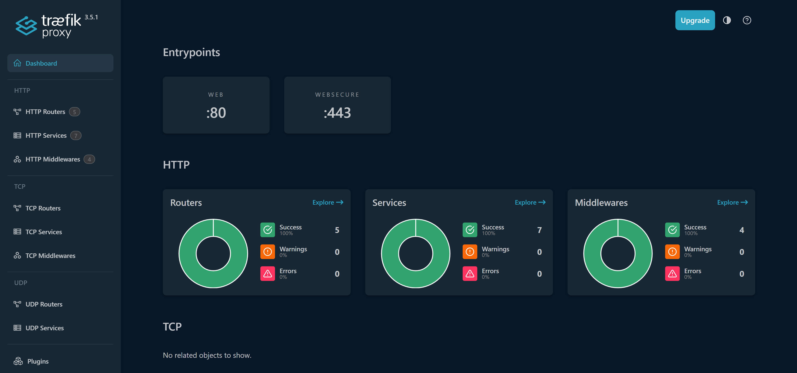
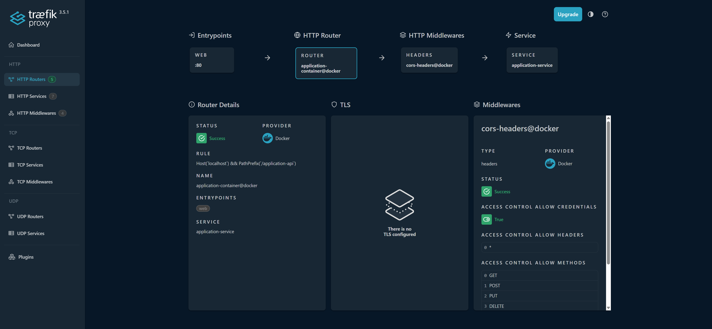
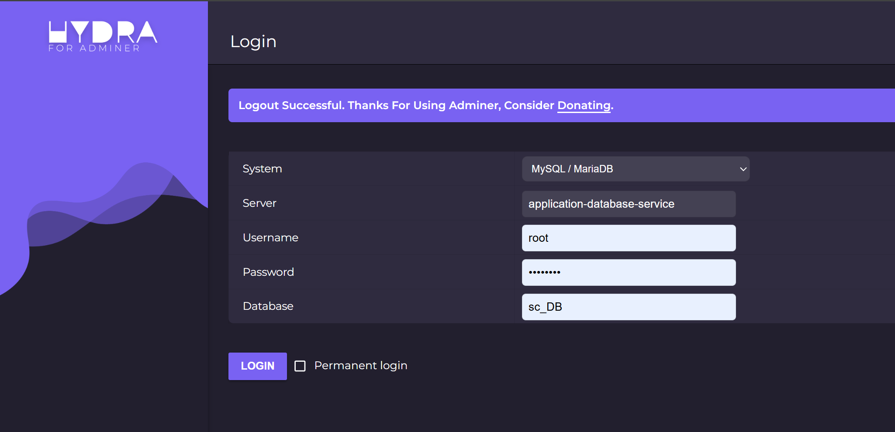
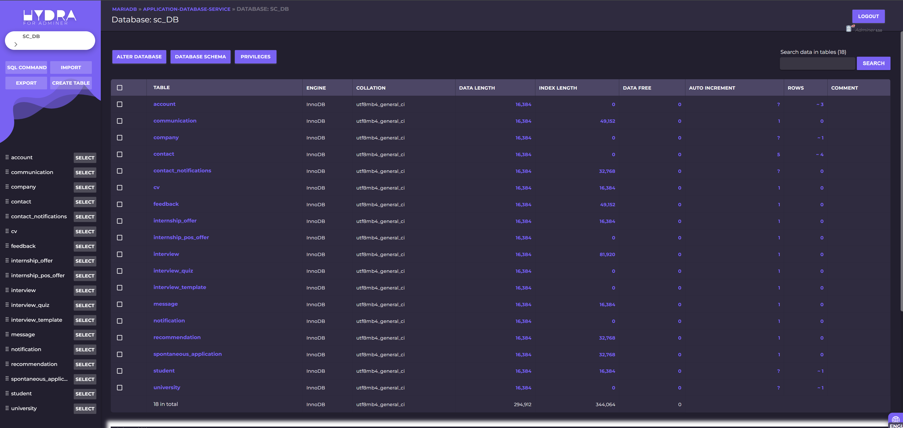

<div align="center">
  
# Students & Companies
</div>

<div align="center">
  
  
📜 Software Engineering 2 (Prof. Matteo Camilli)  

📌 R&amp;DD &amp; IT Project 

Lorenzo Ricci - Slaitroc

Matteo Giovanni Paoli - Krotox

Samuele Grisoni - dedepivot

🧐 Grade: 30L

</div>

## 📦 Installation Guide

This section provides detailed instructions on how to install and run the project.

### 🔹 Prerequisites

Before proceeding with the installation, ensure you have the following dependencies installed:

- **Docker**: Required to run backend services using `docker-compose.yml`.
  - Docker requires *WSL 2* to work properly on Windows. 
- **PowerShell** (Windows users only): Optional, but recommended to automate the backend startup process.
- **Node.js** and **npm**: Required to install and run the frontend application.
- **JDK 21**: Required to properly compile the Java code.
- **Maven**: Required to manage dependencies, compile Java code and run tests.

---

### 🚀 Backend Setup

#### 1️⃣ **Docker Setup**
1. Ensure **Docker** is installed and running on your system.
2. Open a terminal and navigate to the project root directory.

#### 2️⃣ **Compile and Launch Backend**
A **PowerShell script** is provided to create the `.jar` files and launch Docker containers.

1. Open a **PowerShell** terminal.
2. Navigate to the `Implementation` directory.
3. Run the command:

   ```powershell
   .\build-and-execute.ps1
   ```

4. When prompted, press `p` for Production mode.
5. Confirm container rebuild by pressing **Yes** when asked.

The script simplifies creating Java build files, setting environment variables, and launching containers.

⚡ **Manual Alternative**
You can achieve the same result by manually running:

```sh
mvn clean package
```
in each maven project location (`Implementation/sc_auth`, `Implementation/sc_server`);
and then:

```sh
docker compose up --build
```

in the Implementation directory


---

### 🎨 Frontend Setup

1. Ensure **Node.js** and **npm** are installed.
2. Open a terminal and navigate to the `Implementation/sc_frontend/client-web-app` directory.
3. Install dependencies by running:

   ```sh
   npm install
   ```

4. Start the application with API support:

   ```sh
   npm run dev:api
   ```

---

### 🚨 Frontend and Containers Hosts 🚨 (Important!)
Typically the vite project dev environment is hosted in http::/localhost:5173`, but sometimes, depending on the device, the port can change. 
The terminal launching the npm vite project will specify the used port. To have the email confirmation service working, you shall change the host ip coherently in the` `Implementation\sc_frontend\client-web-app\src\api-calls\apiConfig.js` file.

In the same file you can set the IP of the device that is running the backend container, which shall be `http://localhost` if your not using external tools like zeroTier to connect to other devices running containers.

The same should be set in the docker compose file where all the traefik rules using the Host definintion syntax along the file must contain the `localhost` (for local testing) or the used host for the backend services (for other types of cunfigurations). 


### ✅ Final Steps

Once both backend and frontend are running, the application should be accessible via the specified local development URL.

Make sure both services are properly started before testing the platform. 🚀

❓ Need Help?

If anything does not work properly and you have trouble setting it up, feel free to contact us or open an issue. 📩

---

## Documents & Presentation

The official versions of the documents are in the [Delivery Folder](./DeliveryFolder/). Please note that this markdown version may contain errors or be inconsistent with the official PDF versions.

Access the final presentation slides [here](DeliveryFolder/Final%20Presentation.pdf)

## Walkthrough

### Traefik

We use Traefik as our edge router and reverse proxy in Docker. It discovers services via labels and exposes a single HTTP entry point on port 80.
Routing is host/path-based: 
- `/application-api` goes to the `application-service` (port 8443);
- `/auth-api` to the `auth-service` (port 8444);
- `/adminer` to `adminer` (port 8080).

The Traefik dashboard and Adminer are protected with Basic Auth. 
For “private” endpoints (matched by a PathRegexp containing private), Traefik performs ForwardAuth against our auth service (`/auth-api/validate`); on success the request is forwarded to the application service, otherwise it’s rejected. We also attach CORS and a custom header via middlewares. All services run on a shared Docker network, so Traefik routes internally by service name without exposing backend ports publicly.

It also provides an intuitive and useful web dashboard to understand what is going on. The dashboard is accessible via `localhost` in the browser with the following credentials:
  - **user** = `user`
  - **password** = `user`




### Adminer  

Sometimes it is useful to have a fast way to check or modify the data in the database, so we used **Adminer** as a lightweight database management tool running in Docker.  

Adminer is exposed through Traefik at the path `/adminer` and is protected with Basic Auth to avoid unauthorized access. Once authenticated, it provides a simple web interface where we can connect to our MariaDB containers (`application-database-service` and `notification-database-service`) and directly inspect or modify tables, run queries, and manage the schema.  

The connection parameters to use in the Adminer login page are:  
- **System**: `MySQL/MariaDB`  
- **Server**: `application-database-service` or `notification-database-service`  
- **Username**: `root`  
- **Password**: `password`  
- **Database**: `sc_DB`  

The Adminer interface is accessible via `localhost/adminer` in the browser with the following Basic Auth credentials:  
- user = `user`  
- password = `user`  


  
