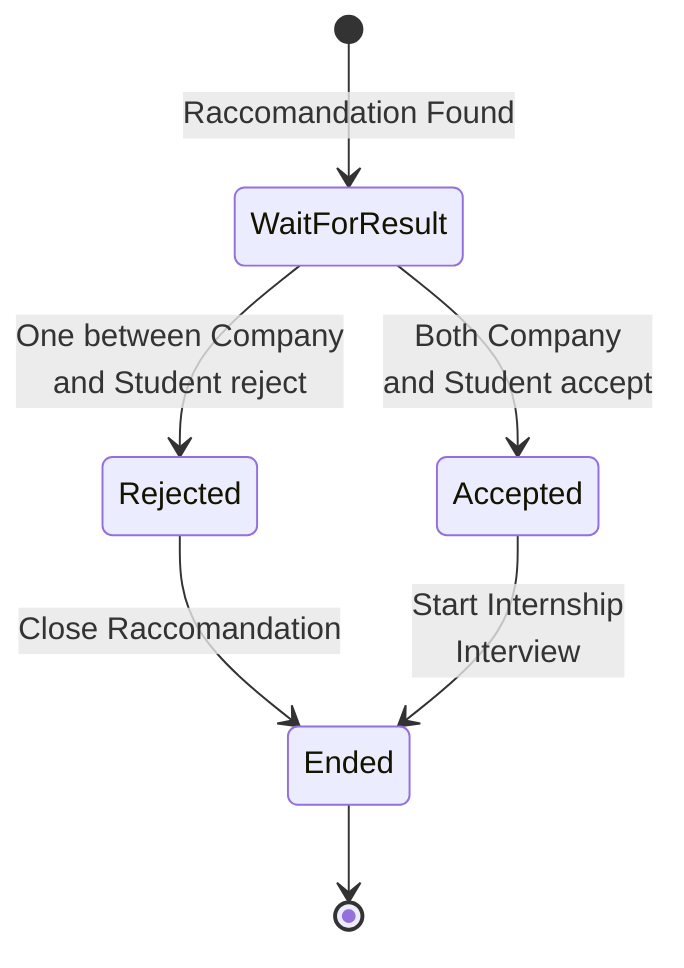
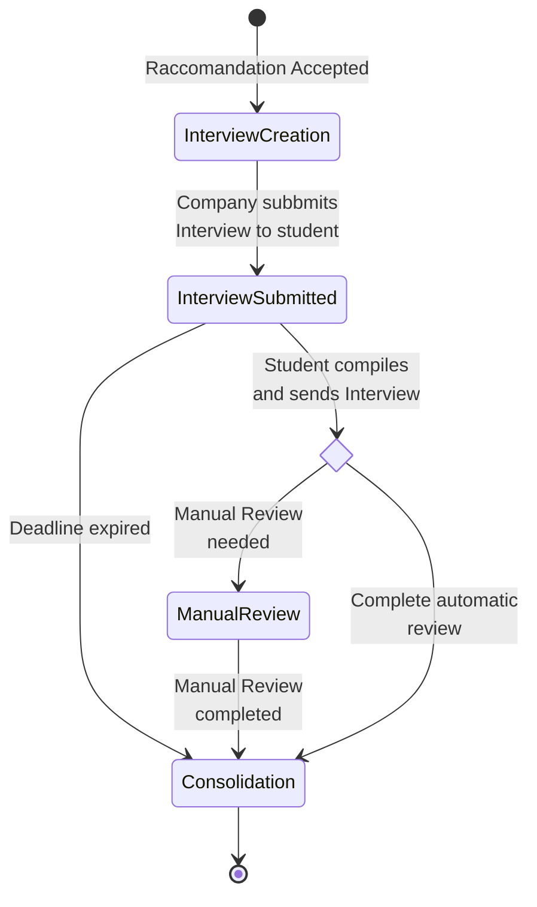
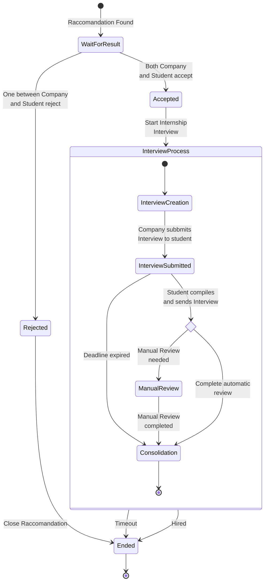

```mermaid
%% Raccomandation Process Evolution
stateDiagram-v2
    [*] --> WaitForResult: Raccomandation Found
    WaitForResult --> Rejected: One between Company<br> and Student reject
    WaitForResult --> Accepted: Both Company <br>and Student accept
    Rejected --> Ended: Close Raccomandation
    Accepted --> Ended: Start Internship<br>Interview
    Ended --> [*]
```

```mermaid
%% Internship Evolution
stateDiagram-v2
    state if <<choice>>
    
    [*] --> InterviewCreation: Raccomandation Accepted
    InterviewCreation --> InterviewSubmitted: Company subbmits<br> Interview to student
    InterviewSubmitted --> if: Student compiles<br> and sends Interview
    InterviewSubmitted --> Consolidation: Deadline expired
    if --> ManualReview: Manual Review<br> needed
    ManualReview --> Consolidation: Manual Review<br> completed
    if --> Consolidation: Complete automatic<br> review
    Consolidation --> [*]
```

```mermaid
%% Interation between Raccomandation and Internship
stateDiagram-v2
    state if <<choice>>
    [*] --> WaitForResult: Raccomandation Found
    WaitForResult --> Rejected: One between Company<br> and Student reject
    WaitForResult --> Accepted: Both Company <br>and Student accept
    Rejected --> Ended: Close Raccomandation
    Accepted --> InterviewProcess: Start Internship<br>Interview
    state InterviewProcess{
        [*] --> InterviewCreation
        InterviewCreation --> InterviewSubmitted: Company subbmits<br> Interview to student
        InterviewSubmitted --> if: Student compiles<br> and sends Interview
        InterviewSubmitted --> Consolidation: Deadline expired
        if --> ManualReview: Manual Review<br> needed
        ManualReview --> Consolidation: Manual Review<br> completed
        if --> Consolidation: Complete automatic<br> review
        Consolidation --> [*]
    }
    InterviewProcess --> Ended: Timeout
    InterviewProcess --> Ended: Hired
    Ended --> [*]
```
